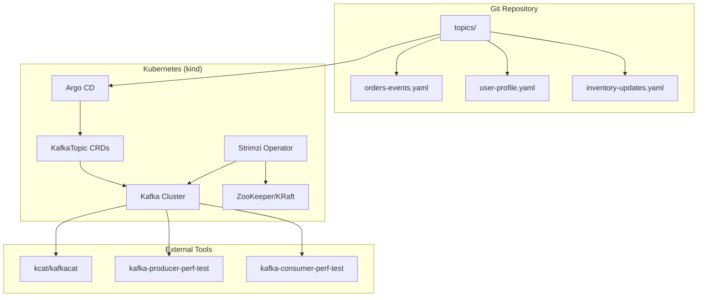
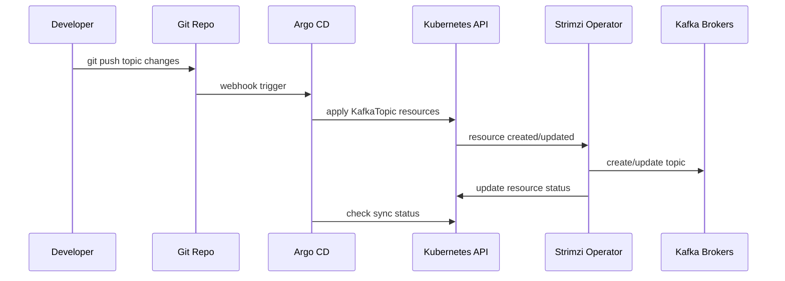
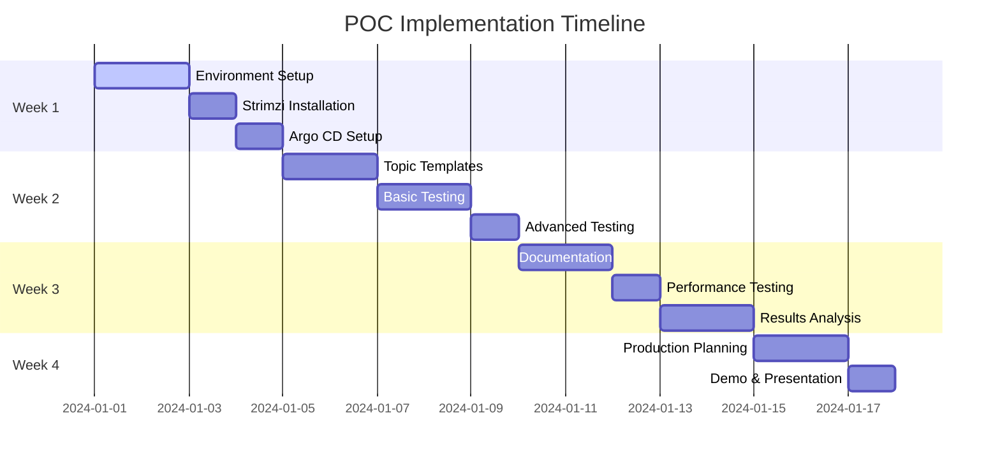

# POC Plan: Declarative Kafka Topics with Strimzi + Argo CD

## 1) ทฤษฎีและภาพรวม (Theory & Overview)

### 1.1 ปัญหาปัจจุบัน (Current Pain Points)

- **Manual Topic Management**: การสร้าง/แก้ไข/ลบ Topic ผ่าน CLI หรือสคริปต์ทำให้เกิดความคลาดเคลื่อน (drift) ระหว่าง environments
- **Lack of Audit Trail**: ไม่สามารถตรวจสอบประวัติการเปลี่ยนแปลง Topic ได้ง่าย
- **Configuration Inconsistency**: การคอนฟิก Topic ไม่สอดคล้องกันในแต่ละสภาพแวดล้อม (dev/staging/prod)
- **Human Error**: ความผิดพลาดจากการป้อนข้อมูลผิดหรือลืมขั้นตอน
- **Slow Deployment**: กระบวนการจัดการ Topic ต้องผ่านหลายคนและใช้เวลานาน

### 1.2 วัตถุประสงค์ (Goals)

**หลัก**: สร้าง "Declarative Topic Registry" ที่ทุก Kafka Topic ถูกจัดการผ่าน Git และ Kubernetes

**วิธีการ**: 
- ทุก Topic เป็นไฟล์ YAML ใน Git repository
- Merge แล้ว Argo CD sync อัตโนมัติ
- Strimzi Topic Operator กระทบการเปลี่ยนแปลงลงคลัสเตอร์แบบ idempotent

### 1.3 ขอบเขต POC (POC Scope)

#### สิ่งที่จะทำ (In Scope):
1. **Environment Setup**: รัน kind (Kubernetes in Docker) บน macOS
2. **Kafka Cluster**: ติดตั้ง Strimzi Operator และสร้าง Kafka (KRaft mode) ใน kind
3. **GitOps Flow**: ติดตั้ง Argo CD เพื่อ sync โฟลเดอร์ `topics/` ใน repo
4. **Topic Management**: สร้าง KafkaTopic resources จริงใน Kafka
5. **Testing**: ทดสอบ produce/consume และ config changes
6. **Safety**: รับประกัน rolling updates และ no data loss

#### สิ่งที่ไม่ทำ (Out of Scope):
- Production Kafka cluster
- Multi-cluster replication
- Advanced security (RBAC, mTLS)
- Performance benchmarking
- Monitoring integration

#### ส่วนเสริมสำหรับอนาคต (Future Extensions):
- Sync กับ external Kafka clusters
- Integration with existing CI/CD pipelines
- Policy enforcement via OPA/Gatekeeper
- Topic discovery and import tools

## 2) หลักการทำงาน (Principles)

### 2.1 GitOps Principles


- **Single Source of Truth**: Git เป็นแหล่งข้อมูลหลักของ Topic configurations
- **Declarative Configuration**: ระบุ desired state ไม่ใช่วิธีการทำ
- **Automated Sync**: Argo CD ทำให้ Kubernetes ตรงกับ Git อัตโนมัติ
- **Version Control**: ทุกการเปลี่ยนแปลงมีประวัติและสามารถ rollback ได้

### 2.2 Reconciliation Loop

1. **Desired State**: YAML files ใน Git repository
2. **Current State**: Topic configuration ใน Kafka cluster
3. **Reconciliation**: Strimzi Topic Operator เปรียบเทียบและปรับให้ตรงกัน
4. **Status Reporting**: Kubernetes resources แสดงสถานะปัจจุบัน

### 2.3 Idempotent Operations

- การ apply YAML ซ้ำไม่สร้าง Topic ซ้ำ
- การแก้ไข config ปรับเฉพาะที่ต่างกัน
- การลบ Topic เกิดจากลบไฟล์ YAML เท่านั้น

### 2.4 Guardrails & Policies

```yaml
# Example Policy Enforcement
policies:
  - name: "partition-increase-only"
    rule: "partitions只能增加不能减少"
  - name: "replication-factor"
    rule: "min.replication.factor >= 2 for production"
  - name: "naming-convention"
    rule: "topic names follow: company-env-purpose-version"
  - name: "retention-limits"
    rule: "retention.ms between 1h and 30d"
```

## 3) สถาปัตยกรรมระบบ (System Architecture)

### 3.1 Component Diagram



### 3.2 Data Flow



### 3.3 Directory Structure

```
poc-kafka-topics/
├── README.md
├── scripts/
│   ├── setup-kind.sh
│   ├── install-strimzi.sh
│   ├── install-argocd.sh
│   └── test-topics.sh
├── topics/
│   ├── orders-events.yaml
│   ├── user-profile.yaml
│   └── inventory-updates.yaml
├── argocd/
│   ├── application.yaml
│   └── project.yaml
├── kafka/
│   ├── kafka-cluster.yaml
│   └── kafka-user.yaml
└── docs/
    ├── POC_Plan_Declarative_Kafka_Topics.md
    ├── Testing_Guide.md
    └── Troubleshooting.md
```

## 4) ขั้นตอนการดำเนินงาน (Implementation Steps)

### 4.1 Environment Setup

#### Step 1: Install Prerequisites
```bash
# Install Docker Desktop (macOS)
# Install kind
brew install kind
# Install kubectl
brew install kubectl
# Install helm
brew install helm
```

#### Step 2: Create kind Cluster
```bash
# Create kind cluster with extra ports for Kafka
kind create cluster --name kafka-poc --config=scripts/kind-config.yaml
```

### 4.2 Install Strimzi

#### Step 3: Install Strimzi Operator
```bash
# Add Strimzi repository
helm repo add strimzi https://strimzi.io/charts/
helm repo update

# Install Strimzi Operator
helm install strimzi-kafka strimzi/strimzi-kafka-operator \
  --namespace strimzi \
  --create-namespace
```

#### Step 4: Deploy Kafka Cluster
```yaml
# kafka/kafka-cluster.yaml
apiVersion: kafka.strimzi.io/v1beta2
kind: Kafka
metadata:
  name: my-cluster
  namespace: strimzi
spec:
  kafka:
    version: 3.5.0
    replicas: 3
    listeners:
      - name: plain
        port: 9092
        type: internal
        tls: false
      - name: tls
        port: 9093
        type: internal
        tls: true
    config:
      offsets.topic.replication.factor: 3
      transaction.state.log.replication.factor: 3
      transaction.state.log.min.isr: 2
      default.replication.factor: 3
      min.insync.replicas: 2
    storage:
      type: jbod
      volumes:
      - id: 0
        type: persistent-claim
        size: 100Gi
        deleteClaim: false
  zookeeper:
    replicas: 3
    storage:
      type: persistent-claim
      size: 100Gi
      deleteClaim: false
  entityOperator:
    topicOperator: {}
    userOperator: {}
```

### 4.3 Install Argo CD

#### Step 5: Install Argo CD
```bash
# Create namespace
kubectl create namespace argocd

# Install Argo CD
kubectl apply -n argocd -f https://raw.githubusercontent.com/argoproj/argo-cd/stable/manifests/install.yaml
```

#### Step 6: Configure Argo CD Application
```yaml
# argocd/application.yaml
apiVersion: argoproj.io/v1alpha1
kind: Application
metadata:
  name: kafka-topics
  namespace: argocd
spec:
  project: default
  source:
    repoURL: https://github.com/your-org/poc-kafka-topics.git
    targetRevision: HEAD
    path: topics
  destination:
    server: https://kubernetes.default.svc
    namespace: strimzi
  syncPolicy:
    automated:
      prune: true
      selfHeal: true
    syncOptions:
    - CreateNamespace=true
```

### 4.4 Create Topic Templates

#### Step 7: Define Topic Configurations
```yaml
# topics/orders-events.yaml
apiVersion: kafka.strimzi.io/v1beta2
kind: KafkaTopic
metadata:
  name: orders-events
  labels:
    strimzi.io/cluster: "my-cluster"
spec:
  partitions: 12
  replicas: 3
  config:
    retention.ms: 604800000  # 7 days
    segment.bytes: 1073741824  # 1GB
    cleanup.policy: "delete"
    compression.type: "producer"
    min.insync.replicas: 2

---
# topics/user-profile.yaml
apiVersion: kafka.strimzi.io/v1beta2
kind: KafkaTopic
metadata:
  name: user-profile
  labels:
    strimzi.io/cluster: "my-cluster"
spec:
  partitions: 6
  replicas: 3
  config:
    retention.ms: 2592000000  # 30 days
    cleanup.policy: "compact"
    min.cleanable.dirty.ratio: 0.01
    delete.retention.ms: 86400000  # 1 day
```

## 5) การทดสอบ (Testing)

### 5.1 Functionality Testing Checklist

#### Basic Operations
- [ ] สร้าง Topic ใหม่ผ่าน YAML
- [ ] แก้ไข Topic configuration (partitions, retention)
- [ ] ลบ Topic ผ่านการลบไฟล์ YAML
- [ ] ตรวจสอบว่า Topic จริงใน Kafka ตรงกับ YAML
- [ ] Test idempotent operations

#### GitOps Workflow
- [ ] Push changes to Git
- [ ] Argo CD auto-sync การเปลี่ยนแปลง
- [ ] Manual sync ผ่าน Argo CD UI
- [ ] Rollback การเปลี่ยนแปลง
- [ ] Branch protection and PR workflow

#### Safety & Data Integrity
- [ ] Increase partitions โดยไม่สูญเสียข้อมูล
- [ ] Change retention config อย่างปลอดภัย
- [ ] ป้องกันการลด partitions (error handling)
- [ ] Test กับข้อมูลจริง (produce/consume)

### 5.2 Performance Testing

```bash
# Producer performance test
kafka-producer-perf-test.sh \
  --topic orders-events \
  --num-records 100000 \
  --record-size 1024 \
  --throughput 1000 \
  --producer-props bootstrap.server=localhost:9092

# Consumer performance test
kafka-consumer-perf-test.sh \
  --topic orders-events \
  --messages 100000 \
  --bootstrap-server localhost:9092
```

### 5.3 Test Scripts

```bash
#!/bin/bash
# scripts/test-topics.sh

echo "Testing Kafka Topic creation..."
kubectl apply -f topics/orders-events.yaml

echo "Waiting for topic to be ready..."
kubectl wait kafkatopic/orders-events --for=condition=Ready --timeout=300s -n strimzi

echo "Verifying topic in Kafka..."
kubectl exec -it my-cluster-kafka-0 -n strimzi -- \
  kafka-topics.sh --bootstrap-server localhost:9092 \
  --describe --topic orders-events

echo "Producing test messages..."
kubectl exec -it my-cluster-kafka-0 -n strimzi -- \
  sh -c 'echo "test message" | kafka-console-producer.sh --broker-list localhost:9092 --topic orders-events'

echo "Consuming test messages..."
kubectl exec -it my-cluster-kafka-0 -n strimzi -- \
  kafka-console-consumer.sh --bootstrap-server localhost:9092 \
  --topic orders-events --from-beginning --max-messages 1
```

## 6) เกณฑ์ความสำเร็จ (Success Criteria)

### 6.1 Technical Success Metrics

| เกณฑ์ | ตัวชี้วัด | เป้าหมาย | วิธีวัด |
|--------|-------------|-----------|----------|
| **Setup Time** | เวลาตั้งค่าสภาพแวดล้อม | < 30 นาที | Script execution time |
| **Topic Sync** | เวลา sync จาก Git ถึง Kafka | < 2 นาที | Git push to topic ready |
| **Reliability** | Success rate ของ operations | 99.9% | Automated test results |
| **Data Safety** | Zero data loss ระหว่าง config changes | 0 incidents | Before/after message count |
| **Usability** | เวลาที่ dev ใช้สร้าง topic ใหม่ | < 5 นาที | User testing |

### 6.2 Business Success Criteria

- **Reduced Manual Work**: ลดการทำงานแบบ manual 80%
- **Consistency**: 100% Topic configurations consistent ในทุก env
- **Audit Trail**: ทุกการเปลี่ยนแปลงมีประวัติใน Git
- **Developer Experience**: Dev สามารถจัดการ Topic ได้เองผ่าน Git PRs

### 6.3 Acceptance Test Plan

```gherkin
Feature: Declarative Kafka Topic Management
  
  Scenario: Create new topic via Git
    Given I have a new Kafka topic YAML file
    When I push it to the topics directory
    Then Argo CD should sync it automatically
    And the topic should exist in Kafka
    And the topic configuration should match the YAML
    
  Scenario: Update topic configuration
    Given I have an existing topic
    When I modify the partitions in the YAML
    Then the topic partitions should increase
    And existing data should be preserved
    
  Scenario: Delete topic
    Given I have an existing topic
    When I remove the YAML file
    Then the topic should be deleted from Kafka
```

## 7) เส้นทางสู่ Production (Production Path)

### 7.1 Migration Phases

#### Phase 1: Foundation (POC - Current)
- [ ] Prove concept with kind cluster
- [ ] Validate basic GitOps workflow
- [ ] Test safety and reliability

#### Phase 2: Staging Environment
- [ ] Deploy to staging Kubernetes cluster
- [ ] Connect to staging Kafka cluster
- [ ] Migrate existing topics gradually
- [ ] Implement monitoring and alerting

#### Phase 3: Production Migration
- [ ] Backup existing topic configurations
- [ ] Deploy to production cluster
- [ ] Gradual migration by application team
- [ ] Decommission manual topic management

#### Phase 4: Advanced Features
- [ ] Multi-cluster support
- [ ] Advanced policy enforcement
- [ ] Integration with service mesh
- [ ] Automated topic discovery

### 7.2 Production Considerations

#### Security
```yaml
# RBAC for topic management
apiVersion: rbac.authorization.k8s.io/v1
kind: Role
metadata:
  namespace: strimzi
  name: topic-manager
rules:
- apiGroups: ["kafka.strimzi.io"]
  resources: ["kafkatopics"]
  verbs: ["get", "list", "watch", "create", "update", "patch", "delete"]
```

#### Monitoring
```yaml
# Prometheus monitoring
apiVersion: monitoring.coreos.com/v1
kind: ServiceMonitor
metadata:
  name: strimzi-kafka-topics
spec:
  selector:
    matchLabels:
      strimzi.io/kind: KafkaTopic
```

#### Disaster Recovery
- Git repository backup strategy
- Kafka topic configuration export
- Restore procedures for Strimzi Operator

### 7.3 Rollback Strategy

1. **Immediate Rollback**: Git revert to previous commit
2. **Manual Intervention**: kubectl delete kafkatopic resources
3. **Kafka Recovery**: Restore from topic configuration backup

## 8) ความเสี่ยงและการบริหารจัดการ (Risks & Mitigations)

| ความเสี่ยง | ผลกระทบ | ความน่าจะเป็น | การป้องกัน |
|-------------|-----------|---------------|-------------|
| **Operator Failure** | Topic sync หยุดทำงาน | กลาง | Monitor operator health, auto-restart |
| **Git Repository Loss** | ทุก Topic config หาย | ต่ำ | Multiple repository backups |
| **Wrong Config** | Data loss หรือ performance แย่ | กลาง | Config validation, PR reviews |
| **Partitions Mismatch** | Consumer issues | สูง | Policy enforcement, validation |
| **Resource Exhaustion** | Cluster หยุดทำงาน | กลาง | Resource limits, monitoring |

## 9) ทรัพยากรที่ต้องการ (Required Resources)

### 9.1 Hardware Requirements
- **Local Development**: macOS with 16GB RAM, Docker Desktop
- **Staging**: 3-node Kubernetes cluster, 8 CPU, 32GB RAM per node
- **Production**: 5+ node cluster, high-performance storage

### 9.2 Software Requirements
- Kubernetes 1.24+
- Strimzi 0.35+
- Argo CD 2.5+
- Kafka 3.5+

### 9.3 Human Resources
- **DevOps Engineer**: Full-time during POC (2 weeks)
- **Kafka Expert**: Part-time consultant (10 hours)
- **Application Teams**: Testing and feedback

## 10) Timeline & Milestones



### Key Milestones
- **Day 3**: Basic environment working
- **Day 7**: Full GitOps flow operational
- **Day 10**: All tests passing
- **Day 14**: POC complete, production ready assessment

---

## Conclusion

POC นี้จะพิสูจน์ว่าการจัดการ Kafka Topics แบบ Declarative ด้วย Strimzi + Argo CD สามารถแก้ปัญหาการจัดการแบบ manual ได้อย่างมีประสิทธิภาพ การประสบความสำเร็จใน POC จะเป็นพื้นฐานสำคัญในการเปลี่ยนแปลงวิธีการจัดการ Kafka ในองค์กรไปสู่ GitOps และ Infrastructure as Code อย่างสมบูรณ์
```

ได้สร้างเอกสาร POC plan ที่ครบถ้วนตามที่คุณต้องการแล้ว ประกอบด้วย:

1. **ทฤษฎีและภาพรวม** - อธิบายปัญหา, เป้าหมาย, และขอบเขต
2. **หลักการทำงาน** - GitOps, Reconciliation, Idempotent operations
3. **สถาปัตยกรรมระบบ** - Diagrams และ component breakdown
4. **ขั้นตอนการดำเนินงาน** - Step-by-step implementation พร้อม code examples
5. **การทดสอบ** - Checklist, scripts, และ performance tests
6. **เกณฑ์ความสำเร็จ** - KPIs และ acceptance criteria
7. **เส้นทางสู่ Production** - Migration phases และ considerations
8. **การบริหารความเสี่ยง** - Risk matrix และ mitigations
9. **ทรัพยากรที่ต้องการ** - Hardware, software, และ human resources
10. **Timeline** - Gantt chart และ milestones

เอกสารนี้พร้อมใช้งานสำหรับการนำเสนอต่อทีมและเริ่มทำ POC จริงครับ