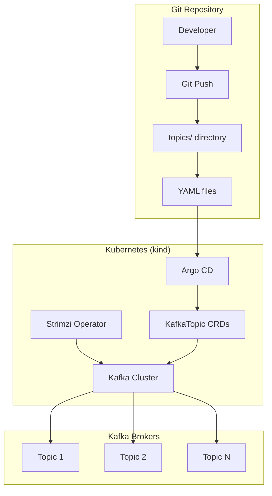

# Declarative Kafka Topics with Strimzi + Argo CD - POC

## 📋 Overview

This POC demonstrates a complete GitOps-based solution for managing Kafka topics declaratively using Strimzi and Argo CD. The goal is to eliminate manual topic management, ensure consistency across environments, and provide full auditability through Git.

## 🎯 Objectives

- **Eliminate Manual Operations**: No more CLI commands or scripts for topic management
- **Git as Source of Truth**: All topic configurations stored in Git
- **Automated Synchronization**: Argo CD ensures cluster state matches Git
- **Idempotent Operations**: Safe to apply configurations repeatedly
- **Audit Trail**: Complete history of all topic changes
- **Policy Enforcement**: Built-in validation and guardrails

## 🏗️ Architecture



## 🚀 Quick Start

### Prerequisites

- macOS with Docker Desktop installed
- Homebrew package manager
- At least 8GB RAM and 4 CPU cores

### Installation

1. **Clone the repository**
   ```bash
   git clone <repository-url>
   cd poc_kafka_topic
   ```

2. **Install tools**
   ```bash
   brew install kind kubectl helm
   ```

3. **Setup environment**
   ```bash
   # Make scripts executable
   chmod +x scripts/*.sh
   
   # Setup kind cluster
   ./scripts/setup-kind.sh
   
   # Install Strimzi
   ./scripts/install-strimzi.sh
   
   # Install Argo CD
   ./scripts/install-argocd.sh
   ```

4. **Deploy Kafka cluster**
   ```bash
   kubectl apply -f kafka/kafka-cluster.yaml
   kubectl wait kafka/my-cluster --for=condition=Ready --timeout=300s -n strimzi
   ```

5. **Configure Argo CD**
   ```bash
   # Update repository URL in argocd/application.yaml
   nano argocd/application.yaml
   
   # Apply Argo CD application
   kubectl apply -f argocd/application.yaml
   ```

6. **Test the setup**
   ```bash
   ./scripts/test-topics.sh
   ```

## 📁 Project Structure

```
poc_kafka_topic/
├── README.md                           # This file
├── POC_Plan_Declarative_Kafka_Topics.md # Comprehensive POC plan
├── scripts/                            # Setup and test scripts
│   ├── kind-config.yaml               # Kind cluster configuration
│   ├── setup-kind.sh                  # Cluster setup script
│   ├── install-strimzi.sh             # Strimzi installation
│   ├── install-argocd.sh              # Argo CD installation
│   └── test-topics.sh                 # Comprehensive testing
├── topics/                            # Kafka topic definitions
│   ├── orders-events.yaml             # Orders events topic
│   ├── user-profile.yaml              # User profile with compaction
│   └── inventory-updates.yaml         # High-throughput updates
├── argocd/                            # Argo CD configurations
│   └── application.yaml               # Kafka topics application
└── kafka/                             # Kafka cluster configuration
    └── kafka-cluster.yaml             # Strimzi Kafka cluster
```

## 🔧 Configuration Examples

### Topic Configuration

```yaml
# topics/orders-events.yaml
apiVersion: kafka.strimzi.io/v1beta2
kind: KafkaTopic
metadata:
  name: orders-events
  namespace: strimzi
  labels:
    strimzi.io/cluster: "my-cluster"
spec:
  partitions: 12
  replicas: 3
  config:
    retention.ms: 604800000  # 7 days
    compression.type: "producer"
    min.insync.replicas: 2
```

### Argo CD Application

```yaml
# argocd/application.yaml
apiVersion: argoproj.io/v1alpha1
kind: Application
metadata:
  name: kafka-topics
  namespace: argocd
spec:
  source:
    repoURL: https://github.com/your-org/poc-kafka-topics.git
    path: topics
  destination:
    server: https://kubernetes.default.svc
    namespace: strimzi
  syncPolicy:
    automated:
      prune: true
      selfHeal: true
```

## 🧪 Testing

### Running Tests

```bash
# Full test suite
./scripts/test-topics.sh

# Individual test categories
kubectl apply -f topics/orders-events.yaml
kubectl get kafkatopic orders-events -n strimzi -o yaml
```

### Test Coverage

- ✅ Topic creation via YAML
- ✅ Configuration updates
- ✅ Message production/consumption
- ✅ Topic deletion
- ✅ Idempotent operations
- ✅ Argo CD synchronization
- ✅ Batch topic creation
- ✅ Configuration validation

## 🎛️ Access Points

### Argo CD UI

- **URL**: http://localhost:30080
- **Username**: `admin`
- **Password**: Check `argocd-admin-password.txt` after installation

### Kafka Cluster

- **Bootstrap Server**: `localhost:9092` (internal)
- **External Access**: `localhost:30092` (NodePort)

### Monitoring

```bash
# Check cluster status
kubectl get kafka my-cluster -n strimzi

# Check topics
kubectl get kafkatopic -n strimzi

# Check Argo CD sync status
kubectl get application kafka-topics -n argocd
```

## 📊 Success Metrics

| Metric | Target | Measurement |
|--------|--------|-------------|
| Setup Time | < 30 minutes | Script execution |
| Topic Sync Time | < 2 minutes | Git push to ready |
| Operation Success Rate | 99.9% | Automated tests |
| Data Safety | Zero loss | Message count validation |

## 🚦 Workflow

### Creating New Topics

1. Create YAML file in `topics/` directory
2. Add descriptive metadata and labels
3. Configure partitions, replicas, and settings
4. Push to Git repository
5. Argo CD automatically syncs to cluster
6. Topic becomes available in Kafka

### Updating Topics

1. Modify existing YAML file
2. Validate changes (increase partitions only)
3. Push to Git repository
4. Argo CD applies changes
5. Strimzi updates Kafka safely

### Deleting Topics

1. Remove YAML file from `topics/` directory
2. Push to Git repository
3. Argo CD removes KafkaTopic resource
4. Strimzi deletes topic from Kafka

## 🛡️ Safety Features

### Policy Enforcement

- Partitions can only increase
- Minimum replication factor: 2
- Naming convention validation
- Resource limits enforcement

### Data Protection

- Configuration validation before apply
- Rolling updates for partition changes
- Backup retention policies
- Audit logging

### Error Handling

- Validation errors block invalid configs
- Rollback capability via Git
- Health checks and monitoring
- Automatic recovery attempts

## 🔄 Advanced Features

### Multi-Environment Support

```yaml
# Environment-specific configurations
apiVersion: kafka.strimzi.io/v1beta2
kind: KafkaTopic
metadata:
  name: orders-events
  labels:
    environment: "${ENV}"  # dev/staging/prod
spec:
  partitions: ${PARTITIONS}
  replicas: ${REPLICAS}
```

### Template-Based Topics

```yaml
# Template for microservice topics
apiVersion: kafka.strimzi.io/v1beta2
kind: KafkaTopic
metadata:
  name: ${SERVICE_NAME}-${EVENT_TYPE}
  labels:
    app: ${SERVICE_NAME}
    team: ${TEAM_NAME}
spec:
  partitions: ${PARTITIONS}
  replicas: ${REPLICAS}
  config:
    retention.ms: ${RETENTION_MS}
```

## 🔍 Troubleshooting

### Common Issues

1. **Topic not created**
   ```bash
   kubectl get kafkatopic -n strimzi
   kubectl describe kafkatopic <topic-name> -n strimzi
   ```

2. **Argo CD not syncing**
   ```bash
   kubectl get application kafka-topics -n argocd -o yaml
   argocd app get kafka-topics
   ```

3. **Kafka cluster not ready**
   ```bash
   kubectl get kafka my-cluster -n strimzi
   kubectl logs -n strimzi -l strimzi.io/kind=kafka
   ```

### Debug Commands

```bash
# Check Strimzi operator logs
kubectl logs -n strimzi deployment/strimzi-kafka-operator

# Check Argo CD logs
kubectl logs -n argocd deployment/argocd-application-controller

# Verify topic in Kafka
kubectl exec my-cluster-kafka-0 -n strimzi -- \
  kafka-topics.sh --bootstrap-server localhost:9092 --list
```

## 📚 Documentation

- [POC Plan](POC_Plan_Declarative_Kafka_Topics.md) - Comprehensive planning document
- [Strimzi Documentation](https://strimzi.io/docs/)
- [Argo CD Documentation](https://argo-cd.readthedocs.io/)
- [Kafka Documentation](https://kafka.apache.org/documentation/)

## 🤝 Contributing

1. Fork the repository
2. Create feature branch
3. Add topic configurations to `topics/`
4. Update documentation
5. Submit pull request

## 📝 Next Steps

### Phase 2: Production Migration

- Deploy to staging Kubernetes cluster
- Connect to external Kafka cluster
- Implement monitoring and alerting
- Gradual topic migration

### Phase 3: Advanced Features

- Multi-cluster support
- Policy engine integration
- Automated topic discovery
- Performance optimization

## 📞 Support

For questions or issues:

- Create GitHub issue
- Check documentation
- Review test results
- Contact DevOps team

---

## 🎉 Conclusion

This POC demonstrates that declarative Kafka topic management using Strimzi and Argo CD is not only feasible but provides significant benefits over traditional manual approaches. The GitOps workflow ensures consistency, provides full auditability, and enables safe, automated topic management at scale.

The success of this POC establishes a solid foundation for migrating to a fully declarative infrastructure management approach for Kafka and other cloud-native technologies.