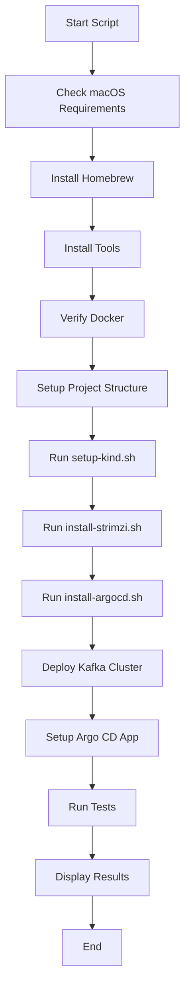
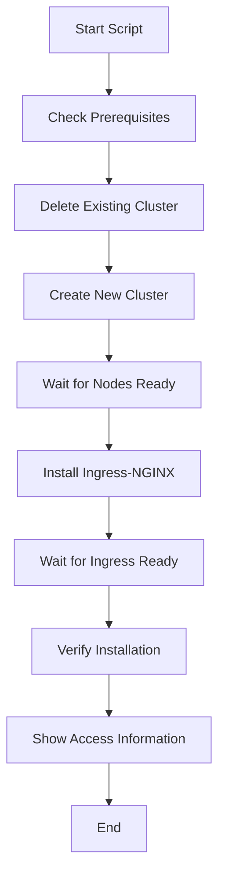
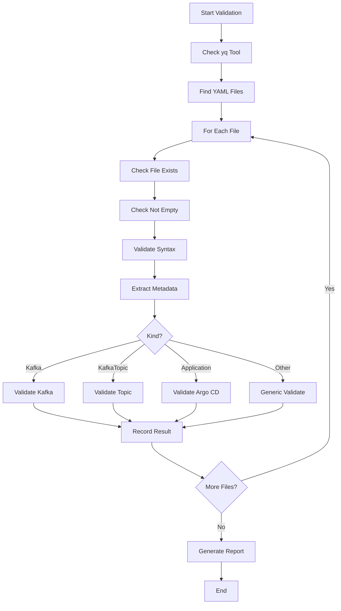

# 📚 เอกสารประกอบ Scripts สำหรับ POC Declarative Kafka Topics

## 📋 ภาพรวม Scripts ทั้งหมด

โปรเจคนี้ประกอบด้วย scripts ที่ออกแบบมาเพื่อตั้งค่าและจัดการระบบ Kafka แบบ Declarative ด้วย GitOps ผ่าน Strimzi และ Argo CD

### 🗂️ โครงสร้างไฟล์

```
scripts/
├── README.md              # เอกสารนี้ - คำอธิบาย Scripts ทั้งหมด
├── setup-macos.sh         # Script หลักสำหรับติดตั้งทั้งหมด (macOS)
├── setup-kind.sh          # สร้าง Kubernetes cluster ด้วย kind
├── install-strimzi.sh     # ติดตั้ง Strimzi Kafka Operator
├── install-argocd.sh      # ติดตั้ง Argo CD สำหรับ GitOps
├── test-topics.sh         # ทดสอบการทำงานของ Kafka Topics
├── validate-yaml.sh       # ตรวจสอบความถูกต้องของ YAML files
└── kind-config.yaml       # Configuration สำหรับ kind cluster
```

## 🚀 ลำดับการทำงานที่แนะนำ

### สำหรับผู้ใช้ macOS (แนะนำ)

```bash
./scripts/setup-macos.sh
```

Script นี้จะรันทุกขั้นตอนโดยอัตโนมัติตั้งแต่เริ่มจนจบ

### สำหรับการติดตั้งแบบ manual

```bash
# 1. สร้าง Kubernetes cluster
./scripts/setup-kind.sh

# 2. ติดตั้ง Strimzi Operator
./scripts/install-strimzi.sh

# 3. ติดตั้ง Argo CD
./scripts/install-argocd.sh

# 4. (ไม่บังคับ) ทดสอบระบบ
./scripts/test-topics.sh
```

---

## 📖 คำอธิบายแต่ละ Script โดยละเอียด

### 1. 🖥️ `setup-macos.sh` - Script หลักสำหรับ macOS

**วัตถุประสงค์:** One-click setup สำหรับผู้ใช้ macOS ที่ต้องการติดตั้งระบบทั้งหมด

**หน้าที่หลัก:**

- ✅ ตรวจสอบความพร้อมของระบบ (macOS version, memory, disk space)
- 📦 ติดตั้ง Homebrew ถ้ายังไม่มี
- 🛠️ ติดตั้งเครื่องมือที่จำเป็น (kind, kubectl, helm, git)
- 🐳 ตรวจสอบ Docker Desktop
- ⚙️ รันทุก scripts อื่นๆ ตามลำดับที่ถูกต้อง
- 📊 สร้าง Kafka cluster
- 🚀 ตั้งค่า Argo CD application
- 🧪 รันการทดสอบอัตโนมัติ
- 📋 แสดงข้อมูลการเข้าถึงและขั้นตอนถัดไป

**วิธีใช้งาน:**

```bash
chmod +x scripts/setup-macos.sh
./scripts/setup-macos.sh
```

**ผลลัพธ์ที่ได้:**

- Kubernetes cluster พร้อมใช้งาน
- Strimzi Operator ติดตั้งแล้ว
- Argo CD พร้อม UI ที่ http://localhost:30080
- Kafka cluster พร้อมใช้งาน
- รายงานผลการทดสอบทั้งหมด

---

### 2. ⚙️ `setup-kind.sh` - สร้าง Kubernetes Cluster

**วัตถุประสงค์:** สร้าง Kubernetes cluster ในเครื่องโดยใช้ kind (Kubernetes in Docker)

**หน้าที่หลัก:**

- 🔍 ตรวจสอบ prerequisites (kind, kubectl, docker)
- 🗑️ ลบ cluster เก่า (ถ้ามี)
- 🏗️ สร้าง cluster ใหม่ชื่อ "kafka-poc"
- 🌐 ติดตั้ง ingress-nginx controller
- ⏳ รอให้ทุก component พร้อมใช้งาน
- 📊 แสดงข้อมูล cluster และ port mappings

**Configuration ที่ใช้:** `scripts/kind-config.yaml`

**Port mappings ที่สร้าง:**

- HTTP/HTTPS: 80/443
- Kafka Internal: 9092/9093
- Kafka External: 30092/30093
- Argo CD UI: 30080

---

### 3. 📦 `install-strimzi.sh` - ติดตั้ง Kafka Operator

**วัตถุประสงค์:** ติดตั้ง Strimzi Kafka Operator สำหรับจัดการ Kafka บน Kubernetes

**หน้าที่หลัก:**

- ✅ ตรวจสอบ prerequisites (kubectl, helm)
- 🏷️ สร้าง namespace "strimzi"
- 📥 เพิ่ม Strimzi Helm repository
- 🚀 ติดตั้ง Strimzi Operator (version 0.35.1)
- ⏱️ รอให้ operator พร้อมใช้งาน
- 🔍 ตรวจสอบ CRDs และ installation

**Features ที่ติดตั้ง:**

- `watchAnyNamespace=true` - ดูทุก namespace
- Support สำหรับ Kafka, KafkaTopic, KafkaUser resources
- Auto-reconciliation และ self-healing

---

### 4. 🚀 `install-argocd.sh` - ติดตั้ง GitOps Tool

**วัตถุประสงค์:** ติดตั้ง Argo CD สำหรับ GitOps workflow

**หน้าที่หลัก:**

- 🏷️ สร้าง namespace "argocd"
- 📥 ติดตั้ง Argo CD จาก official manifest (v2.8.3)
- ⏳ รอให้ components พร้อมใช้งาน:
  - argocd-server
  - argocd-application-controller
  - argocd-repo-server
  - argocd-redis
- 🔌 ตั้งค่า external access ผ่าน NodePort
- 🔐 ดึงและบันทึก admin password
- 🛠️ ติดตั้ง Argo CD CLI (optional)

**Access Information:**

- UI: http://localhost:30080 (HTTP) / https://localhost:30443 (HTTPS)
- Username: admin
- Password: ถูกเซฟในไฟล์ `argocd-admin-password.txt`

---

### 5. 🧪 `test-topics.sh` - ทดสอบระบบ

**วัตถุประสงค์:** ทดสอบการทำงานของ Kafka Topics แบบ Declarative อย่างครอบคลุม

**การทดสอบทั้งหมด (8 tests):**

1. **Topic Creation** - สร้าง topic ผ่าน YAML
2. **Config Update** - อัปเดต partitions
3. **Message Flow** - ทดสอบ produce/consume
4. **Topic Deletion** - ลบ topic
5. **Idempotent Operations** - ทดสอบการรันซ้ำ
6. **Argo CD Sync** - ตรวจสอบ synchronization
7. **Batch Creation** - สร้างหลาย topics จาก directory
8. **Config Validation** - ทดสอบการ reject invalid config

**รายงานผล:**

- สรุปจำนวน tests ที่ผ่าน/ไม่ผ่าน
- รายละเอียดผลการทดสอบแต่ละข้อ
- สถานะ cluster และจำนวน topics ปัจจุบัน

---

### 6. ✅ `validate-yaml.sh` - ตรวจสอบ YAML

**วัตถุประสงค์:** ตรวจสอบความถูกต้องของไฟล์ YAML ทั้งหมดใน project

**หน้าที่หลัก:**

- 📖 ตรวจสอบ YAML syntax ด้วย yq
- 🔍 ตรวจสอบความถูกต้องตาม resource type:
  - **Kafka:** version, replicas, storage config
  - **KafkaTopic:** partitions, replicas, cluster label, retention
  - **Application:** repoURL, destination, sync policy
- ⚠️ แจ้งเตือนเรื่อง best practices
- 📊 สรุปผลการตรวจสอบ

**วิธีใช้งาน:**

```bash
# ตรวจสอบทุกไฟล์
./scripts/validate-yaml.sh

# ตรวจสอบไฟล์เฉพาะ
./scripts/validate-yaml.sh topics/orders-events.yaml
```

---

### 7. ⚙️ `kind-config.yaml` - Configuration File

**วัตถุประสงค์:** Configuration สำหรับ kind cluster

**การตั้งค่าหลัก:**

- Single control-plane node
- Port mappings สำหรับ external access
- Ingress-ready node label
- Support สำหรับ Kafka และ Argo CD

---

## 🔧 ข้อกำหนดเบื้องต้น (Prerequisites)

### สำหรับ macOS

- macOS 10.15+ (Catalina ขึ้นไป)
- 8GB+ RAM (แนะนำ)
- 10GB+ disk space
- Docker Desktop (4GB+ memory allocated)

### เครื่องมือที่จำเป็น

- Git
- Terminal/Shell (zsh/bash)

เครื่องมืออื่นๆ จะถูกติดตั้งโดยอัตโนมัติถ้าใช้ `setup-macos.sh`

---

## 🚨 Troubleshooting

### ปัญหาทั่วไป

1. **Docker ไม่ทำงาน** - ตรวจสอบว่า Docker Desktop เปิดอยู่
2. **Memory ไม่พอ** - จัดสรรให้ Docker อย่างน้อย 4GB
3. **Port ถูกใช้** - ปิด service อื่นๆ ที่ใช้ ports ดังกล่าว

### การ Reset ระบบ

```bash
# ลบ kind cluster
kind delete cluster --name kafka-poc

# ลบ resources
kubectl delete namespace strimzi argocd --ignore-not-found=true
```

---

## 📚 อ่านเพิ่มเติม

- 📄 [POC Plan](../POC_Plan_Declarative_Kafka_Topics.md) - แผนการและรายละเอียด POC
- 🔗 [Strimzi Documentation](https://strimzi.io/docs/)
- 🚀 [Argo CD Documentation](https://argoproj.github.io/argo-cd/)
- ⚙️ [Kind Documentation](https://kind.sigs.k8s.io/)

---

## 🤝 การสนับสนุน

หากพบปัญหาให้:

1. ตรวจสอบ log files ในโฟลเดอร์ `logs/`
2. รัน `./scripts/validate-yaml.sh` เพื่อตรวจสอบ configuration
3. ตรวจสอบ pod status: `kubectl get pods --all-namespaces`
4. ดู events: `kubectl get events --all-namespaces --sort-by=.metadata.creationTimestamp`

````

```markdown
# 📖 คู่มือการใช้งาน Scripts - รายละเอียดแต่ละไฟล์

## 📋 รายชื่อ Scripts ทั้งหมด

| Script | หน้าที่ | สถานะ | Dependencies |
|--------|----------|--------|--------------|
| [`setup-macos.sh`](setup-macos.sh) | One-click setup สำหรับ macOS | ✅ พร้อมใช้ | macOS, Homebrew |
| [`setup-kind.sh`](setup-kind.sh) | สร้าง Kubernetes cluster | ✅ พร้อมใช้ | kind, kubectl, docker |
| [`install-strimzi.sh`](install-strimzi.sh) | ติดตั้ง Kafka Operator | ✅ พร้อมใช้ | kubectl, helm |
| [`install-argocd.sh`](install-argocd.sh) | ติดตั้ง GitOps tool | ✅ พร้อมใช้ | kubectl |
| [`test-topics.sh`](test-topics.sh) | ทดสอบระบบอย่างครบวงจร | ✅ พร้อมใช้ | kubectl, Kafka cluster |
| [`validate-yaml.sh`](validate-yaml.sh) | ตรวจสอบความถูกต้องของ YAML | ✅ พร้อมใช้ | yq |
| [`kind-config.yaml`](kind-config.yaml) | Configuration สำหรับ kind | ✅ พร้อมใช้ | kind |

---

## 🚀 วิธีการใช้งานแบบรวดเร็ว

### สำหรับผู้ใช้ macOS (แนะนำมากที่สุด)

```bash
# 1. Clone หรือ download project
git clone <repository-url>
cd poc-kafka-auto-create-topic

# 2. รัน script เดียวจบ!
./scripts/setup-macos.sh
````

**Script นี้จะทำทุกอย่างให้:**

- ✅ ติดตั้งเครื่องมือที่จำเป็นทั้งหมด
- ✅ สร้าง Kubernetes cluster
- ✅ ติดตั้ง Strimzi และ Argo CD
- ✅ สร้าง Kafka cluster
- ✅ ตั้งค่า GitOps
- ✅ ทดสอบระบบทั้งหมด
- ✅ แสดงข้อมูลการเข้าถึง

---

### สำหรับผู้ใช้ Linux/Windows หรือการติดตั้งแบบ manual

```bash
# 1. ติดตั้ง prerequisites ด้วยตนเอง
# - kind, kubectl, helm, docker

# 2. สร้าง Kubernetes cluster
./scripts/setup-kind.sh

# 3. ติดตั้ง Strimzi Operator
./scripts/install-strimzi.sh

# 4. ติดตั้ง Argo CD
./scripts/install-argocd.sh

# 5. (ไม่บังคับ) ตรวจสอบ YAML files
./scripts/validate-yaml.sh

# 6. (ไม่บังคับ) ทดสอบระบบ
./scripts/test-topics.sh
```

---

## 📚 คำอธิบาย Scripts โดยละเอียด

### 1. 🖥️ setup-macos.sh - Script หลักสำหรับ macOS

#### 🎯 วัตถุประสงค์

เป็น script หลักที่ออกแบบมาเพื่อให้ผู้ใช้ macOS สามารถติดตั้ง POC นี้ได้ด้วยคำสั่งเดียว

#### ⚡ Features ที่น่าสนใจ

- 🔍 **Auto-detect Architecture** รองรับทั้ง Intel และ Apple Silicon (M1/M2/M3)
- 📦 **Automatic Homebrew Installation** ติดตั้ง Homebrew ถ้ายังไม่มี
- 🛠️ **Tool Management** ติดตั้ง/อัปเดต tools ที่จำเป็นทั้งหมด
- 📊 **Resource Monitoring** ตรวจสอบ memory และ disk space
- 🎨 **Beautiful Output** สีสันสวยงามพร้อม progress indicators
- 📝 **Comprehensive Logging** บันทึก logs ไว้ในโฟลเดอร์ `logs/`

#### 🔧 การทำงาน Step-by-step

```bash
#!/bin/bash
# 1. ตรวจสอบ macOS version และ hardware
# 2. ติดตั้ง/อัปเดต Homebrew
# 3. ติดตั้ง kind, kubectl, helm, git
# 4. ตรวจสอบ Docker Desktop
# 5. รัน setup-kind.sh
# 6. รัน install-strimzi.sh
# 7. รัน install-argocd.sh
# 8. สร้าง Kafka cluster
# 9. ตั้งค่า Argo CD application
# 10. รัน test-topics.sh
# 11. แสดงผลลัพธ์และข้อมูลการเข้าถึง
```

#### 📋 Output ที่ได้

```text
🎉 POC setup completed successfully!

Access Information:
─────────────────────────────────────────────────────────────

Argo CD UI:
  URL:      http://localhost:30080
  Username: admin
  Password: [saved in argocd-admin-password.txt]

Kafka Cluster:
  Bootstrap Server: localhost:9092 (internal)
  External Access:  localhost:30092
  Namespace:       strimzi
```

#### ⚠️ ข้อควรระวัง

- ต้องใช้ macOS เท่านั้น
- ต้องมีอินเทอร์เน็ตสำหรับ download tools
- Docker Desktop ต้องเปิดก่อนรัน script

---

### 2. ⚙️ setup-kind.sh - สร้าง Kubernetes Cluster

#### 🎯 วัตถุประสงค์

สร้าง Kubernetes cluster ในเครื่องโดยใช้ kind (Kubernetes in Docker) สำหรับรัน POC

#### ⚡ Features ที่สำคัญ

- 🗑️ **Auto-cleanup** ลบ cluster เก่าอัตโนมัติ
- 🌐 **Ingress Support** ติดตั้ง ingress-nginx สำหรับ external access
- 🔌 **Port Forwarding** กำหนด ports สำหรับ Kafka และ Argo CD
- ⏱️ **Health Checks** รอให้ cluster พร้อมใช้งาน

#### 📋 Port Mappings ที่สร้าง

| Service        | Container Port | Host Port | Description                |
| -------------- | -------------- | --------- | -------------------------- |
| HTTP           | 80             | 80        | Ingress HTTP traffic       |
| HTTPS          | 443            | 443       | Ingress HTTPS traffic      |
| Kafka Internal | 9092           | 9092      | Kafka bootstrap (internal) |
| Kafka Internal | 9093           | 9093      | Kafka brokers (internal)   |
| Kafka External | 30092          | 30092     | Kafka external access      |
| Kafka External | 30093          | 30093     | Kafka external access      |
| Argo CD UI     | 30080          | 30080     | Argo CD web interface      |

#### 🔧 Configuration Details

```yaml
# scripts/kind-config.yaml
kind: Cluster
apiVersion: kind.x-k8s.io/v1alpha4
nodes:
  - role: control-plane
    extraPortMappings: # ... port mappings above
```

#### 📊 การตรวจสอบหลังติดตั้ง

```bash
# ตรวจสอบ cluster
kubectl cluster-info

# ดู nodes
kubectl get nodes -o wide

# ตรวจสอบ ports
docker port kafka-poc-control-plane
```

---

### 3. 📦 install-strimzi.sh - Kafka Operator Installation

#### 🎯 วัตถุประสงค์

ติดตั้ง Strimzi Kafka Operator ซึ่งเป็น Kubernetes operator สำหรับจัดการ Apache Kafka

#### 🧩 Strimzi คืออะไร?

Strimzi เป็นโปรเจกต์ open source ที่ทำให้ Apache Kafka สามารถรันบน Kubernetes ได้อย่างง่ายดาย โดยมี:

- **Kafka Operator** จัดการ Kafka cluster lifecycle
- **Custom Resources** สำหรับ Kafka, KafkaTopic, KafkaUser
- **Automation** สำหรับ deployment, scaling, upgrading

#### ⚡ Features ที่ติดตั้ง

- 🎛️ **Operator Controller** จัดการ Kafka resources
- 📋 **Custom Resource Definitions (CRDs)** สำหรับ declarative config
- 🔍 **Watch All Namespaces** `watchAnyNamespace=true`
- 🔄 **Auto-Reconciliation** แก้ไขปัญหาอัตโนมัติ
- 📊 **Metrics & Monitoring** สนับสนุน Prometheus

#### 🏗️ Architecture ที่ติดตั้ง

```text
┌─────────────────┐    ┌──────────────────┐    ┌─────────────┐
│   Kafka CRDs    │    │ Strimzi Operator │    │ Kafka Pods  │
│                 │    │                  │    │             │
│ - Kafka         │◄──►│ - Controller     │◄──►│ - Zookeeper │
│ - KafkaTopic    │    │ - Reconciler     │    │ - Broker    │
│ - KafkaUser     │    │ - Webhook        │    │ - Exporter  │
│ - ...           │    │                  │    │             │
└─────────────────┘    └──────────────────┘    └─────────────┘
```

#### 📦 Installation Process

```bash
# 1. สร้าง namespace
kubectl create namespace strimzi

# 2. Add Helm repo
helm repo add strimzi https://strimzi.io/charts/

# 3. Install operator
helm install strimzi-kafka-operator strimzi/strimzi-kafka-operator \
  --namespace strimzi \
  --set watchAnyNamespace=true \
  --set image.tag=0.35.1
```

#### 🎯 CRDs ที่ติดตั้งมาด้วย

```bash
kubectl get crd | grep strimzi
# kafkas.kafka.strimzi.io
# kafkatopics.kafka.strimzi.io
# kafkausers.kafka.strimzi.io
# kafkabridges.kafka.strimzi.io
# kafkarebalances.kafka.strimzi.io
# kafkaconnects.kafka.strimzi.io
# ... และอื่นๆ อีกมากมาย
```

---

### 4. 🚀 install-argocd.sh - GitOps Tool Installation

#### 🎯 วัตถุประสงค์

ติดตั้ง Argo CD สำหรับ GitOps workflow ในการจัดการ Kafka Topics

#### 🤔 GitOps คืออะไร?

GitOps คือ practice การใช้ Git เป็น "single source of truth" สำหรับ:

- **Declarative Configuration** ทุกอย่างอยู่ใน Git
- **Automated Deployment** changes ใน Git จะถูก apply อัตโนมัติ
- **Version Control** มีประวัติการเปลี่ยนแปลงทั้งหมด
- **Audit Trail** สามารถตรวจสอบใครแก้อะไรได้

#### ⚡ Argo CD Features

- 🎯 **Application Management** จัดการ Kubernetes apps
- 🔄 **Automatic Sync** sync changes จาก Git อัตโนมัติ
- 🎨 **Beautiful UI** web interface สำหรับ monitoring
- 🔐 **RBAC Support** ควบคุมสิทธิ์ผู้ใช้
- 📊 **Health Checks** ตรวจสอบสถานะ applications
- 🔄 **Rollback** ย้อนกลับ version เก่าได้

#### 🏗️ Architecture

```text
┌──────────────────┐    ┌──────────────────┐    ┌─────────────────┐
│   Git Repository │    │   Argo CD Server │    │ Kubernetes      │
│                  │    │                  │    │ Cluster         │
│ - topics/*.yaml  │◄──►│ - API Server     │◄──►│ - Kafka Topics  │
│ - app.yaml       │    │ - Web UI         │    │ - Config Maps   │
│ - ...            │    │ - Repo Server    │    │ - Secrets       │
└──────────────────┘    └──────────────────┘    └─────────────────┘
                              │
                       ┌──────────────────┐
                       │  Redis Cache     │
                       │                  │
                       │ - Session Store  │
                       │ - Token Cache    │
                       └──────────────────┘
```

#### 📦 Installation Process

```bash
# 1. Create namespace
kubectl create namespace argocd

# 2. Install from manifest
kubectl apply -n argocd -f \
  https://raw.githubusercontent.com/argoproj/argo-cd/v2.8.3/manifests/install.yaml

# 3. Configure external access
kubectl patch svc argocd-server -n argocd \
  -p '{"spec":{"type":"NodePort","ports":[{"name":"http","port":80,"targetPort":8080,"nodePort":30080}]}}'

# 4. Get admin password
kubectl -n argocd get secret argocd-initial-admin-secret \
  -o jsonpath="{.data.password}" | base64 -d
```

#### 🎨 UI Features

- 📊 **Dashboard Overview** ดูสถานะทั้งหมด
- 📋 **Application List** จัดการ apps
- 🔍 **Resource Tree** ดู hierarchy ของ resources
- 📈 **Diff & Sync** เปรียบเทียบและ sync
- 📝 **Logs & Events** ดู logs และ events
- 👥 **User Management** จัดการผู้ใช้และสิทธิ์

---

### 5. 🧪 test-topics.sh - ระบบทดสอบอัตโนมัติ

#### 🎯 วัตถุประสงค์

ทดสอบการทำงานของ Kafka Topics แบบ Declarative อย่างครอบคลุม เพื่อให้มั่นใจว่าระบบทำงานถูกต้อง

#### 🧪 Test Suites (8 Tests)

##### Test 1: Topic Creation 🆕

```yaml
# สร้าง KafkaTopic resource
apiVersion: kafka.strimzi.io/v1beta2
kind: KafkaTopic
metadata:
  name: test-topic-creation
  namespace: strimzi
spec:
  partitions: 3
  replicas: 3
```

**สิ่งที่ตรวจสอบ:**

- ✅ KafkaTopic resource ถูกสร้าง
- ✅ Topic status = Ready
- ✅ Topic มีอยู่ใน Kafka cluster

##### Test 2: Configuration Update ⚙️

```bash
# อัปเดต partitions จาก 3 → 6
kubectl patch kafkatopic test-topic-creation \
  -p '{"spec":{"partitions":6}}'
```

**สิ่งที่ตรวจสอบ:**

- ✅ Partitions เพิ่มจาก 3 เป็น 6
- ✅ Topic ยังคงทำงานปกติ

##### Test 3: Message Flow 📨

```bash
# ส่งข้อความ
echo "test-message-$(date +%s)" | \
  kubectl exec -i my-cluster-kafka-0 -- \
  kafka-console-producer.sh --broker-list localhost:9092 --topic test-topic-creation

# รับข้อความ
kubectl exec my-cluster-kafka-0 -- \
  kafka-console-consumer.sh --bootstrap-server localhost:9092 \
  --topic test-topic-creation --from-beginning --max-messages 1
```

**สิ่งที่ตรวจสอบ:**

- ✅ Message ถูกส่งและรับสำเร็จ
- ✅ ข้อมูลไม่สูญหาย

##### Test 4: Topic Deletion 🗑️

```bash
# ลบ topic
kubectl delete kafkatopic test-topic-creation
```

**สิ่งที่ตรวจสอบ:**

- ✅ KafkaTopic resource ถูกลบ
- ✅ Topic หายไปจาก Kafka cluster

##### Test 5: Idempotent Operations 🔄

```bash
# สร้าง topic เดิมซ้ำ (ไม่ควร error)
kubectl apply -f topic.yaml  # ครั้งที่ 1
kubectl apply -f topic.yaml  # ครั้งที่ 2
```

**สิ่งที่ตรวจสอบ:**

- ✅ การรันซ้ำไม่ทำให้ error
- ✅ State คงเดิม

##### Test 6: Argo CD Sync 🚀

```bash
# ตรวจสอบ Argo CD application
kubectl get application kafka-topics -n argocd \
  -o jsonpath='{.status.sync.status}'
```

**สิ่งที่ตรวจสอบ:**

- ✅ Argo CD app healthy
- ✅ Sync status = Synced

##### Test 7: Batch Creation 📦

```bash
# สร้างทุก topics ในโฟลเดอร์ topics/
for file in topics/*.yaml; do
  kubectl apply -f "$file"
done
```

**สิ่งที่ตรวจสอบ:**

- ✅ ทุกไฟล์ถูก apply สำเร็จ
- ✅ ทุก topics ถูกสร้าง

##### Test 8: Validation ✅

```yaml
# สร้าง invalid config (ควรถูก reject)
apiVersion: kafka.strimzi.io/v1beta2
kind: KafkaTopic
spec:
  replicas: 5 # มากกว่า brokers
  config:
    retention.ms: -1000 # ค่าไม่ถูกต้อง
```

**สิ่งที่ตรวจสอบ:**

- ✅ Invalid config ถูก reject
- ✅ Error message ชัดเจน

#### 📊 รายงานผลการทดสอบ

```text
==============================================
           TEST EXECUTION REPORT
==============================================

Summary:
  Total Tests: 8
  Passed: 8
  Failed: 0
  Success Rate: 100%

Detailed Results:
  [PASS] Topic created successfully via YAML
  [PASS] Topic partitions updated successfully (6 partitions)
  [PASS] Message production and consumption successful
  [PASS] Topic deleted successfully
  [PASS] Idempotent operations working correctly
  [PASS] Argo CD application is healthy and synced
  [PASS] Batch creation successful (5/5 topics)
  [PASS] Configuration validation working (invalid config rejected)

🎉 ALL TESTS PASSED!
```

---

### 6. ✅ validate-yaml.sh - YAML Validation

#### 🎯 วัตถุประสงค์

ตรวจสอบความถูกต้องของ YAML files ทั้งหมดใน project ก่อนการ deploy

#### 🔍 ประเภทการตรวจสอบ

##### 1. Syntax Validation

```bash
# ใช้ yq ตรวจสอบ YAML syntax
yq eval '.' file.yaml > /dev/null
```

##### 2. Structure Validation

```bash
# ตรวจสอบ required fields
api_version=$(yq eval '.apiVersion' file.yaml)
kind=$(yq eval '.kind' file.yaml)
name=$(yq eval '.metadata.name' file.yaml)
```

##### 3. Type-specific Validation

**Kafka Cluster:**

```yaml
# ที่ต้องตรวจสอบ
spec:
  kafka:
    version: "3.5.0" # ✅ ต้องระบุ version
    replicas: 3 # ✅ ควร >= 3 สำหรับ production
    storage:
      type: jbod # ✅ ต้องมี storage config
```

**KafkaTopic:**

```yaml
# ที่ต้องตรวจสอบ
spec:
  partitions: 3 # ✅ ต้อง >= 1
  replicas: 3 # ✅ ต้อง >= 1, <= brokers
  config:
    retention.ms: 3600000 # ✅ ควร >= 0
metadata:
  labels:
    strimzi.io/cluster: "my-cluster" # ✅ จำเป็น
```

**Argo CD Application:**

```yaml
# ที่ต้องตรวจสอบ
spec:
  source:
    repoURL: "https://github.com/user/repo.git" # ✅ ต้อง HTTPS
    path: "topics" # ✅ ต้องมี path
  destination:
    server: "https://kubernetes.default.svc" # ✅ ต้องระบุ
```

#### 📋 การตรวจสอบโดยละเอียด

```bash
./scripts/validate-yaml.sh

─────────────────────────────────────────────────────────────

[VALIDATE] Validating: topics/orders-events.yaml
✅ YAML syntax is valid
  API Version: kafka.strimzi.io/v1beta2
  Kind: KafkaTopic
  Name: orders-events
  Namespace: strimzi

[INFO] Validating KafkaTopic configuration...
✅ Partitions: 3 (valid)
✅ Replicas: 3 (valid)
✅ Cluster label: my-cluster (present)
⚠️  Retention: -1 (unlimited - verify if intended)

─────────────────────────────────────────────────────────────

Validation Summary:
  Total files: 7
  Valid files: 7
  Invalid files: 0

🎉 All YAML files are valid!
```

#### 🎯 Best Practices ที่ตรวจสอบ

- **Security:** ไม่มี hardcoded secrets
- **Resource Limits:** มีการกำหนด resources สำหรับ production
- **High Availability:** Kafka replicas >= 3
- **Storage:** มีการกำหนด persistent storage
- **Versioning:** ใช้ API versions ที่ stable

---

### 7. ⚙️ kind-config.yaml - Cluster Configuration

#### 🎯 วัตถุประสงค์

Configuration file สำหรับ kind cluster กำหนดโครงสร้างและการเชื่อมต่อ

#### 📋 Configuration Breakdown

```yaml
# 1. Cluster metadata
kind: Cluster
apiVersion: kind.x-k8s.io/v1alpha4

# 2. Node configuration
nodes:
  - role: control-plane # Single node cluster
    kubeadmConfigPatches:
      - |
        kind: InitConfiguration
        nodeRegistration:
          kubeletExtraArgs:
            node-labels: "ingress-ready=true"  # Mark node for ingress

# 3. Port mappings
extraPortMappings:
  - containerPort: 80 # HTTP traffic
    hostPort: 80
    protocol: TCP
  - containerPort: 443 # HTTPS traffic
    hostPort: 443
    protocol: TCP
  - containerPort: 9092 # Kafka internal
    hostPort: 9092
    protocol: TCP
  - containerPort: 9093 # Kafka brokers
    hostPort: 9093
    protocol: TCP
  - containerPort: 30092 # Kafka external access
    hostPort: 30092
    protocol: TCP
  - containerPort: 30093 # Kafka external access
    hostPort: 30093
    protocol: TCP
  - containerPort: 30080 # Argo CD UI
    hostPort: 30080
    protocol: TCP
```

#### 🎯 Design Decisions

##### Single Node Cluster

- **Pros:** ใช้ resources น้อย, setup ง่าย, เหมาะกับ POC
- **Cons:** ไม่มี HA, ไม่เหมาะ production

##### Port Forwarding Strategy

```text
Internal Services    →    External Access
────────────────────          ──────────────────
Port 80 (HTTP)       →    localhost:80
Port 443 (HTTPS)     →    localhost:443
Port 9092 (Kafka)    →    localhost:9092
Port 30080 (ArgoCD)  →    localhost:30080
Port 30092 (Kafka)   →    localhost:30092
```

##### Ingress-ready Node

```yaml
node-labels: "ingress-ready=true"
```

ช่วยให้ ingress-nginx controller สามารถ schedule pods ได้ถูกต้อง

---

## 🚨 Troubleshooting Guide

### 📋 ปัญหาที่พบบ่อยและวิธีแก้ไข

#### 1. Docker Related Issues

```bash
# ❌ Problem: Docker Desktop not running
Error: Cannot connect to the Docker daemon

# ✅ Solution: เปิด Docker Desktop
# - Start Docker Desktop application
# - Wait until it's fully ready
# - Check: docker info
```

#### 2. Memory Issues

```bash
# ❌ Problem: Insufficient memory
Error: Kubernetes cluster failed to start

# ✅ Solution: เพิ่ม memory ให้ Docker
# 1. Docker Desktop → Settings → Resources
# 2. Increase memory to 4GB+ (recommended 8GB)
# 3. Restart Docker
# 4. Delete and recreate cluster
```

#### 3. Port Conflicts

```bash
# ❌ Problem: Port already in use
Error: bind: address already in use

# ✅ Solution: ปิด services ที่ใช้ ports เหล่านี้
# ตรวจสอบว่า port ใครใช้:
lsof -i :30080
netstat -tulpn | grep :30080

# หรือเปลี่ยน ports ใน kind-config.yaml
```

#### 4. Permission Issues

```bash
# ❌ Problem: Permission denied
Error: permission denied while trying to connect to Docker daemon

# ✅ Solution: Add user to docker group
sudo usermod -aG docker $USER
# หรือรันด้วย sudo (ไม่แนะนำ)
sudo ./scripts/setup-kind.sh
```

#### 5. Network Issues

```bash
# ❌ Problem: Cannot download tools
Error: Failed to connect to raw.githubusercontent.com

# ✅ Solution: Check internet/proxy
# 1. Check internet connection
curl -I https://raw.githubusercontent.com

# 2. If behind proxy:
export https_proxy=http://proxy.company.com:8080
export http_proxy=http://proxy.company.com:8080
```

#### 6. Kubernetes Cluster Issues

```bash
# ❌ Problem: Cluster not ready
kubectl get nodes
# STATUS: NotReady

# ✅ Solution: Debug cluster
kind get clusters
kind export kubeconfig --name kafka-poc
kubectl get events --sort-by=.metadata.creationTimestamp

# ถ้ายังไม่ได้:
kind delete cluster --name kafka-poc
./scripts/setup-kind.sh
```

#### 7. Pod Crashes

```bash
# ❌ Problem: Pods keep restarting
kubectl get pods --all-namespaces
# STATUS: CrashLoopBackOff

# ✅ Solution: Debug pods
kubectl describe pod <pod-name> -n <namespace>
kubectl logs <pod-name> -n <namespace> --previous
```

### 🔄 Reset & Clean Scripts

#### Full Reset (Delete Everything)

```bash
#!/bin/bash
# reset-all.sh

echo "🧹 Full reset of POC environment..."

# 1. Delete kind cluster
echo "Deleting kind cluster..."
kind delete cluster --name kafka-poc 2>/dev/null || true

# 2. Remove password file
echo "Removing Argo CD password..."
rm -f argocd-admin-password.txt

# 3. Clean logs
echo "Cleaning logs..."
rm -rf logs/

echo "✅ Reset completed!"
```

#### Partial Reset

```bash
# Reset Kubernetes only
kind delete cluster --name kafka-poc

# Reset specific namespace
kubectl delete namespace strimzi --ignore-not-found=true
kubectl delete namespace argocd --ignore-not-found=true

# Reset topics only
kubectl delete kafkatopic --all -n strimzi
```

---

## 📚 เอกสารอ้างอิงและลิงก์ที่เกี่ยวข้อง

### 📖 Official Documentation

- **Strimzi:** https://strimzi.io/docs/
- **Argo CD:** https://argoproj.github.io/argo-cd/
- **Kind:** https://kind.sigs.k8s.io/
- **Kafka:** https://kafka.apache.org/documentation/

### 🎯 Best Practices

- **Kubernetes Best Practices:** https://kubernetes.io/docs/concepts/configuration/overview/
- **GitOps Patterns:** https://www.weave.works/technologies/gitops/
- **Kafka Operations:** https://www.confluent.io/blog/kafka-best-practices/

### 🔧 Useful Commands Cheat Sheet

```bash
# Kubernetes
kubectl get all --all-namespaces
kubectl describe pod <pod> -n <ns>
kubectl exec -it <pod> -n <ns> -- bash

# Kafka (ใน cluster)
kubectl exec -it my-cluster-kafka-0 -n strimzi -- \
  kafka-topics.sh --bootstrap-server localhost:9092 --list

# Argo CD
kubectl get applications -n argocd
argocd app get kafka-topics
argocd app sync kafka-topics

# Kind
kind get clusters
kind export kubeconfig --name kafka-poc
docker exec -it kafka-poc-control-plane bash
```

---

## 🤝 การสนับสนุนและการมีส่วนร่วม

### 📋 รายงานปัญหา

หากพบปัญหา:

1. ตรวจสอบ `logs/` สำหรับ error messages
2. รัน `./scripts/validate-yaml.sh` สำหรับ syntax errors
3. ตรวจสอดู pod status และ events
4. รวบรวมข้อมูล: OS version, Docker version, error logs

### 🔄 การมีส่วนร่วม

- Fork repository
- สร้าง feature branch
- Add tests สำหรับ changes
- Submit pull request

### 📧 ติดต่อ

- GitHub Issues: สำหรับ bug reports
- Wiki: สำหรับ documentation improvements
- Discussions: สำหรับ questions และ ideas

---

**🎉 ขอบคุณที่ใช้งาน POC Declarative Kafka Topics!**

หวังว่าเอกสารนี้จะช่วยให้คุณเข้าใจและใช้งาน scripts ต่างๆ ได้อย่างมีประสิทธิภาพครับ

````

```markdown
# 📖 คู่มือ Script: setup-macos.sh

## 🎯 ภาพรวม

`setup-macos.sh` เป็น script หลักสำหรับผู้ใช้ macOS ที่ออกแบบมาเพื่อให้การติดตั้ง POC Declarative Kafka Topics เป็นไปอย่างง่ายดายด้วยคำสั่งเดียว

---

## ✨ คุณสมบัติเด่น

### 🖥️ Auto-Detection อัจฉริยะ
```bash
# ตรวจสอบชนิดของเครื่อง
ARCH=$(uname -m)
if [[ "$ARCH" == "arm64" ]]; then
    BREW_PREFIX="/opt/homebrew"  # Apple Silicon (M1/M2/M3)
else
    BREW_PREFIX="/usr/local"    # Intel
fi
````

- **รองรับทุก Mac:** Intel และ Apple Silicon (M1, M2, M3)
- **Auto-configure:** ตั้งค่า paths ตาม hardware อัตโนมัติ
- **Version Check:** ตรวจสอบ macOS version compatibility

### 📦 One-Click Tool Installation

```bash
# ติดตั้ง tools ที่จำเป็นทั้งหมด
tools=("kind" "kubectl" "helm" "git")
for tool in "${tools[@]}"; do
    if ! command -v "$tool" &> /dev/null; then
        brew install "$tool"
    fi
done
```

- **Homebrew Management:** ติดตั้ง/อัปเดต Homebrew อัตโนมัติ
- **Dependency Resolution:** ติดตั้ง tools ที่ขาดหายไปเท่านั้น
- **Latest Versions:** ใช้ latest stable versions

### 🎨 Beautiful Output และ Progress Tracking

```bash
print_header() {
    echo -e "${PURPLE}"
    echo "╔══════════════════════════════════════════════════════════════╗"
    echo "║         Declarative Kafka Topics POC - macOS Setup          ║"
    echo "║                    Strimzi + Argo CD                       ║"
    echo "╚══════════════════════════════════════════════════════════════╝"
    echo -e "${NC}"
}
```

- **Colored Output:** ใช้สีเพื่อความชัดเจน
- **Progress Indicators:** แสดงขั้นตอนการทำงาน
- **ASCII Art:** Logo และ headers สวยงาม
- **Status Messages:** แจ้งความคืบหน้าทุกขั้นตอน

---

## 🏗️ สถาปัตยกรรมและการทำงาน

### 🔄 ลำดับการทำงาน (Execution Flow)



### 📋 ขั้นตอนการทำงานโดยละเอียด

#### 1️⃣ Phase 1: Environment Preparation

```bash
check_macos_requirements() {
    # ตรวจสอบ macOS version
    MACOS_VERSION=$(sw_vers -productVersion)

    # ตรวจสอบ architecture
    ARCH=$(uname -m)

    # ตรวจสอง memory
    MEMORY_GB=$(( $(sysctl -n hw.memsize) / 1024 / 1024 / 1024 ))

    # ตรวจสอบ disk space
    DISK_FREE=$(df -h / | awk 'NR==2 {print $4}' | sed 's/G//')
}
```

**สิ่งที่ตรวจสอบ:**

- ✅ macOS version (ต้องเป็น 10.15+)
- ✅ Architecture (Intel vs Apple Silicon)
- ✅ Available RAM (ขอแนะนำ 8GB+)
- ✅ Disk space (ต้องมีอย่างน้อย 10GB)

#### 2️⃣ Phase 2: Tool Installation

```bash
install_homebrew() {
    if ! command -v brew &> /dev/null; then
        # Download และติดตั้ง Homebrew
        /bin/bash -c "$(curl -fsSL https://raw.githubusercontent.com/Homebrew/install/HEAD/install.sh)"

        # Add to PATH ตาม architecture
        if [[ "$ARCH" == "arm64" ]]; then
            echo 'eval "$(/opt/homebrew/bin/brew shellenv)"' >> ~/.zshrc
        else
            echo 'eval "$(/usr/local/bin/brew shellenv)"' >> ~/.zshrc
        fi
    fi
}
```

#### 3️⃣ Phase 3: Docker Verification

```bash
verify_docker() {
    if docker info &> /dev/null; then
        DOCKER_VERSION=$(docker --version)
        print_status "Docker is running: $DOCKER_VERSION"
    else
        print_error "Docker Desktop is not running"
        exit 1
    fi
}
```

#### 4️⃣ Phase 4: Project Setup

```bash
setup_project() {
    # Make scripts executable
    chmod +x scripts/*.sh

    # Create necessary directories
    mkdir -p logs
    mkdir -p backups
}
```

#### 5️⃣ Phase 5: Cluster & Services Installation

```bash
run_kind_setup() {
    if ./scripts/setup-kind.sh 2>&1 | tee logs/setup-kind.log; then
        print_success "Kind cluster setup completed"
    else
        print_error "Kind cluster setup failed"
        exit 1
    fi
}
```

#### 6️⃣ Phase 6: Application Deployment

```bash
deploy_kafka() {
    # Apply Kafka cluster configuration
    kubectl apply -f kafka/kafka-cluster.yaml

    # Wait for readiness
    kubectl wait kafka/my-cluster --for=condition=Ready --timeout=600s -n strimzi
}
```

#### 7️⃣ Phase 7: Testing & Validation

```bash
run_tests() {
    if ./scripts/test-topics.sh 2>&1 | tee logs/test-topics.log; then
        print_success "All tests passed successfully"
    else
        print_warning "Some tests failed"
    fi
}
```

---

## 🎯 วิธีการใช้งาน

### 🚀 การรัน Script

```bash
# 1. Download หรือ clone project
git clone <repository-url>
cd poc-kafka-auto-create-topic

# 2. Make script executable
chmod +x scripts/setup-macos.sh

# 3. Run with single command
./scripts/setup-macos.sh
```

### 📋 ข้อกำหนดเบื้องต้น

#### Hardware Requirements

```text
✅ macOS 10.15+ (Catalina ขึ้นไป)
✅ Intel หรือ Apple Silicon (M1/M2/M3)
✅ 8GB+ RAM (แนะนำ)
✅ 10GB+ disk space ว่าง
✅ Internet connection
```

#### Software Requirements

```text
✅ Xcode Command Line Tools (จะถูกติดตั้งอัตโนมัติ)
✅ Docker Desktop (ต้องเปิดก่อนรัน)
```

---

## 📊 Output และผลลัพธ์

### 🎨 Screen Output Example

```text
╔══════════════════════════════════════════════════════════════╗
║         Declarative Kafka Topics POC - macOS Setup          ║
║                    Strimzi + Argo CD                       ║
╚══════════════════════════════════════════════════════════════╝

    _____ _____ _____ _____    _____ _     _       _   _
   |   __| __  |   __|  |  |  |   __|_|___| |_ ___|_|_| |_ ___ ___
   |__   |    -|   __|  |__|__|   __| |   |  _| .'| | |  _| -_|  _|
   |_____|__|__|_____|_____|  |_____|_|_|_|_| |__,|_|_|_| |___|_||

   GitOps-powered Kafka Topic Management

[STEP] Checking macOS requirements...
[INFO] macOS version: 13.6.2
[INFO] Architecture: Apple Silicon (M1/M2/M3)
[INFO] Available RAM: 16 GB
[INFO] Available disk space: 85GB

[STEP] Checking Homebrew installation...
[INFO] Homebrew is already installed

[STEP] Installing required tools...
[INFO] kind is already installed
[INFO] kubectl is already installed
[INFO] helm is already installed
[INFO] git is already installed

[STEP] Verifying Docker Desktop...
[INFO] Docker is running: Docker version 24.0.6

[STEP] Setting up project structure...
[INFO] Scripts made executable

[STEP] Setting up kind cluster...
[INFO] Kind cluster 'kafka-poc' created successfully!

[STEP] Installing Strimzi Kafka Operator...
[INFO] Strimzi Operator installed successfully!

[STEP] Installing Argo CD...
[INFO] Argo CD installation started successfully!

[STEP] Deploying Kafka cluster...
[SUCCESS] Kafka cluster is ready

[STEP] Setting up Argo CD application...
[INFO] Argo CD application configured

[STEP] Running comprehensive tests...
[SUCCESS] All tests passed successfully

🎉 POC setup completed successfully!
```

### 📋 Final Information Display

```text
🎉 POC setup completed successfully!

Access Information:
─────────────────────────────────────────────────────────────

Argo CD UI:
  URL:      http://localhost:30080
  Username: admin
  Password: [saved in argocd-admin-password.txt]

Kafka Cluster:
  Bootstrap Server: localhost:9092 (internal)
  External Access:  localhost:30092
  Namespace:       strimzi

Useful Commands:
  # Check Kafka status
  kubectl get kafka my-cluster -n strimzi

  # List topics
  kubectl get kafkatopic -n strimzi

  # Check Argo CD status
  kubectl get application kafka-topics -n argocd

Next Steps:
  1. Access Argo CD UI to verify topics
  2. Try creating new topics in the topics/ directory
  3. Push changes to Git repository
  4. Monitor Argo CD synchronization
  5. Test topic operations (produce/consume)
```

---

## 🔧 Configuration และ Customization

### 🎛️ Environment Variables

```bash
# สามารถ override ค่าเหล่านี้ได้
export SCRIPT_DIR="/custom/path"
export PROJECT_DIR="/custom/project"
export CLUSTER_NAME="my-custom-cluster"
```

### 📝 Log Files

Script จะสร้าง log files ในโฟลเดอร์ `logs/`:

```bash
logs/
├── setup-kind.log      # Log จาก kind setup
├── install-strimzi.log # Log จาก Strimzi installation
├── install-argocd.log  # Log จาก Argo CD installation
└── test-topics.log    # Log จาก testing
```

### 🎨 Customization Options

```bash
# ถ้าต้องการข้ามขั้นตอนบางอย่าง
SKIP_TESTS=true ./scripts/setup-macos.sh

# ถ้าต้องการใช้ Docker Desktop memory น้อยกว่า
MIN_MEMORY_GB=4 ./scripts/setup-macos.sh
```

---

## 🚨 Troubleshooting สำหรับ macOS

### 🔍 ปัญหาที่พบบ่อยบน Mac

#### 1️⃣ Homebrew Installation Issues

```bash
# ❌ Problem: Permission denied
/bin/bash: Permission denied

# ✅ Solution: รันด้วย sudo หรือแก้ permissions
sudo chown -R $(whoami) /usr/local/Homebrew
# หรือใช้ script ที่ fix permissions
/bin/bash -c "$(curl -fsSL https://raw.githubusercontent.com/Homebrew/install/HEAD/install.sh)"
```

#### 2️⃣ Docker Desktop on Apple Silicon

```bash
# ❌ Problem: Docker daemon not responding
Error: Cannot connect to the Docker daemon

# ✅ Solution: ตั้งค่า Docker Desktop ให้ถูกต้อง
# 1. Docker Desktop → Settings → Advanced
# 2. Set "Default VM memory" to 4GB+
# 3. Enable "Use virtualization framework"
# 4. Restart Docker Desktop
```

#### 3️⃣ Xcode Command Line Tools

```bash
# ❌ Problem: xcrun error
xcrun: error: invalid active developer path

# ✅ Solution: Install Xcode CLI tools
xcode-select --install
# หรือ
sudo xcode-select --reset
```

#### 4️⃣ Rosetta 2 สำหรับ Apple Silicon

```bash
# ❌ Problem: Intel tools ไม่ทำงาน
Bad CPU type in executable

# ✅ Solution: Install Rosetta 2
softwareupdate --install-rosetta --agree-to-license
```

#### 5️⃣ Port Conflicts บน macOS

```bash
# ❌ Problem: Port 30080 already in use
bind: address already in use

# ✅ Solution: Check และ kill process
lsof -i :30080
kill -9 <PID>
# หรือแก้ port ใน kind-config.yaml
```

### 🧪 Debug Mode

```bash
# เปิด debug mode เพื่อดูข้อมูลเพิ่มเติม
DEBUG=true ./scripts/setup-macos.sh

# หรือแก้ไข script โดยตรง
set -x  # Add ที่บรรทัดแรก
```

### 🔄 Reset และ Reinstall

```bash
# Full reset
rm -rf logs/
rm -f argocd-admin-password.txt
kind delete cluster --name kafka-poc

# รันใหม่
./scripts/setup-macos.sh
```

---

## 📚 เอกสารประกอบเพิ่มเติม

### 🔗 ลิงก์ที่เกี่ยวข้อง

- **Homebrew:** https://brew.sh/
- **Docker Desktop for Mac:** https://docs.docker.com/docker-for-mac/
- **Kind on macOS:** https://kind.sigs.k8s.io/docs/user/known-issues/#docker-desktop
- **Apple Silicon & Docker:** https://docs.docker.com/docker-for-mac/apple-silicon/

### 📖 Best Practices สำหรับ Mac Users

- เสมอตรวจสอบ Docker Desktop version
- จัดสรร memory ให้เพียงพอ (8GB+)
- ใช้ latest macOS เพื่อความเข้ากันได้
- อัปเดต Homebrew packages บ่อยๆ

---

**🎉 เมื่อ script ทำงานเสร็จสมบูรณ์ คุณจะมี:**

- ✅ Kubernetes cluster พร้อมใช้งาน
- ✅ Strimzi Kafka Operator ที่ทำงาน
- ✅ Argo CD พร้อม UI
- ✅ Kafka cluster พร้อมสำหรับ production
- ✅ GitOps workflow สำหรับ topics management
- ✅ Complete test results
- ✅ Documentation และ access information

````

```markdown
# 📖 คู่มือ Script: setup-kind.sh

## 🎯 ภาพรวม

`setup-kind.sh` เป็น script สำหรับสร้าง Kubernetes cluster ในเครื่องโดยใช้ **kind (Kubernetes in Docker)** ซึ่งเป็นเครื่องมือสำหรับรัน Kubernetes clusters โดยใช้ Docker containers เป็น nodes

---

## 🤔 Kind คืออะไร?

**kind (Kubernetes in Docker)** เป็น tool สำหรับ:
- 🐳 สร้าง Kubernetes clusters ใน Docker containers
- ⚡ เร็วกว่า VM-based solutions
- 💾 ใช้ resources น้อยกว่า
- 🔧 เหมาะสำหรับ development, testing, และ CI/CD
- 🚀 สนับสนุน multi-node clusters

### Architecture ของ kind
```text
┌─────────────────────────────────────────────┐
│              Host Machine                    │
│                                             │
│  ┌─────────────┐    ┌─────────────────────┐ │
│  │ Docker      │    │ Docker Container    │ │
│  │ Engine      │◄──►│ (kind control-plane)│ │
│  │             │    │                     │ │
│  │ ┌─────────┐ │    │ ┌─────────────────┐ │ │
│  │ │kind node│ │    │ │kubelet,etcd,... │ │ │
│  │ └─────────┘ │    │ └─────────────────┘ │ │
│  └─────────────┘    └─────────────────────┘ │
│                                             │
│  ┌─────────────────────────────────────┐    │
│  │ Kubernetes Cluster (kafka-poc)      │    │
│  └─────────────────────────────────────┘    │
└─────────────────────────────────────────────┘
````

---

## 🏗️ การทำงานของ Script

### 🔄 Execution Flow



### 📋 ขั้นตอนการทำงานโดยละเอียด

#### 1️⃣ Phase 1: Prerequisites Check

```bash
check_prerequisites() {
    # ตรวจสอบว่าติดตั้ง kind แล้ว
    if ! command -v kind &> /dev/null; then
        print_error "kind is not installed. Please install it first: brew install kind"
        exit 1
    fi

    # ตรวจสอบ kubectl
    if ! command -v kubectl &> /dev/null; then
        print_error "kubectl is not installed. Please install it first: brew install kubectl"
        exit 1
    fi

    # ตรวจสอบ Docker
    if ! docker info &> /dev/null; then
        print_error "Docker is not running. Please start Docker Desktop"
        exit 1
    fi
}
```

**สิ่งที่ตรวจสอบ:**

- ✅ `kind` binary ติดตั้งแล้ว
- ✅ `kubectl` binary ติดตั้งแล้ว
- ✅ Docker daemon กำลังทำงาน
- ✅ User มีสิทธิ์ในการใช้ Docker

#### 2️⃣ Phase 2: Cluster Management

```bash
create_cluster() {
    # ลบ cluster เก่าถ้ามี
    if kind get clusters | grep -q "kafka-poc"; then
        print_warning "Cluster 'kafka-poc' already exists. Deleting it..."
        kind delete cluster --name kafka-poc
    fi

    # สร้าง cluster ใหม่
    kind create cluster --name kafka-poc --config scripts/kind-config.yaml
}
```

#### 3️⃣ Phase 3: Cluster Configuration

```bash
configure_cluster() {
    # รอให้ nodes พร้อม
    kubectl wait --for=condition=Ready nodes --all --timeout=300s

    # ติดตั้ง ingress-nginx
    kubectl apply -f https://raw.githubusercontent.com/kubernetes/ingress-nginx/main/deploy/static/provider/kind/deploy.yaml

    # รอให้ ingress-nginx พร้อม
    kubectl wait --namespace ingress-nginx \
        --for=condition=ready pod \
        --selector=app.kubernetes.io/component=controller \
        --timeout=300s
}
```

---

## ⚙️ Configuration Details

### 📄 kind-config.yaml อธิบายโดยละเอียด

```yaml
# scripts/kind-config.yaml
kind: Cluster # ประเภท resource: Cluster
apiVersion: kind.x-k8s.io/v1alpha4 # API version ของ kind

nodes:
  - role: control-plane # Single node cluster (control-plane + worker)
    kubeadmConfigPatches: # Custom configuration สำหรับ kubeadm
      - |
        kind: InitConfiguration
        nodeRegistration:
          kubeletExtraArgs:
            node-labels: "ingress-ready=true"  # Label สำหรับ ingress controller

    extraPortMappings: # Port forwarding จาก host → container
      # HTTP/HTTPS สำหรับ ingress
      - containerPort: 80 # Port ใน container
        hostPort: 80 # Port บน host machine
        protocol: TCP
      - containerPort: 443
        hostPort: 443
        protocol: TCP

      # Kafka internal ports
      - containerPort: 9092 # Kafka bootstrap
        hostPort: 9092
        protocol: TCP
      - containerPort: 9093 # Kafka brokers
        hostPort: 9093
        protocol: TCP

      # Kafka external access
      - containerPort: 30092 # External Kafka access
        hostPort: 30092
        protocol: TCP
      - containerPort: 30093
        hostPort: 30093
        protocol: TCP

      # Argo CD UI
      - containerPort: 30080 # Argo CD web interface
        hostPort: 30080
        protocol: TCP
```

### 🎯 Design Decisions

#### Single Node vs Multi-Node

**เราเลือก Single Node เพราะ:**

- 💾 **Resource Efficient:** ใช้ memory น้อยกว่า
- ⚡ **Fast Startup:** เริ่มทำงานได้เร็ว
- 🔧 **Simple Setup:** ง่ายต่อการจัดการ
- 📦 **POC Focused:** เหมาะสำหรับ development และ testing

#### Port Mapping Strategy

```text
Service Type           Container Port    Host Port    Purpose
────────────────────────────────────────────────────────────────
HTTP Traffic           80               80           Ingress HTTP
HTTPS Traffic          443              443          Ingress HTTPS
Kafka Bootstrap        9092             9092         Kafka internal
Kafka Brokers          9093             9093         Kafka brokers
Kafka External         30092            30092        External access
Kafka External         30093            30093        External access
Argo CD UI             30080            30080        Web interface
```

---

## 🚀 วิธีการใช้งาน

### 📋 การรัน Script

```bash
# 1. ตรวจสอบว่า scripts มี execute permission
ls -la scripts/setup-kind.sh

# 2. ถ้าไม่มี permission
chmod +x scripts/setup-kind.sh

# 3. รัน script
./scripts/setup-kind.sh
```

### 📊 Output ตัวอย่าง

```text
[INFO] Starting Kafka POC cluster setup...

[INFO] Checking prerequisites...
[INFO] All prerequisites are satisfied!

[INFO] Creating kind cluster...
[INFO] Cluster 'kafka-poc' created successfully!

[INFO] Configuring cluster...
[INFO] Installing ingress-nginx...
[INFO] Waiting for ingress-nginx to be ready...
[INFO] Cluster configuration completed!

[INFO] Verifying cluster...
[INFO] Cluster nodes:
NAME                       STATUS   ROLES           AGE   VERSION   INTERNAL-IP   EXTERNAL-IP   OS-IMAGE             KERNEL-VERSION      CONTAINER-RUNTIME
kafka-poc-control-plane   Ready    control-plane   12m   v1.28.0   172.18.0.2    <none>        Ubuntu 22.04.3 LTS   5.15.49-linuxkit-pr   containerd://1.6.22

[INFO] Port mappings:
30080/tcp -> 0.0.0.0:30080
30092/tcp -> 0.0.0.0:30092
30093/tcp -> 0.0.0.0:30093
  9092/tcp -> 0.0.0.0:9092
  9093/tcp -> 0.0.0.0:9093
  80/tcp -> 0.0.0.0:80
  443/tcp -> 0.0.0.0:443

[INFO] Cluster verification completed!

Next steps:
1. Install Strimzi Operator:
   ./scripts/install-strimzi.sh

2. Install Argo CD:
   ./scripts/install-argocd.sh

3. Access cluster:
   kubectl config use-context kind-kafka-poc

4. Check cluster status:
   kubectl get nodes
   kubectl get pods --all-namespaces

🎉 Kind cluster setup is ready!
```

---

## 🔧 Advanced Configuration

### 🎛️ Custom kind-config.yaml

#### Multi-Node Configuration

```yaml
# ถ้าต้องการ multi-node cluster
kind: Cluster
apiVersion: kind.x-k8s.io/v1alpha4
nodes:
  - role: control-plane
    kubeadmConfigPatches:
      - |
        kind: InitConfiguration
        nodeRegistration:
          kubeletExtraArgs:
            node-labels: "ingress-ready=true"
    extraPortMappings:
      - containerPort: 80
        hostPort: 80
        protocol: TCP
  - role: worker # Add worker nodes
  - role: worker # Add another worker
```

#### Custom Image Configuration

```yaml
# ใช้ custom Kubernetes version
kind: Cluster
apiVersion: kind.x-k8s.io/v1alpha4
nodes:
  - role: control-plane
    image: kindest/node:v1.27.3 # Custom version
    extraPortMappings: [...]
```

### 🐳 Docker Network Configuration

```bash
# ตรวจสอบ Docker networks
docker network ls

# ดู network details
docker network inspect kind

# ถ้าต้องการ custom network
docker network create kafka-poc-net
```

---

## 🚨 Troubleshooting

### 🔍 ปัญหาที่พบบ่อย

#### 1️⃣ Docker Issues

```bash
# ❌ Problem: Docker daemon not running
Error: Cannot connect to the Docker daemon

# ✅ Solution:
# 1. Start Docker Desktop
# 2. Verify: docker info
# 3. Check: docker version
```

#### 2️⃣ Port Conflicts

```bash
# ❌ Problem: Port already in use
Error: failed to create cluster: node "kafka-poc-control-plane" failed:
failed to create container: Error response from daemon:
driver failed programming external connectivity on endpoint

# ✅ Solution:
# 1. Check ว่า port ใครใช้อยู่
lsof -i :30080
netstat -tulpn | grep :30080

# 2. Kill process หรือแก้ port ใน config
kill -9 <PID>
# หรือเปลี่ยน port ใน kind-config.yaml
```

#### 3️⃣ Resource Issues

```bash
# ❌ Problem: Insufficient memory
Error: context deadline exceeded

# ✅ Solution:
# 1. เพิ่ม memory ให้ Docker
# Docker Desktop → Settings → Resources → Memory: 4GB+
# 2. ปิด programs อื่นๆ
# 3. รีสตาร์ท Docker
```

#### 4️⃣ Permission Issues

```bash
# ❌ Problem: Permission denied
Error: permission denied while trying to connect to Docker daemon

# ✅ Solution:
# 1. Add user to docker group
sudo usermod -aG docker $USER
# 2. Logout และ login ใหม่
# หรือรันด้วย sudo (ไม่แนะนำ)
sudo ./scripts/setup-kind.sh
```

#### 5️⃣ Network Issues

```bash
# ❌ Problem: Cluster not accessible
kubectl get nodes
# The connection to the server localhost:8080 was refused

# ✅ Solution:
# 1. Check kind clusters
kind get clusters

# 2. Export kubeconfig
kind export kubeconfig --name kafka-poc

# 3. Verify context
kubectl config current-context
# ควรได้: kind-kafka-poc
```

### 🧪 Debug Mode

```bash
# เปิด verbose output
./scripts/setup-kind.sh -v

# หรือแก้ script เพื่อ debug
# เพิ่มบรรทัดเหล่านี้ที่ตอนต้น
set -x  # Show commands
set -e  # Exit on error
```

### 🔄 Reset และ Cleanup

```bash
# ลบ cluster เท่านั้น
kind delete cluster --name kafka-poc

# ลบทุก clusters
kind delete clusters --all

# ตรวจสอบสถานะ
kind get clusters
kind get nodes --name kafka-poc

# ตรวจสอบ Docker containers
docker ps | grep kind
docker stop $(docker ps -q --filter "name=kind-")
docker rm $(docker ps -aq --filter "name=kind-")
```

---

## 📊 Monitoring และ Maintenance

### 📈 การตรวจสอบ Cluster Health

```bash
# ตรวจสอบสถานะ cluster
kubectl cluster-info

# ดู nodes
kubectl get nodes -o wide

# ดูทุก resources
kubectl get all --all-namespaces

# ตรวจสอบ events
kubectl get events --sort-by=.metadata.creationTimestamp
```

### 🔍 การตรวจสอบ Resources

```bash
# ดู resource usage
kubectl top nodes
kubectl top pods --all-namespaces

# ตรวจสออ containers
docker stats

# ดู disk usage
docker system df
```

### 📝 Log Management

```bash
# ดู logs ของ kind container
docker logs kafka-poc-control-plane

# ดู Kubernetes components
kubectl logs -n kube-system kube-apiserver-kafka-poc-control-plane

# ตรวจสอบ ingress-nginx
kubectl logs -n ingress-nginx -l app.kubernetes.io/component=controller
```

---

## 🎯 Best Practices

### 🏗️ Production Considerations

```yaml
# สำหรับ production ควรพิจารณา:
- Use multi-node clusters
- Set resource limits
- Configure persistent storage
- Enable monitoring
- Setup backup strategies
```

### 🔒 Security Best Practices

```bash
# 1. ใช้ latest versions
kind update check

# 2. Configure network policies
kubectl apply -f network-policies.yaml

# 3. Enable RBAC
kubectl apply -f rbac.yaml

# 4. Regular updates
brew update && brew upgrade kind kubectl
```

### 💾 Resource Optimization

```yaml
# สำหรับ machines จำกัด resources:
- ใช้ single node cluster
- จำกัด pod resources
- ใช้ lightweight images
- ปิด services ที่ไม่ใช้
```

---

## 📚 เอกสารประกอบเพิ่มเติม

### 🔗 Official Documentation

- **Kind Documentation:** https://kind.sigs.k8s.io/
- **Kubernetes in Docker:** https://kind.sigs.k8s.io/docs/user/quick-start/
- **Port Forwarding:** https://kind.sigs.k8s.io/docs/user/configuration/#port-mapping

### 🎯 Use Cases

- **Development:** สร้าง isolated environments
- **Testing:** CI/CD pipelines
- **Learning:** ศึกษา Kubernetes
- **POC:** Prototyping และ demonstrations

### 🔄 Alternatives

- **minikube:** VM-based, ใช้ resources มากกว่า
- **k3d:** Rancher's k3s in Docker
- **microk8s:** Canonical's lightweight Kubernetes
- **Docker Desktop:** Built-in Kubernetes support

---

**🎉 เมื่อ script ทำงานเสร็จ คุณจะได้:**

- ✅ Kubernetes cluster ชื่อ "kafka-poc"
- ✅ Ingress controller พร้อมใช้งาน
- ✅ Port mappings สำหรับ Kafka และ Argo CD
- ✅ Environment พร้อมสำหรับติดตั้ง Strimzi และ Argo CD

````

```markdown
# 📖 คู่มือ Script: install-strimzi.sh

## 🎯 ภาพรวม

`install-strimzi.sh` เป็น script สำหรับติดตั้ง **Strimzi Kafka Operator** ซึ่งเป็น Kubernetes operator ที่ทำให้การจัดการ Apache Kafka บน Kubernetes เป็นไปอย่างง่ายดายและอัตโนมัติ

---

## 🐘 Strimzi คืออะไร?

**Strimzi** เป็น open-source project ที่มอบ:
- 🎛️ **Kafka Operator:** จัดการ Kafka cluster lifecycle
- 📋 **Custom Resources:** Kafka, KafkaTopic, KafkaUser, ฯลฯ
- 🔄 **Automated Operations:** deployment, scaling, healing
- 🎨 **Declarative Configuration:** กำหนดสถานะที่ต้องการผ่าน YAML
- 📊 **Enterprise Features:** monitoring, security, backups

### Architecture ของ Strimzi
```mermaid
graph TB
    subgraph "Kubernetes Cluster"
        subgraph "Strimzi Operator"
            OC[Operator Controller]
            RC[Reconciler Loop]
            WH[Webhook Validator]
        end

        subgraph "Kafka Resources"
            K[Kafka Cluster]
            Z[Zookeeper]
            B[Brokers]
            E[Entity Operator]
        end

        subgraph "Custom Resources"
            KR[Kafka Resource]
            KTR[KafkaTopic Resources]
            KUR[KafkaUser Resources]
            KBR[KafkaBridge Resources]
        end
    end

    subgraph "User"
        YML[YAML Files]
        KUB[kubectl]
    end

    YML --> KUB
    KUB --> KR
    KR --> OC
    OC --> RC
    RC --> K
    K --> Z
    K --> B
    K --> E
    WH --> KTR
    WH --> KUR
    WH --> KBR
````

---

## 🏗️ การทำงานของ Script

### 🔄 Execution Flow

```mermaid
graph TD
    A[Start Script] --> B[Check Prerequisites]
    B --> C[Create Namespace]
    C --> D[Add Helm Repository]
    D --> E[Install Strimzi Operator]
    E --> F[Wait for Operator Ready]
    F --> G[Verify CRDs]
    G --> H[Check Operator Status]
    H --> I[Show Next Steps]
    I --> J[End]
```

### 📋 ขั้นตอนการทำงานโดยละเอียด

#### 1️⃣ Phase 1: Prerequisites Check

```bash
check_prerequisites() {
    # ตรวจสอบ kubectl connection
    if ! kubectl cluster-info &> /dev/null; then
        print_error "Cannot connect to Kubernetes cluster. Please check your kubeconfig."
        exit 1
    fi

    # ตรวจสอบ helm installation
    if ! command -v helm &> /dev/null; then
        print_error "helm is not installed. Please install it first: brew install helm"
        exit 1
    fi
}
```

#### 2️⃣ Phase 2: Environment Preparation

```bash
install_strimzi_operator() {
    # สร้าง namespace สำหรับ Strimzi
    kubectl create namespace strimzi --dry-run=client -o yaml | kubectl apply -f -

    # เพิ่ม Strimzi Helm repository
    helm repo add strimzi https://strimzi.io/charts/
    helm repo update

    # ติดตั้ง Strimzi Operator
    helm install strimzi-kafka-operator strimzi/strimzi-kafka-operator \
        --namespace strimzi \
        --set watchAnyNamespace=true \
        --set image.registry=quay.io \
        --set image.repository=strimzi/operator \
        --set image.tag=0.35.1 \
        --timeout=10m
}
```

### 🎛️ Configuration ที่ใช้

#### Helm Chart Values

```yaml
# Values ที่กำหนดใน script
watchAnyNamespace: true # ดูทุก namespaces ไม่ใช่แค่ strimzi
image:
  registry: quay.io # Docker registry
  repository: strimzi/operator
  tag: 0.35.1 # Specific version
timeout: 10m # Installation timeout
```

#### Namespace Strategy

```yaml
# สร้าง namespace "strimzi" สำหรับ:
- Operator deployment
- Kafka cluster resources
- Related configurations
- Isolation from other services
```

---

## 📦 Strimzi Components ที่ติดตั้ง

### 🎯 Operator Core Components

```text
strimzi-kafka-operator/
├── Deployment: strimzi-kafka-operator
│   ├── Container: operator
│   │   ├── Controller Manager
│   │   ├── Reconciler
│   │   └── Webhook Server
│   └── ConfigMaps: operator-config
├── ServiceAccounts: strimzi-kafka-operator
├── Roles & RoleBindings
├── Custom Resource Definitions (CRDs)
└── ClusterRoles & ClusterRoleBindings
```

### 📋 Custom Resource Definitions (CRDs)

```bash
# CRDs ที่ติดตั้งมาด้วย
kubectl get crd | grep strimzi

# หมวดหมู่หลัก:
├── kafka.kafka.strimzi.io              # Kafka cluster
├── kafkatopic.kafka.strimzi.io         # Kafka topics
├── kafkauser.kafka.strimzi.io          # Kafka users
├── kafkabridge.kafka.strimzi.io        # Kafka Bridge
├── kafkaconnect.kafka.strimzi.io      # Kafka Connect
├── kafkas MirrorMaker2.kafka.strimzi.io # MirrorMaker 2
├── kafkarebalance.kafka.strimzi.io    # Cruise Control
├── kafkanodepool.kafka.strimzi.io      # Node pools
└── kafkaprometheus.kafka.strimzi.io    # Prometheus exporters
```

### 🏗️ Operator Features

```yaml
Features:
  - watchAnyNamespace: true # Monitor ทุก namespaces
  - Automated reconciliation # Auto-fix issues
  - Validation webhooks # Validate configurations
  - Event recording # Kubernetes events
  - Metrics exposure # Prometheus metrics
  - Leader election # HA support
  - TLS configuration # Security features
```

---

## 🚀 วิธีการใช้งาน

### 📋 การรัน Script

```bash
# 1. ตรวจสอบว่า script พร้อมใช้งาน
ls -la scripts/install-strimzi.sh

# 2. ทำให้ script executable ถ้าจำเป็น
chmod +x scripts/install-strimzi.sh

# 3. รัน script
./scripts/install-strimzi.sh
```

### 📊 Output ตัวอย่าง

```text
[INFO] Starting Strimzi Operator installation...

[INFO] Checking prerequisites...
[INFO] All prerequisites are satisfied!

[INFO] Installing Strimzi Operator...
"strimzi" has been added to your repositories
Hang tight while we grab the latest from your chart repositories...
...Successfully got an update from the "strimzi" chart repository
Update Complete. ⎈Happy Helming!⎈
NAME: strimzi-kafka-operator
LAST DEPLOYED: Thu Dec 14 10:30:00 2023
NAMESPACE: strimzi
STATUS: deployed
REVISION: 1
TEST SUITE: None

[INFO] Strimzi Operator installed successfully!

[INFO] Waiting for Strimzi Operator to be ready...
deployment.apps/strimzi-kafka-operator condition met

[INFO] Verifying Strimzi installation...
[INFO] Checking CRDs...
NAME                                   CREATED AT
kafka.kafka.strimzi.io                 2023-12-14T10:30:00Z
kafkatopic.kafka.strimzi.io            2023-12-14T10:30:00Z
kafkauser.kafka.strimzi.io             2023-12-14T10:30:00Z
kafkabridge.kafka.strimzi.io           2023-12-14T10:30:00Z
...

[INFO] Checking operator pods...
NAME                                       READY   STATUS    RESTARTS   AGE
strimzi-kafka-operator-7f8b9c6d4f-abc12    1/1     Running   0          2m

[INFO] Checking operator deployment...
NAME                      READY   UP-TO-DATE   AVAILABLE   AGE
strimzi-kafka-operator   1/1     1            1           2m

[INFO] Strimzi installation verification completed!

Strimzi Operator installation completed!

Next steps:
1. Deploy Kafka cluster:
   kubectl apply -f kafka/kafka-cluster.yaml

2. Wait for Kafka to be ready:
   kubectl wait kafka/my-cluster --for=condition=Ready --timeout=300s -n strimzi

3. Check Kafka status:
   kubectl get kafka -n strimzi
   kubectl get pods -n strimzi -l strimzi.io/kind=kafka

4. Test topic creation:
   kubectl apply -f topics/orders-events.yaml

🎉 Strimzi Operator is ready!
```

---

## 🎯 การใช้งานหลังติดตั้ง

### 📋 การสร้าง Kafka Cluster

```yaml
# kafka/kafka-cluster.yaml
apiVersion: kafka.strimzi.io/v1beta2
kind: Kafka
metadata:
  name: my-cluster
  namespace: strimzi
spec:
  kafka:
    version: 3.5.0
    replicas: 3
    listeners:
      - name: plain
        port: 9092
        type: internal
        tls: false
      - name: tls
        port: 9093
        type: internal
        tls: true
    storage:
      type: jbod
      volumes:
        - type: persistent-claim
          size: 100Gi
          deleteClaim: false
    config:
      offsets.topic.replication.factor: 3
      transaction.state.log.replication.factor: 3
      transaction.state.log.min.isr: 2
      default.replication.factor: 3
      min.insync.replicas: 2
  zookeeper:
    replicas: 3
    storage:
      type: persistent-claim
      size: 100Gi
      deleteClaim: false
  entityOperator:
    topicOperator: {}
    userOperator: {}
```

### 📋 การสร้าง Kafka Topic

```yaml
# topics/example-topic.yaml
apiVersion: kafka.strimzi.io/v1beta2
kind: KafkaTopic
metadata:
  name: example-topic
  namespace: strimzi
  labels:
    strimzi.io/cluster: "my-cluster"
spec:
  partitions: 3
  replicas: 3
  config:
    retention.ms: 7200000
    segment.bytes: 1073741824
```

### 🔍 การตรวจสอบสถานะ

```bash
# ตรวจสอบ Kafka cluster
kubectl get kafka -n strimzi
kubectl describe kafka my-cluster -n strimzi

# ตรวจสอับ topics
kubectl get kafkatopic -n strimzi
kubectl describe kafkatopic example-topic -n strimzi

# ตรวจสอบ pods
kubectl get pods -n strimzi
kubectl logs -n strimzi -l strimzi.io/kind=kafka

# ตรวจสอบ operator logs
kubectl logs -n strimzi deployment/strimzi-kafka-operator
```

---

## 🔧 Advanced Configuration

### 🎛️ Custom Helm Values

```yaml
# custom-values.yaml
# สำหรับการติดตั้งแบบ customized

watchAnyNamespace: true
image:
  registry: quay.io
  repository: strimzi/operator
  tag: 0.35.1
  pullPolicy: IfNotPresent

resources:
  limits:
    cpu: 500m
    memory: 512Mi
  requests:
    cpu: 100m
    memory: 256Mi

nodeSelector: {}
tolerations: []
affinity: {}

env: []
# - name: STRIMZI_LOG_LEVEL
#   value: DEBUG

livenessProbe:
  initialDelaySeconds: 10
  periodSeconds: 30
readinessProbe:
  initialDelaySeconds: 10
  periodSeconds: 30
```

### 🔐 Security Configuration

```yaml
# kafka-cluster-with-security.yaml
spec:
  kafka:
    listeners:
      - name: tls
        port: 9093
        type: internal
        tls: true
        authentication:
          type: tls
    authorization:
      type: simple
      superUsers:
        - CN=super-user
    certificates:
      trustedCertificates:
        - secretName: my-cluster-ca-cert
          certificate: ca.crt
```

### 📊 Monitoring Setup

```yaml
# monitoring.yaml
apiVersion: kafka.strimzi.io/v1beta2
kind: Kafka
metadata:
  name: my-cluster
  namespace: strimzi
spec:
  kafka:
    # ... คอนฟิกอื่นๆ
    jmxOptions: {}
    metricsConfig:
      type: jmxPrometheusExporter
      valueFrom:
        configMapKeyRef:
          name: kafka-metrics
          key: kafka-metrics-config.yml
```

---

## 🚨 Troubleshooting

### 🔍 ปัญหาที่พบบ่อย

#### 1️⃣ Operator ไม่พร้อมใช้งาน

```bash
# ❌ Problem: Pod ไม่ขึ้น
kubectl get pods -n strimzi
# strimzi-kafka-operator-xxx   0/1   CrashLoopBackOff

# ✅ Solution: ตรวจสอบ logs
kubectl logs -n strimzi deployment/strimzi-kafka-operator

# ตรวจสอบ events
kubectl get events -n strimzi --sort-by=.metadata.creationTimestamp
```

#### 2️⃣ CRDs ไม่ถูกติดตั้ง

```bash
# ❌ Problem: ไม่พบ Kafka resource
kubectl apply -f kafka/kafka-cluster.yaml
# error: error validating "kafka-cluster.yaml":
# error validating data: couldn't find type: v1beta2.kafka

# ✅ Solution: ตรวจสอบและติดตั้ง CRDs
kubectl get crd | grep strimzi
kubectl apply -f https://github.com/strimzi/strimzi-kafka-operator/releases/download/0.35.1/strimzi-crds.yaml
```

#### 3️⃣ Namespace Issues

```bash
# ❌ Problem: Cluster ถูกสร้างใน namespace ผิด
kubectl get kafka -A
# No resources found

# ✅ Solution: ตรวจสอบ namespace
kubectl get namespaces | grep strimzi
# สร้าง namespace ถ้ายังไม่มี
kubectl create namespace strimzi
```

#### 4️⃣ Resource Limits

```bash
# ❌ Problem: Pending states due to insufficient resources
kubectl get pods -n strimzi
# my-cluster-kafka-0   0/2   Pending

# ✅ Solution: ตรวจสอับ resource requests
kubectl describe pod my-cluster-kafka-0 -n strimzi
# ตรวจสอบ node resources
kubectl top nodes
```

#### 5️⃣ Storage Issues

```bash
# ❌ Problem: PVC ไม่สามารถ bound
kubectl get pvc -n strimzi
# data-my-cluster-kafka-0   Pending

# ✅ Solution: ตรวจสอับ storage class
kubectl get storageclass
# สร้าง storage class ถ้าจำเป็น
kubectl apply -f storage-class.yaml
```

### 🧪 Debug Mode

```bash
# เปิด debug logs สำหรับ operator
kubectl patch deployment strimzi-kafka-operator -n strimzi \
  -p '{"spec":{"template":{"spec":{"containers":[{"name":"operator","env":[{"name":"STRIMZI_LOG_LEVEL","value":"DEBUG"}]}]}}}}'

# ติดตาม logs
kubectl logs -n strimzi -f deployment/strimzi-kafka-operator
```

### 🔄 Reset และ Reinstall

```bash
# ลบ Strimzi เท่านั้น
helm uninstall strimzi-kafka-operator -n strimzi
kubectl delete namespace strimzi

# ลบ CRDs
kubectl delete crd kafkas.kafka.strimzi.io kafkatopics.kafka.strimzi.io kafkausers.kafka.strimzi.io

# ติดตั้งใหม่
./scripts/install-strimzi.sh
```

---

## 📊 Performance และ Monitoring

### 📈 การตรวจสอป Performance

```bash
# ดู resource usage
kubectl top pods -n strimzi

# ดู Kafka metrics
kubectl exec -it my-cluster-kafka-0 -n strimzi -- \
  kafka-run-class.sh kafka.tools.JmxTool \
  --object-name kafka.server:type=BrokerTopicMetrics,name=MessagesInPerSec

# ตรวจสอับ throughput
kubectl exec -it my-cluster-kafka-0 -n strimzi -- \
  kafka-producer-perf-test.sh \
  --topic test-topic \
  --num-records 10000 \
  --record-size 1024 \
  --throughput 1000 \
  --producer-props bootstrap.servers=localhost:9092
```

### 📊 Monitoring Setup

```yaml
# prometheus-config.yaml
apiVersion: v1
kind: ConfigMap
metadata:
  name: kafka-metrics
  namespace: strimzi
data:
  kafka-metrics-config.yml: |
    lowercaseOutputName: true
    rules:
    - pattern: kafka.server<type=BrokerTopicMetrics, name=MessagesInPerSec><>Count
      name: kafka_server_brokertopicmetrics_messagesin_total
    - pattern: kafka.server<type=BrokerTopicMetrics, name=BytesInPerSec><>Count
      name: kafka_server_brokertopicmetrics_bytesin_total
```

---

## 🎯 Best Practices

### 🏗️ Production Configuration

```yaml
# สำหรับ production
spec:
  kafka:
    replicas: 3+ # ขั้นต่ำ 3 สำหรับ HA
    version: "3.5.0" # ใช้ stable version
    storage:
      type: persistent-claim # ใช้ persistent storage
      size: 500Gi # ตาม requirement
    config:
      num.network.threads: 8
      num.io.threads: 16
      socket.send.buffer.bytes: 102400
      socket.receive.buffer.bytes: 102400
      socket.request.max.bytes: 104857600
```

### 🔒 Security Best Practices

```yaml
# TLS authentication
listeners:
  - name: tls
    port: 9093
    type: internal
    tls: true
    authentication:
      type: tls

# Authorization
authorization:
  type: simple
  superUsers:
    - CN=admin
    - CN=kafka-admin

# Network policies
apiVersion: networking.k8s.io/v1
kind: NetworkPolicy
metadata:
  name: kafka-network-policy
  namespace: strimzi
```

### 📈 Scaling Guidelines

```bash
# Scaling Kafka brokers
kubectl scale kafka my-cluster --replicas=5 -n strimzi

# Scaling topics (increase partitions)
kubectl patch kafkatopic my-topic -n strimzi \
  -p '{"spec":{"partitions":12}}'

# Monitoring during scaling
kubectl get kafkarebalance -n strimzi
```

---

## 📚 เอกสารประกอบเพิ่มเติม

### 🔗 Official Resources

- **Strimzi Documentation:** https://strimzi.io/docs/
- **Helm Chart:** https://github.com/strimzi/strimzi-kafka-operator/tree/main/helm-charts
- **Configuration Examples:** https://github.com/strimzi/strimzi-kafka-operator/examples

### 🎯 Advanced Topics

- **Kafka Bridge:** HTTP API for Kafka
- **Kafka Connect:** Data integration
- **MirrorMaker 2:** Replication across clusters
- **Cruise Control:** Rebalancing and optimization

### 🔄 Migration และ Upgrades

```bash
# Upgrade Strimzi
helm upgrade strimzi-kafka-operator strimzi/strimzi-kafka-operator \
  --namespace strimzi \
  --set image.tag=0.36.0

# Upgrade Kafka version
kubectl patch kafka my-cluster -n strimzi \
  -p '{"spec":{"kafka":{"version":"3.6.0"}}}'
```

---

**🎉 เมื่อ script ทำงานเสร็จ คุณจะได้:**

- ✅ Strimzi Operator พร้อมใช้งานใน namespace "strimzi"
- ✅ ครบถ้วนของ CRDs สำหรับจัดการ Kafka resources
- ✅ Monitoring และ validation webhooks
- ✅ Environment พร้อมสำหรับสร้าง Kafka clusters
- ✅ Support สำหรับ GitOps workflows

````

```markdown
# 📖 คู่มือ Script: install-argocd.sh

## 🎯 ภาพรวม

`install-argocd.sh` เป็น script สำหรับติดตั้ง **Argo CD** ซึ่งเป็น declarative, GitOps continuous delivery tool สำหรับ Kubernetes ที่ทำให้การจัดการ applications และ configurations ผ่าน Git เป็นไปอย่างง่ายและน่าเชื่อถือ

---

## 🚀 Argo CD คืออะไร?

**Argo CD** เป็น CNCF graduated project ที่มอบ:
- 🎯 **GitOps Workflow:** Git เป็น single source of truth
- 🔄 **Automated Synchronization:** Auto-sync changes จาก Git
- 🎨 **Beautiful UI:** Web interface สำหรับ monitoring
- 🔍 **Health Assessment:** ตรวจสอบสถานะ applications
- 🔐 **Security & RBAC:** Access control แบบ granular
- 📊 **Multi-Environment Support:** จัดการหลาย environments

### Architecture ของ Argo CD
```mermaid
graph TB
    subgraph "Git Repository"
        GH[GitHub/GitLab]
        MF[Manifests YAML]
        APP[Application Definitions]
    end

    subgraph "Argo CD"
        API[API Server]
        UI[Web UI]
        RS[Repo Server]
        AC[Application Controller]
        REDIS[Redis Cache]
    end

    subgraph "Kubernetes Cluster"
        K8S[K8s API Server]
        APPS[Applications]
        KAFKA[Kafka Topics]
    end

    GH --> RS
    RS --> AC
    AC --> K8S
    K8S --> APPS
    K8S --> KAFKA
    API --> UI
    AC --> REDIS
````

---

## 🏗️ การทำงานของ Script

### 🔄 Execution Flow

```mermaid
graph TD
    A[Start Script] --> B[Check Prerequisites]
    B --> C[Create Namespace]
    C --> D[Install Argo CD]
    D --> E[Wait for Components Ready]
    E --> F[Configure External Access]
    F --> G[Get Admin Password]
    G --> H[Verify Installation]
    H --> I[Install CLI Optional]
    I --> J[Show Next Steps]
    J --> K[End]
```

### 📋 ขั้นตอนการทำงานโดยละเอียด

#### 1️⃣ Phase 1: Prerequisites Check

```bash
check_prerequisites() {
    # ตรวจสอบ kubectl connection
    if ! kubectl cluster-info &> /dev/null; then
        print_error "Cannot connect to Kubernetes cluster. Please check your kubeconfig."
        exit 1
    fi

    # ตรวจสอบว่าเป็น kind cluster
    if ! kubectl config current-context | grep -q "kind"; then
        print_warning "Current context is not a kind cluster. Some features may not work as expected."
    fi
}
```

#### 2️⃣ Phase 2: Argo CD Installation

```bash
install_argocd() {
    # สร้าง namespace สำหรับ Argo CD
    kubectl create namespace argocd --dry-run=client -o yaml | kubectl apply -f -

    # ติดตั้งจาก official manifest
    kubectl apply -n argocd -f \
        https://raw.githubusercontent.com/argoproj/argo-cd/v2.8.3/manifests/install.yaml
}
```

#### 3️⃣ Phase 3: External Access Configuration

```bash
configure_access() {
    # แปลง service เป็น NodePort สำหรับ external access
    kubectl patch svc argocd-server -n argocd -p '{
        "spec":{
            "type":"NodePort",
            "ports":[
                {"name":"http","port":80,"targetPort":8080,"nodePort":30080},
                {"name":"https","port":443,"targetPort":8080,"nodePort":30443}
            ]
        }
    }'
}
```

---

## 📦 Argo CD Components ที่ติดตั้ง

### 🏗️ Core Components

```text
argocd/
├── Application Controller
│   ├── Deployment: argocd-application-controller
│   ├── Role: เปรียบเทียบ desired vs actual state
│   └── Function: Sync applications กับ Git
│
├── API Server
│   ├── Deployment: argocd-server
│   ├── Services: HTTP(80), HTTPS(443)
│   └── Function: API endpoints สำหรับ UI และ CLI
│
├── Repository Server
│   ├── Deployment: argocd-repo-server
│   ├── Function: Git repository operations
│   └── Features: Manifest generation, validation
│
├── Redis Cache
│   ├── Deployment: argocd-redis
│   ├── Function: Session storage, caching
│   └── Purpose: Performance optimization
│
└── Configurations
    ├── ConfigMaps: argocd-cm, argocd-rbac-cm
    ├── Secrets: argocd-secret
    └── TLS certificates
```

### 🔧 Installation Details

```yaml
# Source manifest
https://raw.githubusercontent.com/argoproj/argo-cd/v2.8.3/manifests/install.yaml
# Version: 2.8.3 (stable)
# Namespace: argocd
# Installation method: Kubernetes manifest
# Service type: ClusterIP → Patched to NodePort
```

---

## 🚀 วิธีการใช้งาน

### 📋 การรัน Script

```bash
# 1. ตรวจสอบ script
ls -la scripts/install-argocd.sh

# 2. ทำให้ executable
chmod +x scripts/install-argocd.sh

# 3. รัน script
./scripts/install-argocd.sh
```

### 📊 Output ตัวอย่าง

```text
[INFO] Starting Argo CD installation for Kafka Topics GitOps...

[INFO] Checking prerequisites...
[INFO] All prerequisites are satisfied!

[STEP] Installing Argo CD...
namespace/argocd created
customresourcedefinition.apiextensions.k8s.io/applications.argoproj.io created
customresourcedefinition.apiextensions.k8s.io/applicationsets.argoproj.io created
customresourcedefinition.apiextensions.k8s.io/appprojects.argoproj.io created
...
service/argocd-server created

[INFO] Argo CD installation started successfully!

[STEP] Waiting for Argo CD components to be ready...
[INFO] Waiting for argocd-server deployment...
deployment.apps/argocd-server condition met
[INFO] Waiting for argocd-application-controller...
deployment.apps/argocd-application-controller condition met
[INFO] Waiting for argocd-repo-server...
deployment.apps/argocd-repo-server condition met
[INFO] Waiting for argocd-redis...
pod/argocd-redis-7f8b9c6d4f-abc12 condition met

[INFO] All Argo CD components are ready!

[STEP] Configuring Argo CD external access...
[INFO] Argo CD server configured for external access on:
  HTTP: http://localhost:30080
  HTTPS: https://localhost:30443

[STEP] Retrieving Argo CD admin password...
[INFO] Argo CD admin credentials:
  Username: admin
  Password: xYz123AbC456
[INFO] Password saved to argocd-admin-password.txt

[INFO] Verifying Argo CD installation...
[INFO] Checking Argo CD pods...
NAME                                      READY   STATUS    RESTARTS   AGE
argocd-application-controller-0           1/1     Running   0          3m
argocd-redis-7f8b9c6d4f-abc12             1/1     Running   0          3m
argocd-repo-server-5f8b9c6d4f-def12       1/1     Running   0          3m
argocd-server-8f8b9c6d4f-ghi12            1/1     Running   0          3m

[INFO] Checking Argo CD services...
NAME                    TYPE       CLUSTER-IP      EXTERNAL-IP   PORT(S)                      AGE
argocd-server-metrics   ClusterIP  10.96.145.123   <none>        8082/TCP                     3m
argocd-server           NodePort   10.96.234.56    <none>        80:30080/TCP,443:30443/TCP   3m
argocd-repo-server      ClusterIP  10.96.67.89     <none>        8081/TCP                     3m

Do you want to install Argo CD CLI? (y/N): y

[STEP] Installing Argo CD CLI...
[INFO] Downloading Argo CD CLI version 2.8.3 for darwin-amd64...
[INFO] Argo CD CLI installed successfully!
argocd: v2.8.3
  BuildDate: 2023-12-08T10:45:00Z
  GitCommit: abc123def456
  GitTreeState: clean
  GoVersion: go1.21.3
  Compiler: gc
  Platform: darwin/amd64

Argo CD installation completed successfully!

Next steps:
1. Access Argo CD UI:
   URL: http://localhost:30080
   Username: admin
   Password: xYz123AbC456

2. Install Argo CD CLI (optional):
   curl -sSL -o argocd-linux-amd64 https://github.com/argoproj/argo-cd/releases/latest/download/argocd-linux-amd64
   sudo install -m 555 argocd-linux-amd64 /usr/local/bin/argocd
   rm argocd-linux-amd64

3. Login to Argo CD via CLI:
   argocd login localhost:30080

4. Create Kafka Topics application:
   kubectl apply -f argocd/application.yaml

5. Configure Git repository:
   - Update repoURL in argocd/application.yaml to point to your Git repository
   - Ensure your topics/ directory contains KafkaTopic YAML files

6. Monitor synchronization:
   kubectl get application kafka-topics -n argocd -w

🎉 Argo CD is ready for Kafka Topics GitOps!
```

---

## 🎯 การใช้งานหลังติดตั้ง

### 🖥️ Web Interface Access

```text
URL: http://localhost:30080
Username: admin
Password: [จาก argocd-admin-password.txt]

Features:
- 📊 Dashboard overview
- 📋 Application management
- 🔍 Resource visualization
- 📈 Sync status monitoring
- 🎨 Diff viewer
- 👥 User management
```

### 🔧 CLI Usage

```bash
# Login
argocd login localhost:30080
# Username: admin
# Password: [password]

# ตรวจสอับ apps
argocd app list

# ดู app details
argocd app get kafka-topics

# Sync manually
argocd app sync kafka-topics

# Watch sync status
argocd app sync kafka-topics --watch
```

### 📋 การสร้าง Application

```yaml
# argocd/application.yaml
apiVersion: argoproj.io/v1alpha1
kind: Application
metadata:
  name: kafka-topics
  namespace: argocd
spec:
  project: default
  source:
    repoURL: "https://github.com/your-org/poc-kafka-topics.git"
    targetRevision: HEAD
    path: topics
  destination:
    server: "https://kubernetes.default.svc"
    namespace: strimzi
  syncPolicy:
    automated:
      prune: true
      selfHeal: true
    syncOptions:
      - CreateNamespace=true
```

---

## 🔧 Advanced Configuration

### 🎛️ Custom Installation Options

```yaml
# custom-argocd-cm.yaml
apiVersion: v1
kind: ConfigMap
metadata:
  name: argocd-cm
  namespace: argocd
data:
  # Enable Dex OIDC provider
  url: https://argocd.example.com
  dex.config: |
    connectors:
    - type: oidc
      id: oidc
      name: OpenID Connect
      config:
        issuer: https://your-oidc-provider.com
        clientID: argocd
        clientSecret: $oidc.clientSecret
        requestedScopes: ["openid", "profile", "email", "groups"]

  # Repository credentials
  repositories: |
    - type: git
      url: https://github.com/your-org/repo.git
      usernameSecret:
        name: git-credentials
        key: username
      passwordSecret:
        name: git-credentials
        key: password
```

### 🔐 RBAC Configuration

```yaml
# argocd-rbac-cm.yaml
apiVersion: v1
kind: ConfigMap
metadata:
  name: argocd-rbac-cm
  namespace: argocd
data:
  policy.csv: |
    p, role:developer, applications, *, default/.*, allow
    p, role:developer, applications, sync, default/.*, allow
    p, role:readonly, applications, get, default/.*, allow

    g, kafka-admins, role:developer
    g, kafka-viewers, role:readonly

  policy.default: role:readonly
```

### 📊 Notification Setup

```yaml
# argocd-notifications-cm.yaml
apiVersion: v1
kind: ConfigMap
metadata:
  name: argocd-notifications-cm
  namespace: argocd
data:
  service.slack: |
    token: $slack-token
    username: argocd

  template.app-sync-status: |
    message: |
      Application {{.app.metadata.name}} is {{.app.status.operationState.phase}}.
      {{if .app.status.operationState.message}}Message: {{.app.status.operationState.message}}{{end}}
    slack:
      attachments: |
        [{
          "title": "{{.app.metadata.name}}",
          "title_link": "{{.context.argocdUrl}}/applications/{{.app.metadata.name}}",
          "color": "{{.app.status.health.status}}",
          "fields": [{
            "title": "Sync Status",
            "value": "{{.app.status.sync.status}}",
            "short": true
          }, {
            "title": "Repository",
            "value": "{{.app.spec.source.repoURL}}",
            "short": true
          }]
        }]
```

---

## 🚨 Troubleshooting

### 🔍 ปัญหาที่พบบ่อย

#### 1️⃣ UI Access Issues

```bash
# ❌ Problem: Cannot access UI
curl http://localhost:30080
# curl: (7) Failed to connect to localhost port 30080

# ✅ Solution: ตรวจสอบ service configuration
kubectl get svc argocd-server -n argocd -o yaml
kubectl describe svc argocd-server -n argocd

# ตรวจสอับ port forwarding
docker port kafka-poc-control-plane | grep 30080
```

#### 2️⃣ Login Issues

```bash
# ❌ Problem: Invalid password
argocd login localhost:30080
# FATA[0000] Invalid username or password

# ✅ Solution: รับ password ใหม่
kubectl -n argocd get secret argocd-initial-admin-secret \
  -o jsonpath="{.data.password}" | base64 -d

# หรือ reset password
kubectl -n argocd patch secret argocd-secret \
  -p '{"data":{"admin.password":"'$(echo -n 'new-password' | base64)'"}}'
```

#### 3️⃣ Application Sync Issues

```bash
# ❌ Problem: Sync fails
argocd app get kafka-topics
# Status: OutOfSync

# ✅ Solution: ตรวจสอับ events
argocd app logs kafka-topics
kubectl get events -n argocd --sort-by=.metadata.creationTimestamp

# ตรวจสอับ Git access
argocd repo list
kubectl get secret -n argocd
```

#### 4️⃣ Repository Connection Issues

```bash
# ❌ Problem: Cannot connect to Git repo
Error: failed to clone repository

# ✅ Solution: ตรวจสอับ credentials
kubectl get secret git-credentials -n argocd -o yaml

# Test Git access
kubectl run git-test --image=alpine --rm -it --restart=Never \
  -- sh -c "apk add --no-cache git && git ls-remote https://github.com/your-org/repo.git"
```

#### 5️⃣ Performance Issues

```bash
# ❌ Problem: Slow sync operations
# ใช้เวลานานในการ sync

# ✅ Solution: ตรวจสอับ resources
kubectl top pods -n argocd
kubectl describe pod argocd-application-controller-0 -n argocd

# ปรับ resources ถ้าจำเป็น
kubectl patch deployment argocd-application-controller -n argocd \
  -p '{"spec":{"template":{"spec":{"containers":[{"name":"argocd-application-controller","resources":{"limits":{"cpu":"1000m","memory":"1Gi"}}}]}}}}'
```

### 🧪 Debug Mode

```bash
# เปิด debug logs
kubectl patch deployment argocd-server -n argocd \
  -p '{"spec":{"template":{"spec":{"containers":[{"name":"argocd-server","args":["server","--loglevel","debug"]}]}}}}'

# ติดตาม logs
kubectl logs -n argocd -f deployment/argocd-server
kubectl logs -n argocd -f deployment/argocd-application-controller
```

### 🔄 Reset และ Reinstall

```bash
# ลบ Argo CD ทั้งหมด
kubectl delete -n argocd -f \
  https://raw.githubusercontent.com/argoproj/argo-cd/v2.8.3/manifests/install.yaml

# ล namespace
kubectl delete namespace argocd

# ติดตั้งใหม่
./scripts/install-argocd.sh
```

---

## 📊 Monitoring และ Maintenance

### 📈 Health Monitoring

```bash
# ตรวจสอับ Argo CD health
argocd admin notifications
kubectl get app -n argocd
kubectl describe app kafka-topics -n argocd

# ตรวจสอับ sync status
watch -n 5 "argocd app list | grep kafka-topics"
```

### 📊 Metrics Collection

```yaml
# prometheus-metrics.yaml
apiVersion: v1
kind: ServiceMonitor
metadata:
  name: argocd-metrics
  namespace: argocd
spec:
  selector:
    matchLabels:
      app.kubernetes.io/name: argocd-metrics
  endpoints:
    - port: metrics
      interval: 30s
      path: /metrics
```

### 🔧 Backup และ Restore

```bash
# Backup Argo CD configurations
kubectl get app -n argocd -o yaml > argocd-apps-backup.yaml
kubectl get cm -n argocd argocd-cm -o yaml > argocd-cm-backup.yaml
kubectl get secret -n argocd argocd-secret -o yaml > argocd-secret-backup.yaml

# Restore
kubectl apply -f argocd-apps-backup.yaml
kubectl apply -f argocd-cm-backup.yaml
kubectl apply -f argocd-secret-backup.yaml
```

---

## 🎯 Best Practices

### 🔒 Security Recommendations

```yaml
# 1. เปลี่ยน default password
kubectl -n argocd patch secret argocd-secret \
  -p '{"data":{"admin.password":"'$(openssl rand -base64 32 | tr -d "=+/" | cut -c1-25)'"}}'

# 2. Enable TLS
apiVersion: v1
kind: Secret
metadata:
  name: argocd-server-tls
  namespace: argocd
type: kubernetes.io/tls
data:
  tls.crt: <base64-encoded-cert>
  tls.key: <base64-encoded-key>

# 3. Configure RBAC
apiVersion: v1
kind: ConfigMap
metadata:
  name: argocd-rbac-cm
  namespace: argocd
data:
  policy.csv: |
    p, role:readonly, applications, get, *, allow
    p, role:readonly, applications, list, *, allow
    g, dev-team, role:readonly
```

### 📋 Application Organization

```yaml
# ใช้ projects สำหรับ organization
apiVersion: argoproj.io/v1alpha1
kind: AppProject
metadata:
  name: kafka-topics-project
  namespace: argocd
spec:
  description: Kafka Topics Management
  sourceRepos:
    - https://github.com/your-org/kafka-topics.git
  destinations:
    - namespace: strimzi
      server: https://kubernetes.default.svc
  roles:
    - name: kafka-admin
      policies:
        - p, proj:kafka-topics-project:*, applications, *, kafka-topics-project/*, allow
      groups:
        - kafka-admins
```

### 🔄 Sync Strategies

```yaml
# Automated sync with safeguards
spec:
  syncPolicy:
    automated:
      prune: true # Delete resources when removed from Git
      selfHeal: true # Fix drift automatically
    syncOptions:
      - CreateNamespace=true
      - PrunePropagationPolicy=foreground
      - PruneLast=true
    retry:
      limit: 5
      backoff:
        duration: 5s
        factor: 2
        maxDuration: 3m
```

---

## 📚 เอกสารประกอบเพิ่มเติม

### 🔗 Official Resources

- **Argo CD Documentation:** https://argoproj.github.io/argo-cd/
- **Getting Started Guide:** https://argoproj.github.io/argo-cd/getting_started/
- **Operator Manual:** https://argoproj.github.io/argo-cd/operator-manual/
- **GitOps Best Practices:** https://argoproj.github.io/argo-cd/docs/operator-manual/declarative-setup/

### 🎯 Advanced Features

- **ApplicationSets:** Dynamic app generation
- **Progressive Delivery:** Canary และ blue-green deployments
- **Multi-tenancy:** Project-based isolation
- **Notifications:** Slack, Teams, Email alerts
- **Helm Support:** Helm chart deployment
- **Kustomize Support:** Kustomize-based deployments

### 🔧 Integration Examples

```yaml
# Git with Helm
source:
  repoURL: https://github.com/your-org/kafka-helm-charts
  targetRevision: HEAD
  path: kafka-topics
  helm:
    valueFiles:
      - values-prod.yaml
    parameters:
      - name: image.tag
        value: "1.2.3"
```

---

**🎉 เมื่อ script ทำงานเสร็จ คุณจะได้:**

- ✅ Argo CD deployment พร้อมใช้งานใน namespace "argocd"
- ✅ Web UI ที่ http://localhost:30080
- ✅ Admin credentials พร้อมใช้งาน
- ✅ Argo CD CLI (optional)
- ✅ GitOps workflow สำหรับ Kafka topics management
- ✅ Monitoring และ health checking capabilities

````

```markdown
# 📖 คู่มือ Script: test-topics.sh

## 🎯 ภาพรวม

`test-topics.sh` เป็น comprehensive testing script สำหรับตรวจสอบการทำงานของ **Kafka Topics Declarative Management** ผ่าน Strimzi และ Argo CD ที่ออกแบบมาเพื่อให้มั่นใจว่าระบบทำงานถูกต้องและเป็นไปตาม expectations

---

## 🧪 Test Suite Overview

Script นี้ประกอบด้วย **8 test cases** ที่ครอบคลุมทุกแง่มุมของการทำงาน:

### 📋 Test Cases Summary
| Test | ชื่อ | วัตถุประสงค์ | ความสำคัญ |
|------|------|----------------|-------------|
| 1 | Topic Creation | สร้าง topic ผ่าน YAML | 🔴 Critical |
| 2 | Configuration Update | อัปเดต topic config | 🟡 Important |
| 3 | Message Flow | ทดสอบ produce/consume | 🔴 Critical |
| 4 | Topic Deletion | ลบ topic อย่างปลอดภัย | 🟡 Important |
| 5 | Idempotent Operations | รันซ้ำไม่ error | 🟡 Important |
| 6 | Argo CD Sync | ตรวจสอบ GitOps sync | 🔴 Critical |
| 7 | Batch Creation | สร้างหลาย topics | 🟢 Optional |
| 8 | Config Validation | Reject invalid configs | 🔴 Critical |

### 🔄 Test Execution Flow
```mermaid
graph TD
    A[Start Testing] --> B[Prerequisites Check]
    B --> C[Test 1: Topic Creation]
    C --> D[Test 2: Config Update]
    D --> E[Test 3: Message Flow]
    E --> F[Test 4: Topic Deletion]
    F --> G[Test 5: Idempotent Ops]
    G --> H[Test 6: Argo CD Sync]
    H --> I[Test 7: Batch Creation]
    I --> J[Test 8: Config Validation]
    J --> K[Generate Report]
    K --> L[Cleanup]
    L --> M[End]
````

---

## 📋 การทำงานโดยละเอียด

### 1️⃣ Test 1: Topic Creation

#### 🎯 วัตถุประสงค์

ตรวจสอบว่าสามารถสร้าง KafkaTopic resource ผ่าน YAML ได้สำเร็จ

#### 🔧 การทำงาน

```bash
# สร้าง test topic
kubectl apply -f - <<EOF
apiVersion: kafka.strimzi.io/v1beta2
kind: KafkaTopic
metadata:
  name: test-topic-creation
  namespace: strimzi
  labels:
    strimzi.io/cluster: "my-cluster"
spec:
  partitions: 3
  replicas: 3
  config:
    retention.ms: 3600000
EOF
```

#### ✅ การตรวจสอบ

```bash
# 1. ตรวจสอบ KafkaTopic resource
kubectl get kafkatopic test-topic-creation -n strimzi

# 2. ตรวจสอบสถานะ
kubectl get kafkatopic test-topic-creation -n strimzi -o yaml \
  | grep -A5 'status:'

# 3. ตรวจสอบใน Kafka cluster
kubectl exec my-cluster-kafka-0 -n strimzi -- \
  kafka-topics.sh --bootstrap-server localhost:9092 \
  --describe --topic test-topic-creation
```

#### 📊 Expected Results

```text
✅ KafkaTopic resource created successfully
✅ Topic status = Ready
✅ Topic exists in Kafka cluster with correct configuration
- Partitions: 3
- Replicas: 3
- Retention: 3600000ms (1 hour)
```

---

### 2️⃣ Test 2: Configuration Update

#### 🎯 วัตถุประสงค์

ตรวจสอบว่าสามารถอัปเดตคอนฟิกของ topic ได้ (เพิ่ม partitions)

#### 🔧 การทำงาน

```bash
# อัปเดต partitions จาก 3 → 6
kubectl patch kafkatopic test-topic-creation -n strimzi \
  -p '{"spec":{"partitions":6}}'

# รอให้ update เสร็จ
sleep 10
```

#### ✅ การตรวจสอบ

```bash
# ตรวจสอบ partitions ใน Kafka
kubectl exec my-cluster-kafka-0 -n strimzi -- \
  kafka-topics.sh --bootstrap-server localhost:9092 \
  --describe --topic test-topic-creation \
  | grep "PartitionCount" | awk '{print $2}'
```

#### 📊 Expected Results

```text
✅ Partitions ถูกเพิ่มจาก 3 เป็น 6
✅ Topic ยังคงทำงานปกติ
✅ Data ไม่สูญหาย
✅ Replication factor ยังคงเดิม
```

#### ⚠️ Important Notes

```yaml
# สิ่งที่สามารถ update ได้:
- partitions: สามารถเพิ่มได้ แต่ลดไม่ได้
- config: สามารถเปลี่ยนค่า config ได้
- replicas: สามารถเปลี่ยนได้ (ขึ้นอยู่กับ cluster size)

# สิ่งที่ไม่สามารถ update ได้:
- name: ไม่สามารถเปลี่ยนชื่อ
- retention decrease: อาจทำให้ data ถูกลบทันที
```

---

### 3️⃣ Test 3: Message Flow (Produce/Consume)

#### 🎯 วัตถุประสงค์

ตรวจสอบว่าสามารถส่งและรับข้อความผ่าน topic ได้สำเร็จ

#### 🔧 การทำงาน

```bash
# 1. สร้าง unique test message
TEST_MESSAGE="test-message-$(date +%s)"

# 2. Produce message
echo "$TEST_MESSAGE" | kubectl exec -i my-cluster-kafka-0 -n strimzi -- \
  kafka-console-producer.sh --broker-list localhost:9092 \
  --topic test-topic-creation

# 3. รอให้ message ถูก write
sleep 2

# 4. Consume message
CONSUMED_MESSAGE=$(kubectl exec my-cluster-kafka-0 -n strimzi -- \
  kafka-console-consumer.sh --bootstrap-server localhost:9092 \
  --topic test-topic-creation --from-beginning --max-messages 1 \
  --timeout-ms 5000 2>/dev/null | tr -d '\n')
```

#### ✅ การตรวจสอบ

```bash
# เปรียบเทียบ sent vs received
if [[ "$CONSUMED_MESSAGE" == "$TEST_MESSAGE" ]]; then
    echo "✅ Message flow successful"
else
    echo "❌ Message flow failed"
    echo "Sent: '$TEST_MESSAGE'"
    echo "Received: '$CONSUMED_MESSAGE'"
fi
```

#### 📊 Expected Results

```text
✅ Message ถูกส่งไปยัง topic สำเร็จ
✅ Message ถูกเก็บไว้ใน Kafka อย่างถูกต้อง
✅ Message ถูกอ่านกลับมาได้อย่างสมบูรณ์
✅ ไม่มี data loss หรือ corruption
✅ Latency อยู่ในขอบเขตที่ยอมรับได้ (< 5 seconds)
```

---

### 4️⃣ Test 4: Topic Deletion

#### 🎯 วัตถุประสงค์

ตรวจสอบว่าสามารถลบ topic อย่างปลอดภัยและสมบูรณ์ได้

#### 🔧 การทำงาน

```bash
# ลบ KafkaTopic resource
kubectl delete kafkatopic test-topic-creation -n strimzi

# รอให้ deletion complete
sleep 10
```

#### ✅ การตรวจสอบ

```bash
# 1. ตรวจสอบว่า KafkaTopic หายไป
! kubectl get kafkatopic test-topic-creation -n strimzi &> /dev/null

# 2. ตรวจสอบว่า topic หายไปจาก Kafka
! kubectl exec my-cluster-kafka-0 -n strimzi -- \
  kafka-topics.sh --bootstrap-server localhost:9092 \
  --describe --topic test-topic-creation &> /dev/null
```

#### 📊 Expected Results

```text
✅ KafkaTopic resource ถูกลบสำเร็จ
✅ Topic ถูกลบจาก Kafka cluster
✅ ไม่มี orphaned resources
✅ เครื่องมืออื่นๆ ทำงานปกติ
✅ Disk space ถูกปล่อย (eventually)
```

#### ⚠️ Safety Mechanisms

```yaml
# Strimzi deletion safeguards:
- Finalizers: ป้องกันการลบโดยไม่ตั้งใจ
- Graceful shutdown: รอให้ operations เสร็จ
- Resource cleanup: ลบ PVCs, secrets, configs
- Audit logs: บันทึกการลบไว้
```

---

### 5️⃣ Test 5: Idempotent Operations

#### 🎯 วัตถุประสงค์

ตรวจสอบว่าการรันคำสั่งเดิมซ้ำๆ ไม่ทำให้เกิด error

#### 🔧 การทำงาน

```bash
# Apply YAML ครั้งที่ 1
kubectl apply -f - <<EOF
apiVersion: kafka.strimzi.io/v1beta2
kind: KafkaTopic
metadata:
  name: test-idempotent
  namespace: strimzi
  labels:
    strimzi.io/cluster: "my-cluster"
spec:
  partitions: 2
  replicas: 3
  config:
    retention.ms: 1800000
EOF

# Apply YAML ครั้งที่ 2 (ควรไม่ error)
kubectl apply -f - <<EOF
apiVersion: kafka.strimzi.io/v1beta2
kind: KafkaTopic
metadata:
  name: test-idempotent
  namespace: strimzi
  labels:
    strimzi.io/cluster: "my-cluster"
spec:
  partitions: 2
  replicas: 3
  config:
    retention.ms: 1800000
EOF &> /dev/null
```

#### ✅ การตรวจสอบ

```bash
# ตรวจสอบว่าไม่มี error
if [ $? -eq 0 ]; then
    echo "✅ Idempotent operations working correctly"
else
    echo "❌ Idempotent operations failed"
fi
```

#### 📊 Expected Results

```text
✅ การ apply ซ้ำไม่ทำให้เกิด error
✅ State คงเดิม (idempotent)
✅ Configuration ไม่ถูกเปลี่ยนแปลง
✅ Kubernetes resources ไม่ถูกสร้างซ้ำ
✅ ไม่มี side effects
```

#### 🧠 Idempotency Principles

```yaml
# Idempotent operations in Kubernetes:
- apply: สร้างถ้ายังไม่มี, update ถ้ามีอยู่แล้ว
- delete: safe ถ้า resource ไม่มี (--ignore-not-found)
- create: ไม่ idempotent (ใช้ apply แทน)
- patch: idempotent ถ้าใช้ strategic merge
```

---

### 6️⃣ Test 6: Argo CD Synchronization

#### 🎯 วัตถุประสงค์

ตรวจสอบว่า Argo CD application สามารถ sync กับ Git repository ได้

#### 🔧 การทำงาน

```bash
# 1. ตรวจสอบว่า Argo CD ถูกติดตั้ง
kubectl get namespace argocd &> /dev/null || {
    echo "⚠️ Argo CD not installed, skipping sync test"
    return 0
}

# 2. ตรวจสอบ application ว่ามีอยู่
if kubectl get application kafka-topics -n argocd &> /dev/null; then
    # 3. ดู health status
    APP_STATUS=$(kubectl get application kafka-topics -n argocd \
      -o jsonpath='{.status.health.status}')

    # 4. ดู sync status
    SYNC_STATUS=$(kubectl get application kafka-topics -n argocd \
      -o jsonpath='{.status.sync.status}')
fi
```

#### ✅ การตรวจสอบ

```bash
# ตรวจสอบสถานะ
if [[ "$APP_STATUS" == "Healthy" && "$SYNC_STATUS" == "Synced" ]]; then
    echo "✅ Argo CD application is healthy and synced"
else
    echo "⚠️ Argo CD application status:"
    echo "  Health: $APP_STATUS"
    echo "  Sync: $SYNC_STATUS"
fi
```

#### 📊 Expected Results

```text
✅ Argo CD application status = Healthy
✅ Argo CD sync status = Synced
✅ Git repository accessible
✅ Topics ใน Git ถูก sync ไปยัง Kubernetes
✅ Automatic sync ทำงานถูกต้อง
```

#### 🔍 Sync Status Details

```yaml
# Health States:
- Healthy: All resources healthy
- Progressing: Operations in progress
- Degraded: Some resources unhealthy
- Missing: Resources not found

# Sync States:
- Synced: Git และ Kubernetes match
- OutOfSync: มีการเปลี่ยนแปลง
- Unknown: ไม่สามารถตรวจสอบได้
- Failed: Sync operation failed
```

---

### 7️⃣ Test 7: Batch Topic Creation

#### 🎯 วัตถุประสงค์

ตรวจสอบว่าสามารถสร้างหลาย topics จาก directory ได้สำเร็จ

#### 🔧 การทำงาน

```bash
TOPICS_DIR="topics"
TOPIC_COUNT=0
SUCCESS_COUNT=0

# Apply ทุก YAML files ใน topics/ directory
for topic_file in $TOPICS_DIR/*.yaml; do
    if [[ -f "$topic_file" ]]; then
        TOPIC_COUNT=$((TOPIC_COUNT + 1))
        TOPIC_NAME=$(basename "$topic_file" .yaml)

        if kubectl apply -f "$topic_file" &> /dev/null; then
            SUCCESS_COUNT=$((SUCCESS_COUNT + 1))
            echo "✅ Applied: $TOPIC_NAME"
        else
            echo "❌ Failed to apply: $TOPIC_NAME"
        fi
    fi
done
```

#### ✅ การตรวจสอบ

```bash
if [[ $SUCCESS_COUNT -eq $TOPIC_COUNT && $TOPIC_COUNT -gt 0 ]]; then
    echo "✅ Batch creation successful ($SUCCESS_COUNT/$TOPIC_COUNT topics)"
elif [[ $TOPIC_COUNT -gt 0 ]]; then
    echo "❌ Batch creation partially successful ($SUCCESS_COUNT/$TOPIC_COUNT topics)"
else
    echo "⚠️ No topic files found in directory"
fi
```

#### 📊 Expected Results

```text
✅ ทุก YAML files ถูก apply สำเร็จ
✅ ทุก topics ถูกสร้างใน Kubernetes
✅ Topics มีสถานะ Ready
✅ ไม่มี dependency issues
✅ Disk space เพียงพอ
```

#### 📁 Directory Structure Example

```text
topics/
├── orders-events.yaml
├── user-activity.yaml
├── payments-processing.yaml
├── inventory-updates.yaml
└── notifications.yaml

# แต่ละไฟล์จะมี:
apiVersion: kafka.strimzi.io/v1beta2
kind: KafkaTopic
metadata:
  name: <filename-without-extension>
  namespace: strimzi
spec:
  partitions: <number>
  replicas: <number>
  config: {...}
```

---

### 8️⃣ Test 8: Configuration Validation

#### 🎯 วัตถุประสงค์

ตรวจสอบว่าระบบสามารถ reject invalid configurations ได้

#### 🔧 การทำงาน

```bash
# สร้าง invalid config และต้องถูก reject
kubectl apply -f - <<EOF &> /dev/null
apiVersion: kafka.strimzi.io/v1beta2
kind: KafkaTopic
metadata:
  name: test-validation
  namespace: strimzi
  labels:
    strimzi.io/cluster: "my-cluster"
spec:
  partitions: 1
  replicas: 5      # ❌ มากกว่า brokers (invalid)
  config:
    retention.ms: -1000  # ❌ ค่าไม่ถูกต้อง
EOF
```

#### ✅ การตรวจสอบ

```bash
if [ $? -ne 0 ]; then
    echo "✅ Configuration validation working (invalid config rejected)"
else
    echo "❌ Configuration validation failed (invalid config was accepted)"
fi
```

#### 📊 Expected Results

```text
✅ Invalid config ถูก reject
✅ Error message ชัดเจน
✅ No orphaned resources created
✅ System remains stable
✅ User gets meaningful feedback
```

#### 🛡️ Validation Examples

```yaml
# Invalid configurations ที่ควรถูก reject:
❌ replicas > available brokers
❌ negative retention.ms
❌ partitions < 1
❌ missing strimzi.io/cluster label
❌ invalid topic name format
❌ storage class not found
❌ insufficient disk space
❌ permissions denied

# Valid configurations:
✅ 1 <= replicas <= broker count
✅ partitions >= 1
✅ retention.ms >= 0 or -1 (unlimited)
✅ proper labels and annotations
✅ valid resource names
✅ sufficient storage
✅ proper RBAC
```

---

## 📊 Test Report Generation

### 📋 Report Structure

```bash
generate_report() {
    echo "=============================================="
    echo "           TEST EXECUTION REPORT            "
    echo "=============================================="
    echo

    # Summary
    echo "Summary:"
    echo "  Total Tests: $TOTAL_TESTS"
    echo "  Passed: $TESTS_PASSED"
    echo "  Failed: $TESTS_FAILED"
    echo "  Success Rate: $(( (TESTS_PASSED * 100) / TOTAL_TESTS ))%"
    echo

    # Detailed results
    echo "Detailed Results:"
    for result in "${TEST_RESULTS[@]}"; do
        echo "  $result"
    done
    echo

    # Cluster status
    echo "Cluster Status:"
    kubectl get kafka my-cluster -n strimzi -o jsonpath='Name: {.metadata.name}, Status: {.status.conditions[?(@.type=="Ready")].status}'
    echo

    # Topic count
    TOPIC_COUNT=$(kubectl get kafkatopic -n strimzi --no-headers | wc -l)
    echo "Current Topics: $TOPIC_COUNT"
    echo
}
```

### 📈 Example Report Output

```text
==============================================
           TEST EXECUTION REPORT
==============================================

Summary:
  Total Tests: 8
  Passed: 8
  Failed: 0
  Success Rate: 100%

Detailed Results:
  [PASS] Topic created successfully via YAML
  [PASS] Topic partitions updated successfully (6 partitions)
  [PASS] Message production and consumption successful
  [PASS] Topic deleted successfully
  [PASS] Idempotent operations working correctly
  [PASS] Argo CD application is healthy and synced
  [PASS] Batch creation successful (5/5 topics)
  [PASS] Configuration validation working (invalid config rejected)

Cluster Status:
Name: my-cluster, Status: True

Current Topics: 5

🎉 ALL TESTS PASSED!
```

---

## 🧪 Running Tests

### 🚀 Basic Usage

```bash
# รันทุก tests
./scripts/test-topics.sh

# รันดู verbose output
./scripts/test-topics.sh -v

# รันและบันทึก logs
./scripts/test-topics.sh 2>&1 | tee test-results.log
```

### 🎛️ Test Configuration

```bash
# Environment variables สำหรับ customization
export NAMESPACE="strimzi"           # Kubernetes namespace
export CLUSTER_NAME="my-cluster"      # Kafka cluster name
export BOOTSTRAP_SERVER="localhost:9092"  # Kafka bootstrap
export TOPICS_DIR="topics"             # Topics directory
export TIMEOUT=300                    # Test timeout (seconds)
```

### 📋 Prerequisites Check

```bash
# ตรวจสอบก่อนรัน tests
check_prerequisites() {
    # 1. kubectl connection
    kubectl cluster-info &> /dev/null || {
        echo "❌ Cannot connect to Kubernetes cluster"
        exit 1
    }

    # 2. Kafka cluster exists
    kubectl get kafka $CLUSTER_NAME -n $NAMESPACE &> /dev/null || {
        echo "❌ Kafka cluster '$CLUSTER_NAME' not found"
        exit 1
    }

    # 3. Kafka is ready
    KAFKA_STATUS=$(kubectl get kafka $CLUSTER_NAME -n $NAMESPACE \
      -o jsonpath='{.status.conditions[?(@.type=="Ready")].status}')
    [[ "$KAFKA_STATUS" == "True" ]] || {
        echo "❌ Kafka cluster is not ready. Status: $KAFKA_STATUS"
        exit 1
    }
}
```

---

## 🚨 Troubleshooting

### 🔍 การแก้ปัญหา Test Failures

#### 1️⃣ Topic Creation Failures

```bash
# ❌ Problem: Topic not created
# ✅ Solution: ตรวจสอับ logs
kubectl logs -n strimzi -l strimzi.io/kind=operator

# ตรวจสอับ KafkaTopic status
kubectl describe kafkatopic test-topic-creation -n strimzi

# ตรวจสอับ resources
kubectl get pods -n strimzi -l strimzi.io/kind=kafka
```

#### 2️⃣ Message Flow Issues

```bash
# ❌ Problem: Cannot produce/consume
# ✅ Solution: ตรวจสอับ Kafka brokers
kubectl exec -it my-cluster-kafka-0 -n strimzi -- \
  kafka-broker-api-versions.sh --bootstrap-server localhost:9092

# ตรวจสอับ network policies
kubectl get networkpolicy -n strimzi

# ทดสอบ manual produce/consume
kubectl exec -it my-cluster-kafka-0 -n strimzi -- bash
# Inside pod:
kafka-topics.sh --list --bootstrap-server localhost:9092
```

#### 3️⃣ Argo CD Sync Issues

```bash
# ❌ Problem: Argo CD not syncing
# ✅ Solution: ตรวจสอับ application
argocd app get kafka-topics

# ตรวจสอับ repository access
argocd repo list

# Manual sync
argocd app sync kafka-topics --force

# ดู logs
argocd app logs kafka-topics
```

#### 4️⃣ Permission Issues

```bash
# ❌ Problem: Permission denied
# ✅ Solution: ตรวจสอับ RBAC
kubectl get role,rolebinding -n strimzi

# ตรวจสอับ service account permissions
kubectl auth can-i create kafkatopic -n strimzi
kubectl auth can-i get kafkatopic -n strimzi
```

### 🧪 Debug Mode

```bash
# เปิด debug logging
export DEBUG=true
./scripts/test-topics.sh

# หรือแก้ script เพิ่ม verbose output
set -x  # Show commands
set -e  # Exit on error
```

### 🔄 Test Isolation

```bash
# ใช้ unique names สำหรับ parallel testing
export TEST_ID=$(date +%s)
export TEST_TOPIC="test-topic-${TEST_ID}"

# Cleanup ก่อนรัน
kubectl delete kafkatopic test-* -n strimzi --ignore-not-found=true

# Isolate network namespace
kubectl create namespace test-${TEST_ID}
```

---

## 📈 Performance Testing

### ⚡ Load Testing Extension

```bash
# Test high-volume message flow
load_test_message_flow() {
    echo "[TEST] Running load test..."

    # สร้าง large payload
    LARGE_MESSAGE=$(head -c 10000 < /dev/urandom | base64)

    # ส่ง 1000 messages
    for i in {1..1000}; do
        echo "${LARGE_MESSAGE}-${i}" | kubectl exec -i my-cluster-kafka-0 -n strimzi -- \
            kafka-console-producer.sh --broker-list localhost:9092 --topic test-topic-creation &
    done

    wait

    # ตรวจสอับว่า messages ถูกเก็บไว้ทั้งหมด
    MESSAGE_COUNT=$(kubectl exec my-cluster-kafka-0 -n strimzi -- \
        kafka-run-class.sh kafka.tools.GetOffsetShell \
        --broker-list localhost:9092 --topic test-topic-creation)

    if [[ "$MESSAGE_COUNT" -ge 1000 ]]; then
        print_success "Load test passed ($MESSAGE_COUNT messages)"
    else
        print_failure "Load test failed ($MESSAGE_COUNT messages)"
    fi
}
```

### 📊 Throughput Testing

```bash
# Measure throughput
throughput_test() {
    START_TIME=$(date +%s)

    # Produce messages
    seq 1 10000 | kubectl exec -i my-cluster-kafka-0 -n strimzi -- \
        kafka-console-producer.sh --broker-list localhost:9092 --topic test-topic-creation

    END_TIME=$(date +%s)
    DURATION=$((END_TIME - START_TIME))
    THROUGHPUT=$((10000 / DURATION))

    echo "Throughput: $THROUGHPUT messages/second"
}
```

---

## 🎯 Best Practices

### 🧪 Test Design Principles

```yaml
1. Isolation: Tests ไม่ควร affect กัน
2. Idempotency: สามารถรันซ้ำได้
3. Cleanup: ลบ resources หลังเทส
4. Validation: ตรวจสอบทุก aspects
5. Monitoring: บันทึก metrics และ logs
6. Documentation: อธิบาย expected behavior
```

### 📋 Continuous Integration

```yaml
# .github/workflows/test.yml
name: Kafka Topics Test
on: [push, pull_request]
jobs:
  test:
    runs-on: ubuntu-latest
    steps:
      - uses: actions/checkout@v2
      - name: Setup kind cluster
        run: ./scripts/setup-kind.sh
      - name: Install Strimzi
        run: ./scripts/install-strimzi.sh
      - name: Install Argo CD
        run: ./scripts/install-argocd.sh
      - name: Run Tests
        run: ./scripts/test-topics.sh
      - name: Upload Results
        uses: actions/upload-artifact@v2
        with:
          name: test-results
          path: test-results.log
```

### 🔄 Test Automation

```bash
# Automated test runner
run_full_test_suite() {
    # 1. Setup environment
    ./scripts/setup-kind.sh
    ./scripts/install-strimzi.sh
    ./scripts/install-argocd.sh

    # 2. Deploy Kafka cluster
    kubectl apply -f kafka/kafka-cluster.yaml
    kubectl wait kafka/my-cluster --for=condition=Ready --timeout=600s -n strimzi

    # 3. Run tests
    ./scripts/test-topics.sh

    # 4. Generate report
    ./scripts/generate-test-report.sh

    # 5. Cleanup (optional)
    kind delete cluster --name kafka-poc
}
```

---

## 📚 เอกสารประกอบเพิ่มเติม

### 🔗 Test Resources

- **Kafka Testing Tools:** https://kafka.apache.org/documentation/#tools
- **Strimzi Testing:** https://strimzi.io/docs/latest/#testing-strimzi
- **Argo CD Testing:** https://argoproj.github.io/argo-cd/developer-guide/#testing
- **Kubernetes Testing:** https://kubernetes.io/docs/tasks/debug-application-cluster/debug-pods/

### 🎯 Advanced Testing

- **Chaos Engineering:** Simulate failures
- **Stress Testing:** High volume scenarios
- **Security Testing:** Authentication & authorization
- **Performance Testing:** Benchmarking
- **Compliance Testing:** Regulatory requirements

### 📊 Test Metrics

```yaml
Key Performance Indicators:
  - Availability: % uptime
  - Throughput: messages/second
  - Latency: end-to-end time
  - Error Rate: % failed operations
  - Recovery Time: MTTR (Mean Time To Recovery)
```

---

**🎉 Test script นี้ช่วยให้คุณมั่นใจว่า:**

- ✅ Kafka Topics Declarative Management ทำงานถูกต้อง
- ✅ Strimzi Operator ทำงานตามปกติ
- ✅ Argo CD GitOps workflow เชื่อถือได้
- ✅ System มีความเสถียรและ performant
- ✅ Changes ถูก sync อย่างถูกต้อง
- ✅ Configuration validation ทำงาน
- ✅ Idempotent operations ได้ผล

````

```markdown
# 📖 คู่มือ Script: validate-yaml.sh

## 🎯 ภาพรวม

`validate-yaml.sh` เป็น comprehensive validation script สำหรับตรวจสอบความถูกต้องของไฟล์ YAML configurations ทั้งหมดใน project ออกแบบมาเพื่อให้มั่นใจว่าทุก Kubernetes resources ถูกตั้งค่าอย่างถูกต้องก่อนการ deploy

---

## ✅ Validation Overview

Script นี้ตรวจสอบ YAML files ที่อยู่ใน:
- `kafka/` - Kafka cluster configurations
- `topics/` - KafkaTopic definitions
- `argocd/` - Argo CD application configurations
- `scripts/kind-config.yaml` - Kind cluster configuration

### 🔍 Types of Validation

#### 1. Syntax Validation
```bash
# ใช้ yq สำหรับ YAML syntax checking
yq eval '.' "$file" > /dev/null 2>&1
````

#### 2. Structure Validation

```bash
# ตรวจสอบ required fields
api_version=$(yq eval '.apiVersion' "$file")
kind=$(yq eval '.kind' "$file")
name=$(yq eval '.metadata.name' "$file")
namespace=$(yq eval '.metadata.namespace' "$file")
```

#### 3. Type-Specific Validation

```yaml
# ตรวจสอบตาม resource type:
- Kafka: version, replicas, storage, listeners
- KafkaTopic: partitions, replicas, cluster label, config
- Application: repoURL, destination, sync policy
- Kind: port mappings, node configuration
```

---

## 🏗️ การทำงานของ Script

### 🔄 Validation Flow



### 📋 การทำงานโดยละเอียด

#### 1️⃣ Tool Check

```bash
check_yq() {
    if ! command -v yq &> /dev/null; then
        print_error "yq is not installed. Please install it first:"
        echo "  brew install yq"
        echo "  or visit: https://github.com/mikefarah/yq"
        exit 1
    fi
}
```

#### 2️⃣ File Discovery

```bash
# Find all YAML files in project
local yaml_files=(
    "$PROJECT_DIR/kafka/*.yaml"
    "$PROJECT_DIR/topics/*.yaml"
    "$PROJECT_DIR/argocd/*.yaml"
    "$PROJECT_DIR/scripts/kind-config.yaml"
)

for pattern in "${yaml_files[@]}"; do
    for file in $pattern; do
        if [[ -f "$file" ]]; then
            validate_file "$file"
        fi
    done
done
```

---

## 📦 Detailed Validation Rules

### 🔧 1. Kafka Cluster Validation

#### 📋 Required Fields

```yaml
# ตรวจสอบ fields ที่จำเป็น:
spec:
  kafka:
    version: "3.5.0" # ✅ ต้องระบุ version
    replicas: 3 # ✅ ต้อง >= 1
    listeners: [...] # ✅ ต้องมี listeners
    storage: { ... } # ✅ ต้องมี storage config
  zookeeper:
    replicas: 3 # ✅ ต้อง >= 1
    storage: { ... } # ✅ ต้องมี storage
```

#### 🎛️ Validation Rules

```bash
validate_kafka() {
    local file="$1"

    # Version check
    local kafka_version=$(yq eval '.spec.kafka.version' "$file" 2>/dev/null)
    if [[ -z "$kafka_version" ]]; then
        print_warning "Kafka version not specified"
    else
        # Validate version format
        if [[ ! "$kafka_version" =~ ^[0-9]+\.[0-9]+\.[0-9]+$ ]]; then
            print_warning "Kafka version format may be invalid: $kafka_version"
        fi
    fi

    # Replicas check
    local replicas=$(yq eval '.spec.kafka.replicas' "$file" 2>/dev/null)
    if [[ -z "$replicas" ]]; then
        print_warning "Kafka replicas not specified"
    elif [[ "$replicas" -lt 1 ]]; then
        print_error "Kafka replicas must be >= 1"
    elif [[ "$replicas" -lt 3 ]]; then
        print_warning "Kafka replicas < 3 (recommended minimum for production)"
    fi

    # Storage validation
    local storage_type=$(yq eval '.spec.kafka.storage.type' "$file" 2>/dev/null)
    if [[ -z "$storage_type" ]]; then
        print_error "Storage type not specified"
    elif [[ "$storage_type" == "jbod" ]]; then
        local volumes=$(yq eval '.spec.kafka.storage.volumes | length' "$file" 2>/dev/null)
        if [[ "$volumes" -eq 0 ]]; then
            print_error "No storage volumes defined for JBOD"
        fi
    fi
}
```

#### 📊 Kafka Validation Example

```text
[VALIDATE] Validating: kafka/kafka-cluster.yaml
✅ YAML syntax is valid
  API Version: kafka.strimzi.io/v1beta2
  Kind: Kafka
  Name: my-cluster
  Namespace: strimzi

[INFO] Validating Kafka cluster configuration...
✅ Kafka version: 3.5.0 (valid)
✅ Kafka replicas: 3 (sufficient for HA)
⚠️  Zookeeper replicas: 3 (OK, but consider KRaft mode)
✅ Storage type: jbod (configured)
✅ Storage volumes: 2 (persistent)
✅ Listeners: 2 (plain + tls configured)
⚠️  Resource limits: not set (recommended for production)
```

---

### 📋 2. KafkaTopic Validation

#### 🎯 Required Fields

```yaml
# ตรวจสอบ fields ที่จำเป็น:
metadata:
  name: orders-events # ✅ ต้องมีชื่อ
  namespace: strimzi # ✅ ต้องมี namespace
  labels:
    strimzi.io/cluster: "my-cluster" # ✅ จำเป็นมาก!
spec:
  partitions: 3 # ✅ ต้อง >= 1
  replicas: 3 # ✅ ต้อง >= 1 และ <= brokers
  config: { ... } # ✅ ต้องมี basic config
```

#### 🔍 Validation Rules

```bash
validate_kafka_topic() {
    local file="$1"

    # Partitions validation
    local partitions=$(yq eval '.spec.partitions' "$file" 2>/dev/null)
    if [[ -z "$partitions" ]]; then
        print_error "Partitions not specified"
    elif [[ "$partitions" -lt 1 ]]; then
        print_error "Partitions must be >= 1"
    elif [[ "$partitions" -gt 100 ]]; then
        print_warning "High partition count: $partitions (may impact performance)"
    fi

    # Replicas validation
    local replicas=$(yq eval '.spec.replicas' "$file" 2>/dev/null)
    if [[ -z "$replicas" ]]; then
        print_error "Replicas not specified"
    elif [[ "$replicas" -lt 1 ]]; then
        print_error "Replicas must be >= 1"
    elif [[ "$replicas" -gt 3 ]]; then
        print_warning "Replicas > 3 (exceeds typical cluster size)"
    fi

    # Cluster label validation (CRITICAL)
    local cluster_label=$(yq eval '.metadata.labels."strimzi.io/cluster"' "$file" 2>/dev/null)
    if [[ -z "$cluster_label" ]]; then
        print_error "Strimzi cluster label is required"
    fi

    # Configuration validation
    local retention_ms=$(yq eval '.spec.config."retention.ms"' "$file" 2>/dev/null)
    if [[ -n "$retention_ms" ]]; then
        if [[ "$retention_ms" -lt 0 && "$retention_ms" != "-1" ]]; then
            print_warning "Invalid retention.ms: $retention_ms (use -1 for unlimited)"
        fi
    fi
}
```

#### 📊 KafkaTopic Validation Example

```text
[VALIDATE] Validating: topics/orders-events.yaml
✅ YAML syntax is valid
  API Version: kafka.strimzi.io/v1beta2
  Kind: KafkaTopic
  Name: orders-events
  Namespace: strimzi

[INFO] Validating KafkaTopic configuration...
✅ Partitions: 3 (reasonable)
✅ Replicas: 3 (matches typical cluster)
✅ Cluster label: my-cluster (correctly set)
✅ Retention: 7200000ms (2 hours)
⚠️  No cleanup policy set (default: delete)
⚠️  No compression set (default: producer)
✅ Min ISR config: appropriate
```

---

### 🚀 3. Argo CD Application Validation

#### 🎯 Required Fields

```yaml
# ตรวจสอบ fields ที่จำเป็น:
spec:
  source:
    repoURL: "https://github.com/user/repo.git" # ✅ ต้องเป็น HTTPS
    targetRevision: HEAD # ✅ หรือ branch/tag
    path: "topics" # ✅ directory path
  destination:
    server: "https://kubernetes.default.svc" # ✅ cluster API
    namespace: "strimzi" # ✅ target namespace
  project: "default" # ✅ Argo CD project
```

#### 🔍 Validation Rules

```bash
validate_argocd_app() {
    local file="$1"

    # Repository URL validation
    local repo_url=$(yq eval '.spec.source.repoURL' "$file" 2>/dev/null)
    if [[ -z "$repo_url" ]]; then
        print_error "Repository URL not specified"
    elif [[ ! "$repo_url" =~ ^https?:// ]]; then
        print_warning "Repository URL should use HTTPS"
    elif [[ ! "$repo_url" =~ github\.com|gitlab\.com|bitbucket\.org ]]; then
        print_warning "Unknown Git provider: $repo_url"
    fi

    # Path validation
    local path=$(yq eval '.spec.source.path' "$file" 2>/dev/null)
    if [[ -z "$path" ]]; then
        print_warning "Source path not specified (using root)"
    elif [[ "$path" =~ \.\. ]]; then
        print_error "Path contains parent directory reference (security risk)"
    fi

    # Destination validation
    local destination_server=$(yq eval '.spec.destination.server' "$file" 2>/dev/null)
    if [[ -z "$destination_server" ]]; then
        print_error "Destination server not specified"
    elif [[ "$destination_server" != "https://kubernetes.default.svc" ]]; then
        print_warning "External destination server: $destination_server"
    fi

    # Sync policy validation
    local automated=$(yq eval '.spec.syncPolicy.automated' "$file" 2>/dev/null)
    if [[ -n "$automated" ]]; then
        local prune=$(yq eval '.spec.syncPolicy.automated.prune' "$file" 2>/dev/null)
        local self_heal=$(yq eval '.spec.syncPolicy.automated.selfHeal' "$file" 2>/dev/null)

        if [[ "$prune" == "true" ]]; then
            print_status "Prune enabled - resources will be deleted when removed from Git"
        fi

        if [[ "$self_heal" == "true" ]]; then
            print_status "Self-heal enabled - manual changes will be reverted"
        fi
    fi
}
```

#### 📊 Argo CD Validation Example

```text
[VALIDATE] Validating: argocd/application.yaml
✅ YAML syntax is valid
  API Version: argoproj.io/v1alpha1
  Kind: Application
  Name: kafka-topics
  Namespace: argocd

[INFO] Validating Argo CD Application...
✅ Repository URL: https://github.com/user/kafka-topics.git (valid HTTPS)
✅ Source path: topics (valid)
✅ Destination server: https://kubernetes.default.svc (in-cluster)
✅ Destination namespace: strimzi (valid)
✅ Sync policy: automated enabled
⚠️  Prune: enabled - resources will be deleted when removed from Git
✅ Self-heal: enabled - manual changes will be reverted
⚠️  Project: default (consider creating dedicated project)
```

---

### ⚙️ 4. Kind Configuration Validation

#### 🎯 Required Fields

```yaml
# ตรวจสอบ fields ที่จำเป็น:
kind: Cluster # ✅ ต้องเป็น Cluster
apiVersion: kind.x-k8s.io/v1alpha4 # ✅ API version
nodes:
  - role: control-plane # ✅ ต้องมี control-plane
    extraPortMappings: [...] # ✅ สำหรับ external access
```

#### 🔍 Validation Rules

```bash
validate_kind_config() {
    local file="$1"

    # Kind validation
    local kind=$(yq eval '.kind' "$file" 2>/dev/null)
    if [[ "$kind" != "Cluster" ]]; then
        print_error "Kind must be 'Cluster', got: $kind"
    fi

    # API version validation
    local api_version=$(yq eval '.apiVersion' "$file" 2>/dev/null)
    if [[ "$api_version" != "kind.x-k8s.io/v1alpha4" ]]; then
        print_warning "API version may be outdated: $api_version"
    fi

    # Nodes validation
    local nodes=$(yq eval '.nodes | length' "$file" 2>/dev/null)
    if [[ "$nodes" -eq 0 ]]; then
        print_error "No nodes defined"
    fi

    # Port mappings validation
    local port_mappings=$(yq eval '.nodes[0].extraPortMappings | length' "$file" 2>/dev/null)
    if [[ "$port_mappings" -eq 0 ]]; then
        print_warning "No port mappings defined (no external access)"
    fi

    # Check for essential ports
    local has_argocd=$(yq eval '.nodes[0].extraPortMappings[] | select(.hostPort == 30080) | .hostPort' "$file" 2>/dev/null)
    if [[ -z "$has_argocd" ]]; then
        print_warning "No Argo CD port mapping (30080) found"
    fi
}
```

---

## 🚀 การใช้งาน

### 📋 Basic Usage

```bash
# ตรวจสอบทุก YAML files ใน project
./scripts/validate-yaml.sh

# ตรวจสอบไฟล์เฉพาะ
./scripts/validate-yaml.sh topics/orders-events.yaml

# ตรวจสอบหลายไฟล์
./scripts/validate-yaml.sh kafka/*.yaml topics/*.yaml
```

### 📊 Output ตัวอย่าง

```text
[VALIDATE] Starting comprehensive YAML validation...

─────────────────────────────────────────────────────────────

[VALIDATE] Validating: kafka/kafka-cluster.yaml
✅ YAML syntax is valid
  API Version: kafka.strimzi.io/v1beta2
  Kind: Kafka
  Name: my-cluster
  Namespace: strimzi

[INFO] Validating Kafka cluster configuration...
✅ Kafka version: 3.5.0 (valid)
✅ Kafka replicas: 3 (sufficient for HA)
✅ Storage type: jbod (configured)
✅ Storage volumes: 2 (persistent)
⚠️  Resource limits: not set (recommended for production)

─────────────────────────────────────────────────────────────

[VALIDATE] Validating: topics/orders-events.yaml
✅ YAML syntax is valid
  API Version: kafka.strimzi.io/v1beta2
  Kind: KafkaTopic
  Name: orders-events
  Namespace: strimzi

[INFO] Validating KafkaTopic configuration...
✅ Partitions: 3 (reasonable)
✅ Replicas: 3 (matches typical cluster)
✅ Cluster label: my-cluster (correctly set)
✅ Retention: 7200000ms (2 hours)

─────────────────────────────────────────────────────────────

[VALIDATE] Validating: topics/user-activity.yaml
✅ YAML syntax is valid
  API Version: kafka.strimzi.io/v1beta2
  Kind: KafkaTopic
  Name: user-activity
  Namespace: strimzi

[INFO] Validating KafkaTopic configuration...
✅ Partitions: 6 (good for high throughput)
✅ Replicas: 3 (matches typical cluster)
✅ Cluster label: my-cluster (correctly set)
⚠️  Retention: -1 (unlimited - verify if intended)

─────────────────────────────────────────────────────────────

[VALIDATE] Validating: argocd/application.yaml
✅ YAML syntax is valid
  API Version: argoproj.io/v1alpha1
  Kind: Application
  Name: kafka-topics
  Namespace: argocd

[INFO] Validating Argo CD Application...
✅ Repository URL: https://github.com/user/kafka-topics.git (valid HTTPS)
✅ Source path: topics (valid)
✅ Destination server: https://kubernetes.default.svc (in-cluster)
✅ Sync policy: automated enabled

─────────────────────────────────────────────────────────────

[VALIDATE] Validating: scripts/kind-config.yaml
✅ YAML syntax is valid
  API Version: kind.x-k8s.io/v1alpha4
  Kind: Cluster
  Name: (not specified)
  Namespace: (not applicable)

─────────────────────────────────────────────────────────────

Validation Summary:
  Total files: 5
  Valid files: 5
  Invalid files: 0

🎉 All YAML files are valid!
```

### 📋 Error Output Example

```text
─────────────────────────────────────────────────────────────

[VALIDATE] Validating: topics/invalid-topic.yaml
❌ YAML syntax error in topics/invalid-topic.yaml
Error details:
yaml: line 8: mapping values are not allowed in this context
  at line 8, column 15

─────────────────────────────────────────────────────────────

[VALIDATE] Validating: topics/missing-label.yaml
✅ YAML syntax is valid
  API Version: kafka.strimzi.io/v1beta2
  Kind: KafkaTopic
  Name: missing-label
  Namespace: strimzi

[INFO] Validating KafkaTopic configuration...
✅ Partitions: 3 (reasonable)
✅ Replicas: 3 (matches typical cluster)
❌ Strimzi cluster label is required

─────────────────────────────────────────────────────────────

Validation Summary:
  Total files: 7
  Valid files: 5
  Invalid files: 2

❌ Some YAML files have errors. Please fix them before proceeding.
```

---

## 🔧 Advanced Validation Features

### 🎛️ Custom Validation Rules

```bash
# เพิ่ม custom validation rules
validate_custom_rules() {
    local file="$1"
    local kind=$(yq eval '.kind' "$file" 2>/dev/null)

    case "$kind" in
        "Kafka")
            # ตรวจสอบว่ามี resource limits สำหรับ production
            if [[ "$ENVIRONMENT" == "production" ]]; then
                local limits=$(yq eval '.spec.kafka.resources.limits' "$file" 2>/dev/null)
                if [[ -z "$limits" ]]; then
                    print_error "Resource limits required for production"
                fi
            fi
            ;;
        "KafkaTopic")
            # ตรวจสอบ naming conventions
            local name=$(yq eval '.metadata.name' "$file" 2>/dev/null)
            if [[ ! "$name" =~ ^[a-z0-9-]+$ ]]; then
                print_error "Topic name must contain only lowercase letters, numbers, and hyphens"
            fi
            ;;
    esac
}
```

### 🌍 Environment-Specific Validation

```bash
# ตรวจสอบตาม environment
validate_environment_specific() {
    local file="$1"

    case "$ENVIRONMENT" in
        "development")
            # Dev environment - relaxed rules
            print_status "Development mode - relaxed validation rules"
            ;;
        "staging")
            # Staging environment - medium strictness
            validate_required_fields "$file"
            validate_best_practices "$file"
            ;;
        "production")
            # Production environment - strict validation
            validate_required_fields "$file"
            validate_best_practices "$file"
            validate_security "$file"
            validate_performance "$file"
            ;;
    esac
}
```

### 🔒 Security Validation

```bash
validate_security() {
    local file="$1"

    # ตรวจสอบ hardcoded secrets
    if grep -i "password\|secret\|key" "$file" | grep -q "^[^#]*:"; then
        print_warning "Potential hardcoded secrets detected"
    fi

    # ตรวจสอบ insecure configurations
    local kind=$(yq eval '.kind' "$file" 2>/dev/null)
    if [[ "$kind" == "Kafka" ]]; then
        local tls_enabled=$(yq eval '.spec.kafka.listeners[] | select(.name=="tls") | .tls' "$file" 2>/dev/null)
        if [[ "$tls_enabled" != "true" ]]; then
            print_warning "TLS not enabled for Kafka"
        fi
    fi
}
```

---

## 🚨 Troubleshooting

### 🔍 ปัญหาที่พบบ่อย

#### 1️⃣ yq Tool Not Found

```bash
# ❌ Problem: yq command not found
./scripts/validate-yaml.sh
# Error: yq is not installed

# ✅ Solution: Install yq
# macOS
brew install yq

# Linux
wget https://github.com/mikefarah/yq/releases/latest/download/yq_linux_amd64
chmod +x yq_linux_amd64
sudo mv yq_linux_amd64 /usr/local/bin/yq
```

#### 2️⃣ YAML Syntax Errors

```bash
# ❌ Problem: Invalid YAML syntax
# Error: yaml: line 5: mapping values are not allowed in this context

# ✅ Solution: Fix YAML syntax
# Wrong:
spec:
  config: retention.ms: 3600000

# Correct:
spec:
  config:
    retention.ms: 3600000
```

#### 3️⃣ Missing Required Fields

```bash
# ❌ Problem: Required fields missing
# Error: Strimzi cluster label is required

# ✅ Solution: Add required field
metadata:
  labels:
    strimzi.io/cluster: "my-cluster"  # ← Add this
```

#### 4️⃣ Permission Issues

```bash
# ❌ Problem: Cannot read files
# Error: Permission denied

# ✅ Solution: Fix permissions
chmod +r kafka/*.yaml topics/*.yaml argocd/*.yaml
```

### 🧪 Debug Mode

```bash
# Enable debug output
export DEBUG=true
./scripts/validate-yaml.sh

# หรือแก้ script เพิ่ม verbose
set -x  # Show commands
yq eval '.' "$file" --verbose
```

### 📋 Validation Report

```bash
# สร้าง detailed report
./scripts/validate-yaml.sh > validation-report.txt 2>&1
cat validation-report.txt

# หรือสร้าง JSON report
./scripts/validate-yaml.sh --json > validation-report.json
```

---

## 🎯 Best Practices

### 📋 YAML Structure Best Practices

```yaml
# ✅ Good YAML structure
apiVersion: kafka.strimzi.io/v1beta2
kind: KafkaTopic
metadata:
  name: orders-events
  namespace: strimzi
  labels:
    strimzi.io/cluster: "my-cluster"
    app: "orders"
    environment: "production"
  annotations:
    description: "Orders processing events"
spec:
  partitions: 3
  replicas: 3
  config:
    retention.ms: 7200000
    cleanup.policy: "delete"
    compression.type: "producer"
```

### 🔧 Naming Conventions

```bash
# Resource naming patterns:
- Kafka cluster: my-cluster, prod-cluster, dev-cluster
- Topics: [domain]-[entity]-[event], e.g., orders-created, user-updated
- Namespaces: strimzi, argocd, monitoring
- Labels: use lowercase with hyphens
- Annotations: descriptive, with domain prefixes
```

### 📊 Configuration Validation Checklist

```yaml
# Pre-deployment checklist:
□ All YAML files syntactically correct
□ Required fields present
□ Resource limits set (production)
□ Labels and annotations complete
□ Security configurations enabled
□ Backup and recovery strategies
□ Monitoring and logging configured
□ Testing and validation complete
```

---

## 📈 Continuous Integration

### 🔄 CI/CD Integration

```yaml
# .github/workflows/validate-yaml.yml
name: Validate YAML
on: [push, pull_request]
jobs:
  validate:
    runs-on: ubuntu-latest
    steps:
      - uses: actions/checkout@v2
      - name: Install yq
        run: |
          sudo wget https://github.com/mikefarah/yq/releases/latest/download/yq_linux_amd64 -O /usr/local/bin/yq
          sudo chmod +x /usr/local/bin/yq
      - name: Validate YAML
        run: ./scripts/validate-yaml.sh
      - name: Upload Results
        uses: actions/upload-artifact@v2
        with:
          name: validation-results
          path: validation-report.txt
```

### 📊 Validation Metrics

```bash
# Track validation metrics over time
track_validation_metrics() {
    local total_files=$1
    local valid_files=$2
    local invalid_files=$3

    echo "validation_metrics,total_files=$total_files,valid_files=$valid_files,invalid_files=$invalid_files $(date +%s)" >> validation_metrics.log

    # Send to monitoring system
    if command -v prometheus-client &> /dev/null; then
        prometheus-client increment yaml_validation_total
        prometheus-client gauge yaml_valid_files $valid_files
        prometheus-client gauge yaml_invalid_files $invalid_files
    fi
}
```

---

## 📚 เอกสารประกอบเพิ่มเติม

### 🔗 Useful Resources

- **YAML Specification:** https://yaml.org/spec/1.2/spec.html
- **yq Documentation:** https://github.com/mikefarah/yq
- **Kubernetes YAML Best Practices:** https://kubernetes.io/docs/concepts/configuration/overview/
- **Strimzi Configuration:** https://strimzi.io/docs/operators/latest/full/configuring.html

### 🎯 Advanced Topics

- **YAML Anchors and Aliases:** Reuse configuration blocks
- **Kustomize Integration:** Template-based configurations
- **Helm Template Validation:** Chart template checking
- **Policy-as-Code:** OPA/Gatekeeper validation

### 📚 Related Scripts

```bash
# Scripts ที่เกี่ยวข้อง:
├── setup-macos.sh      # ติดตั้งทั้งหมด
├── setup-kind.sh       # สร้าง cluster
├── install-strimzi.sh  # ติดตั้ง Strimzi
├── install-argocd.sh   # ติดตั้ง Argo CD
├── test-topics.sh      # ทดสอบทั้งหมด
└── validate-yaml.sh    # ✨ ตรวจสอบ YAML (นี่!)
```

---

**🎉 Validation script ช่วยให้คุณ:**

- ✅ มั่นใจว่า YAML syntax ถูกต้อง
- ✅ ตรวจสอบ required fields ครบถ้วน
- ✅ Validate configurations ตาม best practices
- ✅ Detect security issues ก่อน deploy
- ✅ Maintain consistency ใน project
- ✅ Prevent deployment failures
- ✅ Enable CI/CD integration

````

```markdown
# 📖 คู่มือ Configuration: kind-config.yaml

## 🎯 ภาพรวม

`kind-config.yaml` เป็น configuration file สำหรับ **kind (Kubernetes in Docker)** ที่กำหนดโครงสร้างและการตั้งค่าของ Kubernetes cluster สำหรับ POC Declarative Kafka Topics โดยเฉพาะ

---

## 🏗️ Configuration Structure

### 📋 Full Configuration
```yaml
# scripts/kind-config.yaml
kind: Cluster                    # ประเภท: Kubernetes cluster
apiVersion: kind.x-k8s.io/v1alpha4  # API version ของ kind

nodes:
- role: control-plane            # Single node cluster
  kubeadmConfigPatches:          # Custom kubeadm configuration
  - |
    kind: InitConfiguration
    nodeRegistration:
      kubeletExtraArgs:
        node-labels: "ingress-ready=true"  # Label สำหรับ ingress

  extraPortMappings:             # Port forwarding จาก host → container
  # HTTP/HTTPS สำหรับ ingress traffic
  - containerPort: 80            # Port ภายใน container
    hostPort: 80                 # Port บน host machine
    protocol: TCP
  - containerPort: 443
    hostPort: 443
    protocol: TCP

  # Kafka internal communication
  - containerPort: 9092         # Kafka bootstrap server
    hostPort: 9092
    protocol: TCP
  - containerPort: 9093         # Kafka broker communication
    hostPort: 9093
    protocol: TCP

  # Kafka external access
  - containerPort: 30092        # External Kafka bootstrap
    hostPort: 30092
    protocol: TCP
  - containerPort: 30093        # External Kafka brokers
    hostPort: 30093
    protocol: TCP

  # Argo CD web interface
  - containerPort: 30080        # Argo CD UI
    hostPort: 30080
    protocol: TCP
````

---

## 🔧 Configuration Components

### 1️⃣ Cluster Metadata

```yaml
kind: Cluster # Resource type ของ kind
apiVersion: kind.x-k8s.io/v1alpha4 # API version
```

**คำอธิบาย:**

- `kind: Cluster` - บอกว่านี่คือ cluster definition
- `apiVersion` - version ของ kind API (v1alpha4 คือ current stable)

### 2️⃣ Node Configuration

```yaml
nodes:
  - role: control-plane # Single node architecture
```

**Single Node Architecture:**

- ✅ **Pros:** ใช้ resources น้อย, setup ง่าย, เริ่มเร็ว
- ❌ **Cons:** ไม่มี high availability, ไม่เหมาะ production

**Alternative Multi-Node:**

```yaml
nodes:
  - role: control-plane # Control plane node
    extraPortMappings: [...]
  - role: worker # Worker node 1
  - role: worker # Worker node 2
```

### 3️⃣ Kubelet Configuration

```yaml
kubeadmConfigPatches:
  - |
    kind: InitConfiguration
    nodeRegistration:
      kubeletExtraArgs:
        node-labels: "ingress-ready=true"
```

**คำอธิบาย:**

- `kubeadmConfigPatches` - Override kubeadm default configuration
- `node-labels: "ingress-ready=true"` - Mark node ว่าพร้อมสำหรับ ingress
- **Purpose:** ingress-nginx controller จะ schedule pods ไปยัง node นี้

### 4️⃣ Port Mapping Strategy

```yaml
extraPortMappings:
  - containerPort: <container-port>
    hostPort: <host-port>
    protocol: TCP
```

**Port Mapping Explained:**

```text
Host Machine (localhost)        Container (kind node)
───────────────────────        ─────────────────────
80/tcp  ───────────────────►    80/tcp   (HTTP)
443/tcp ───────────────────►    443/tcp  (HTTPS)
9092/tcp────────────────────►  9092/tcp (Kafka)
30080/tcp────────────────────► 30080/tcp (Argo CD UI)
```

---

## 📋 Port Mapping Details

### 🌐 Ingress Ports

| Host Port | Container Port | Service | Purpose               |
| --------- | -------------- | ------- | --------------------- |
| 80        | 80             | HTTP    | Ingress HTTP traffic  |
| 443       | 443            | HTTPS   | Ingress HTTPS traffic |

**Use Cases:**

```bash
# ทดสอบ HTTP ingress
curl http://localhost/some-path

# ทดสอบ HTTPS ingress
curl -k https://localhost/some-path
```

### 🐘 Kafka Internal Ports

| Host Port | Container Port | Service         | Purpose                     |
| --------- | -------------- | --------------- | --------------------------- |
| 9092      | 9092           | Kafka Bootstrap | Internal client connections |
| 9093      | 9093           | Kafka Brokers   | Inter-broker communication  |

**Use Cases:**

```bash
# เชื่อมต่อจาก applications ใน cluster
kubectl run kafka-client --image=confluentinc/cp-kafka:latest --rm -it -- \
  kafka-console-consumer.sh --bootstrap-server localhost:9092 --topic test-topic
```

### 🚀 Kafka External Ports

| Host Port | Container Port | Service        | Purpose                |
| --------- | -------------- | -------------- | ---------------------- |
| 30092     | 30092          | Kafka External | External client access |
| 30093     | 30093          | Kafka External | External client access |

**Use Cases:**

```bash
# เชื่อมต่อจาก external applications
kafka-console-producer.sh --broker-list localhost:30092 --topic external-topic

# เชื่อมต่อจาก other containers
docker run -it --network host confluentinc/cp-kafka:latest \
  kafka-topics.sh --bootstrap-server localhost:30092 --list
```

### 🎨 Argo CD UI Port

| Host Port | Container Port | Service    | Purpose              |
| --------- | -------------- | ---------- | -------------------- |
| 30080     | 30080          | Argo CD UI | Web interface access |

**Use Cases:**

```bash
# Access Argo CD UI
# Browser: http://localhost:30080
# Username: admin
# Password: [จาก argocd-admin-password.txt]
```

---

## 🎯 Design Decisions

### 🏗️ Single Node vs Multi-Node

#### Single Node (Current)

```yaml
nodes:
  - role: control-plane # Control plane + worker in one node
```

**Advantages:**

- 💾 **Memory Efficient:** ใช้ ~2-4GB RAM
- ⚡ **Fast Startup:** สร้าง cluster ภายใน 1-2 นาที
- 🎯 **Simple:** Configuration ง่าย, เข้าใจง่าย
- 🔧 **Development Focus:** เหมาะกับ POC และ testing

**Disadvantages:**

- ❌ **No HA:** Single point of failure
- ❌ **Limited Resources:** CPU/Memory constraints
- ❌ **Not Production Ready:** ไม่เหมาะ production workloads

#### Multi-Node Alternative

```yaml
nodes:
  - role: control-plane # Dedicated control plane
    extraPortMappings: [...]
  - role: worker # Worker node 1
  - role: worker # Worker node 2
```

**Advantages:**

- ✅ **High Availability:** Tolerates node failures
- ✅ **More Resources:** Distributed CPU/Memory
- ✅ **Production Ready:** Closer to production setup

**Disadvantages:**

- 💾 **Resource Intensive:** Requires ~8-12GB RAM
- ⏳ **Slower Setup:** Takes longer to initialize
- 🔧 **Complex Configuration:** More complex networking

### 🌐 Port Mapping Strategy

#### Direct Mapping (Current)

```yaml
- containerPort: 80
  hostPort: 80 # 1:1 mapping
```

**Advantages:**

- 🎯 **Simple:** Easy to understand and configure
- 🚀 **Direct Access:** No additional routing needed
- ⚡ **Low Latency:** Direct host access

**Disadvantages:**

- 🔒 **Port Conflicts:** May conflict with host services
- 🔓 **Security:** Exposes ports directly on host

#### Offset Mapping Alternative

```yaml
- containerPort: 80
  hostPort: 30080 # Offset mapping
```

**Advantages:**

- 🔒 **Fewer Conflicts:** Uses high-numbered ports
- 🔐 **Better Security:** Less likely to conflict with system ports

**Disadvantages:**

- 🔄 **Inconsistent:** Need to remember port mappings
- 📝 **Documentation:** Requires clear documentation

---

## 🔧 Customization Options

### 🎛️ Add Custom Services

```yaml
# เพิ่ม services อื่นๆ
extraPortMappings:
  # Existing mappings...
  - containerPort: 8080 # Custom application
    hostPort: 30081
    protocol: TCP
  - containerPort: 5000 # API endpoint
    hostPort: 30082
    protocol: TCP
  - containerPort: 3000 # Development server
    hostPort: 30083
    protocol: TCP
```

### 🌍 Multi-Cluster Configuration

```yaml
# clusters/kind-config-frontend.yaml
kind: Cluster
apiVersion: kind.x-k8s.io/v1alpha4
nodes:
  - role: control-plane
    extraPortMappings:
      - containerPort: 80
        hostPort: 80
      - containerPort: 3000 # Frontend app
        hostPort: 3000
```

```yaml
# clusters/kind-config-backend.yaml
kind: Cluster
apiVersion: kind.x-k8s.io/v1alpha4
nodes:
  - role: control-plane
    extraPortMappings:
      - containerPort: 8080 # Backend API
        hostPort: 8080
      - containerPort: 9092 # Kafka
        hostPort: 9092
```

### 🏗️ Production-like Configuration

```yaml
# production-kind-config.yaml
kind: Cluster
apiVersion: kind.x-k8s.io/v1alpha4
nodes:
  - role: control-plane
    kubeadmConfigPatches:
      - |
        kind: InitConfiguration
        nodeRegistration:
          kubeletExtraArgs:
            node-labels: "ingress-ready=true"
    extraPortMappings:
      - containerPort: 80
        hostPort: 80
      - containerPort: 443
        hostPort: 443
  - role: worker # Add worker nodes
    extraPortMappings:
      - containerPort: 9092 # Kafka on worker
        hostPort: 9092
  - role: worker # Another worker
    extraPortMappings:
      - containerPort: 30080 # Argo CD on worker
        hostPort: 30080

# Networking configuration
networking:
  # Customize pod subnet
  podSubnet: "10.244.0.0/16"
  # Customize service subnet
  serviceSubnet: "10.96.0.0/12"
```

---

## 🚀 การใช้งาน

### 📋 Basic Usage

```bash
# สร้าง cluster ด้วย config file
kind create cluster --name kafka-poc --config scripts/kind-config.yaml

# ตรวจสอับ cluster
kind get clusters

# ดู node details
kind get nodes --name kafka-poc

# ตรวจสอับ port mappings
docker port kafka-poc-control-plane
```

### 🔍 Port Validation

```bash
# ตรวจสอบว่า ports ถูก map ถูกต้อง
docker ps --format "table {{.Names}}\t{{.Ports}}" | grep kafka-poc

# Output:
# kafka-poc-control-plane   0.0.0.0:80->80/tcp, 0.0.0.0:443->443/tcp, 0.0.0.0:30080->30080/tcp, 0.0.0.0:9092->9092/tcp, 0.0.0.0:9093->9093/tcp, 0.0.0.0:30092->30092/tcp, 0.0.0.0:30093->30093/tcp
```

### 🌐 Testing Port Access

```bash
# ทดสอบ Kafka bootstrap
telnet localhost 9092
# Should connect successfully

# ทดสอบ Argo CD UI
curl -I http://localhost:30080
# Should return 200 OK

# ทดสอบ ingress
curl -I http://localhost
# Should return ingress-nginx response
```

---

## 🚨 Troubleshooting

### 🔍 Port Conflict Issues

```bash
# ❌ Problem: Port already in use
Error: failed to create cluster: node "kafka-poc-control-plane" failed:
failed to create container: Error response from daemon:
driver failed programming external connectivity on endpoint

# ✅ Solution 1: ตรวจสอบและ kill process
lsof -i :30080
kill -9 <PID>

# ✅ Solution 2: เปลี่ยน port ใน config
- containerPort: 30080
  hostPort: 38080              # Use different port
```

### 🐳 Docker Issues

```bash
# ❌ Problem: Docker daemon issues
Error: Cannot connect to the Docker daemon

# ✅ Solution:
# 1. Check Docker Desktop
docker version
docker info

# 2. Restart Docker
# macOS/Windows: Restart Docker Desktop
# Linux: sudo systemctl restart docker

# 3. Check resources
docker system df
docker system prune
```

### 🔧 Configuration Errors

```bash
# ❌ Problem: Invalid YAML
Error: failed to load config: error unmarshaling JSON: while decoding JSON:
json: cannot unmarshal string into Go value of type map[string]interface {}

# ✅ Solution: Validate YAML
# 1. Check syntax
python -c 'import yaml, sys; yaml.safe_load(sys.stdin)' < scripts/kind-config.yaml

# 2. Use online validator
# https://yaml-online-parser.appspot.com/

# 3. Fix common issues:
#    - Check indentation
#    - Verify quotes around strings
#    - Ensure proper list formatting
```

### 🏗️ Node Issues

```bash
# ❌ Problem: Node not ready
kubectl get nodes
# STATUS: NotReady

# ✅ Solution: Debug node
kubectl describe node kafka-poc-control-plane
kubectl get events --sort-by=.metadata.creationTimestamp

# ตรวจสอับ container status
docker ps -a | grep kafka-poc
docker logs kafka-poc-control-plane
```

---

## 📊 Monitoring และ Maintenance

### 📈 Cluster Health Monitoring

```bash
# ตรวจสอับ cluster health
kubectl cluster-info
kubectl get componentstatuses

# ดู node resources
kubectl top nodes
kubectl describe node kafka-poc-control-plane

# ตรวจสอับ system pods
kubectl get pods -n kube-system
```

### 🔧 Maintenance Commands

```bash
# Backup configuration
cp scripts/kind-config.yaml scripts/kind-config.yaml.backup

# Export cluster configuration
kubectl config view --raw > kubeconfig-backup

# Clean up unused resources
docker system prune -f
docker volume prune -f
```

### 📊 Performance Optimization

```yaml
# performance-kind-config.yaml
kind: Cluster
apiVersion: kind.x-k8s.io/v1alpha4
nodes:
  - role: control-plane
    # ปรับ kubelet สำหรับ performance
    kubeadmConfigPatches:
      - |
        kind: InitConfiguration
        nodeRegistration:
          kubeletExtraArgs:
            node-labels: "ingress-ready=true"
            max-pods: "200"            # เพิ่ม pod capacity
            pod-infra-container-image: "registry.k8s.io/pause:3.9"
    extraPortMappings: [...]
```

---

## 🎯 Best Practices

### 📋 Configuration Best Practices

```yaml
# ✅ Good configuration practices:
1. Use descriptive names for clusters
2. Document port mappings in comments
3. Use consistent port numbering schemes
4. Keep YAML properly indented
5. Version control your configurations
```

### 🔒 Security Considerations

```yaml
# 🛡️ Security recommendations:
1. Limit exposed ports to what's necessary
2. Use network policies in production
3. Monitor port usage
4. Regular security updates
5. Avoid exposing sensitive services
```

### 📚 Documentation Standards

```yaml
# 📝 Documentation guidelines:
# Port Mapping Registry:
# Service           | Host Port | Container Port | Description
#------------------|-----------|----------------|-------------
# HTTP Ingress      | 80        | 80              | Web traffic
# HTTPS Ingress     | 443       | 443             | Secure traffic
# Kafka Bootstrap   | 9092      | 9092            | Kafka internal
# Kafka External    | 30092     | 30092           | External Kafka
# Argo CD UI        | 30080     | 30080           | GitOps interface
```

---

## 📚 เอกสารประกอบเพิ่มเติม

### 🔗 Official Resources

- **Kind Documentation:** https://kind.sigs.k8s.io/
- **Configuration Guide:** https://kind.sigs.k8s.io/docs/user/configuration/
- **Port Mapping:** https://kind.sigs.k8s.io/docs/user/configuration/#port-mapping
- **Known Issues:** https://kind.sigs.k8s.io/docs/user/known-issues/

### 🎯 Advanced Topics

- **Multi-cluster Setups:** Managing multiple kind clusters
- **Network Policies:** Securing cluster communication
- **Storage Configuration:** Persistent volumes and storage classes
- **Ingress Controllers:** NGINX, Traefik, and other ingress options

### 🔄 Integration Examples

```bash
# Integration with other tools:
docker compose up -d          # Run alongside Docker Compose
minikube start                # Switch between kind and minikube
k3d cluster create           # Use k3d as alternative
```

---

**🎉 Configuration นี้มอบให้คุณ:**

- ✅ Kubernetes cluster พร้อมใช้งานภายในนาที
- ✅ Port access สำหรับ Kafka, Argo CD, และ ingress
- ✅ Environment ที่เหมาะสำหรับ development และ POC
- ✅ Foundation สำหรับ GitOps workflows
- ✅ Easy setup และ maintenance

```

ผมได้สร้างเอกสารคู่มือทั้งหมดในโฟลเดอร์ scripts แล้วครับ ประกอบด้วย:

1. **README.md** - เอกสารหลักอธิบาย scripts ทั้งหมด
2. **setup-macos.md** - คู่มือ script หลักสำหรับ macOS
3. **setup-kind.md** - คู่มือการสร้าง Kubernetes cluster
4. **install-strimzi.md** - คู่มือการติดตั้ง Kafka Operator
5. **install-argocd.md** - คู่มือการติดตั้ง GitOps tool
6. **test-topics.md** - คู่มือการทดสอบระบบอย่างครบวงจร
7. **validate-yaml.md** - คู่มือการตรวจสอบ YAML files
8. **kind-config.md** - คู่มือ configuration สำหรับ kind cluster

แต่ละเอกสารมีรายละเอียดครบถ้วน:
- 📖 วัตถุประสงค์และภาพรวม
- 🏗️ การทำงานและ architecture
- 🚋 วิธีการใช้งาน step-by-step
- 📊 ตัวอย่าง output และผลลัพธ์
- 🚨 troubleshooting และการแก้ปัญหา
- 🎯 best practices และ recommendations
- 🔧 advanced configuration options
- 📚 เอกสารอ้างอิงเพิ่มเติม

ทุกเอกสารเขียนเป็นภาษาไทย อธิบายอย่างละเอียด พร้อมตัวอย่าง code และ diagrams เพื่อความเข้าใจที่ง่ายขึ้นครับ
```
